# Session 13: Kubernetes Storage, HPA & Probes (Homework Submission)

> Screenshots in this document are rendered examples of the expected output (generated with `tools/termshot copy`), not captures from a live run. Run the commands yourself to see real output.

**Environment used for the examples**

| Item | Value |
|------|-------|
| Date | 19 Sep 2026 (IST, `+0530`) |
| Cluster | minikube, single node `minikube`, node IP `192.168.49.2`, default StorageClass `standard` |
| kubectl | v1.34.1 (server v1.34.0) |
| metrics-server | v0.8.0 (minikube addon) |
| Namespaces | `default` (Tasks 1–2), `production-webapp` (Task 3) |

**Files used**

| Path | Used for |
|------|----------|
| [01-kubernetes-volumes/README.md](01-kubernetes-volumes/README.md) | **added by me**: volume documentation (Task 1) |
| [01-volumes/](01-volumes) | `emptydir-pod.yaml`, `hostpath-pod.yaml` |
| [02-persistent-storage/](02-persistent-storage) | `pv.yaml`, `pvc.yaml`, `pod.yaml` (static PV) |
| [03-storageclass/pvc.yaml](03-storageclass/pvc.yaml) | dynamic provisioning |
| [04-hpa/](04-hpa) | `deployment.yaml`, `service.yaml`, `hpa.yaml` (Task 2) |
| [mini-project/](mini-project) | namespace, PVC, Deployment with probes, Service, HPA (Task 3) |

---

## Task 1: Kubernetes Volumes

**What it asks:** create `01-kubernetes-volumes/README.md` documenting emptyDir, hostPath, PV, PVC,
StorageClass and dynamic provisioning, with practical examples.

**Deliverable:** [01-kubernetes-volumes/README.md](01-kubernetes-volumes/README.md). It has the full
explanations; below is the short version with the screenshots.

### 1.1 emptyDir

```bash
cd session-13-storage-hpa-probes/01-volumes
kubectl apply -f emptydir-pod.yaml
kubectl exec emptydir-demo -- sh -c 'echo "Hello Kubernetes" > /data/message.txt'
kubectl exec emptydir-demo -- nginx -s quit          # restart only the container
kubectl exec emptydir-demo -- cat /data/message.txt  # still there
kubectl delete pod emptydir-demo && kubectl apply -f emptydir-pod.yaml
kubectl exec emptydir-demo -- cat /data/message.txt  # gone
```

The data survives a **container** restart (`RESTARTS 1`) but not a **Pod** delete. emptyDir lives exactly as long as the Pod.

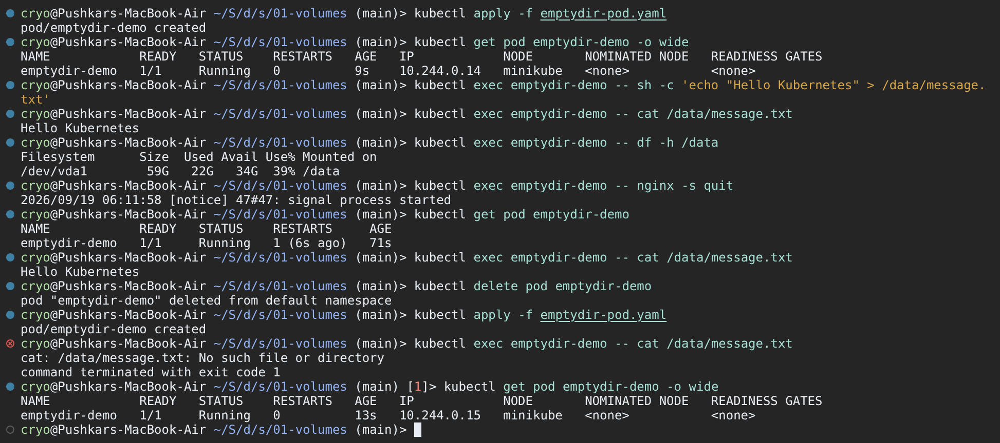

### 1.2 hostPath

```bash
kubectl apply -f hostpath-pod.yaml
kubectl exec hostpath-demo -- sh -c 'echo "written by $(hostname) at $(date)" > /data/host.txt'
minikube ssh -- cat /tmp/hostpath-data/host.txt
kubectl delete pod hostpath-demo && kubectl apply -f hostpath-pod.yaml
kubectl exec hostpath-demo -- cat /data/host.txt
```

The file is on the **node** (`minikube ssh` can read it), so a new Pod sees it again, but only on the same node.

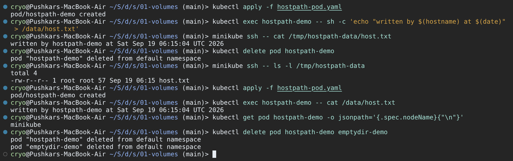

### 1.3 PersistentVolume + PersistentVolumeClaim

```bash
cd ../02-persistent-storage
kubectl apply -f pv.yaml
kubectl apply -f pvc.yaml
kubectl get pv,pvc
```

The PVC did **not** bind to `student-pv`. The file has no `storageClassName`, so minikube's default class
`standard` was filled in, and that class's provisioner created a new PV. `student-pv` (no class) stayed `Available`.

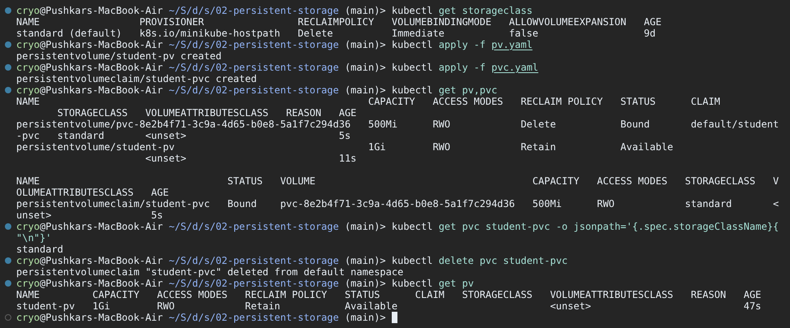

Fix: recreate the claim with `storageClassName: ""` so it only matches class-less PVs:

```bash
kubectl delete pvc student-pvc
kubectl create -f pvc.yaml --dry-run=client -o json | jq '.spec.storageClassName = ""' | kubectl apply -f -
kubectl get pvc student-pvc
kubectl get pv student-pv
```

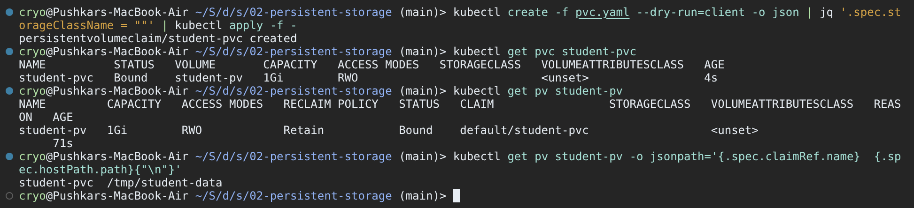

```bash
kubectl apply -f pod.yaml
kubectl exec storage-demo -- sh -c 'echo "Kubernetes Storage" > /data/message.txt'
kubectl delete pod storage-demo && kubectl apply -f pod.yaml
kubectl exec storage-demo -- cat /data/message.txt
```

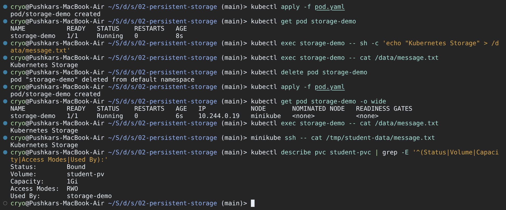

### 1.4 StorageClass and dynamic provisioning

```bash
cd ../03-storageclass
kubectl get storageclass
kubectl describe storageclass standard
kubectl apply -f pvc.yaml
kubectl get pvc dynamic-pvc
kubectl describe pvc dynamic-pvc
kubectl get pv
```

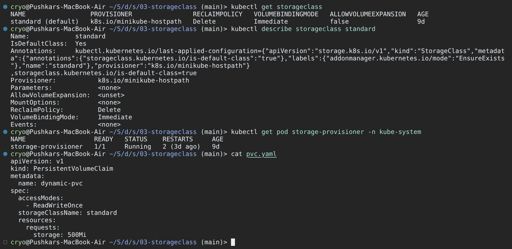

No PV was written by hand. The PVC asked for class `standard`, the `minikube-hostpath` provisioner created
`pvc-1d7c5a92-...`, and the events show `ProvisioningSucceeded`. Deleting the PVCs shows the reclaim policies:
the dynamic PV (`Delete`) disappears, `student-pv` (`Retain`) becomes `Released` and keeps its data.

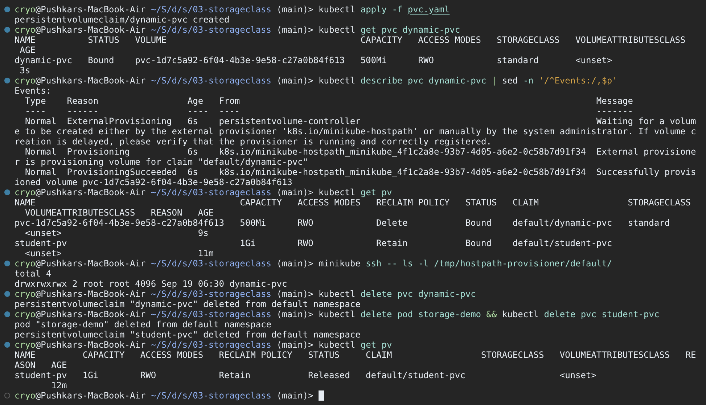

**What I learned:** Pods should only use PVCs; the StorageClass decides where data lives. A PVC without a
class is not "no class", because the cluster default is filled in. That is why static PVs need
`storageClassName: ""` (or a matching class) on both sides.

---

## Task 2: HPA Hands-on

**What it asks:** deploy the app, configure and verify HPA, run a load generator, watch CPU and Pod
scaling, and capture the output with `kubectl get hpa`, `get pods`, `top pods`, `describe hpa`.

**Files involved:** [04-hpa/deployment.yaml](04-hpa/deployment.yaml) (nginx, `requests.cpu: 100m`,
`limits.cpu: 200m`), [04-hpa/service.yaml](04-hpa/service.yaml) (`hpa-demo-service`),
[04-hpa/hpa.yaml](04-hpa/hpa.yaml) (min 1, max 5, target 50% CPU). The load generator is a busybox Pod
running `wget` in a loop against the Service.

```yaml
# 04-hpa/hpa.yaml
apiVersion: autoscaling/v2
kind: HorizontalPodAutoscaler
metadata:
  name: hpa-demo
spec:
  scaleTargetRef: { apiVersion: apps/v1, kind: Deployment, name: hpa-demo }
  minReplicas: 1
  maxReplicas: 5
  metrics:
    - type: Resource
      resource:
        name: cpu
        target: { type: Utilization, averageUtilization: 50 }
```

### 2.1 Metrics Server

HPA reads CPU from the Metrics API, so that has to work first.

```bash
kubectl top pods                       # error: Metrics API not available
minikube addons enable metrics-server
kubectl rollout status deploy/metrics-server -n kube-system
kubectl get apiservice v1beta1.metrics.k8s.io
kubectl top nodes
```

The first `kubectl top` after enabling still fails (`metrics not available yet`) because metrics-server
needs one scrape cycle. Once the APIService is `Available: True`, it works.

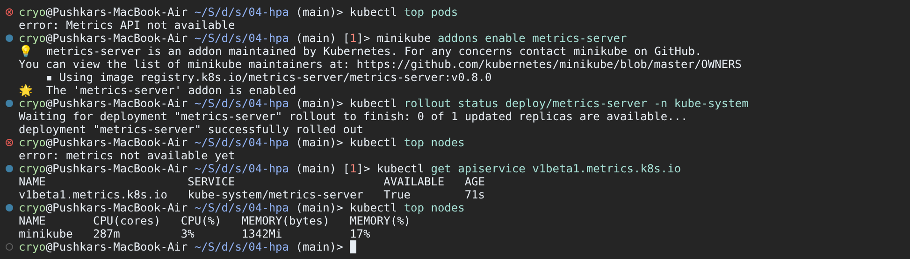

### 2.2 Deploy the application and the HPA

```bash
cd session-13-storage-hpa-probes/04-hpa
kubectl apply -f deployment.yaml -f service.yaml -f hpa.yaml
kubectl get deploy,svc,hpa
kubectl get pods -l app=hpa-demo -o wide
```

Right after creation TARGETS shows `cpu: <unknown>/50%`. The HPA has not received a metric yet.

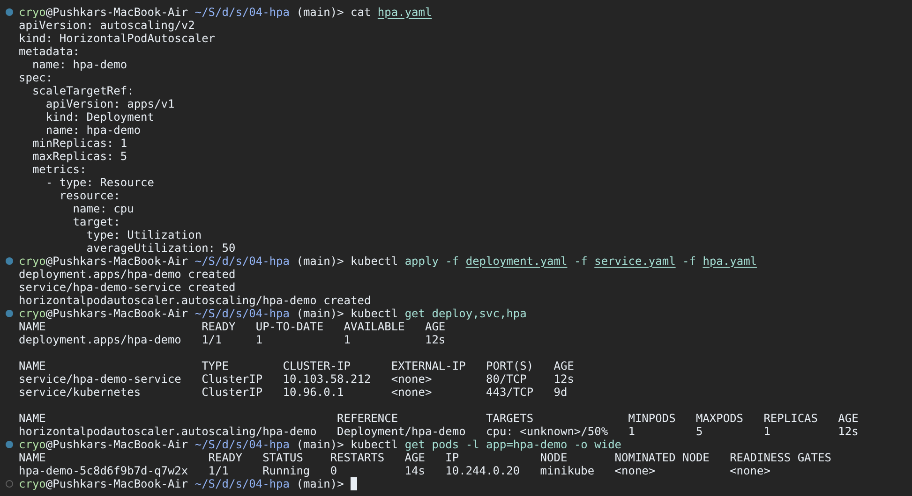

### 2.3 Verify the HPA

```bash
kubectl get hpa
kubectl describe hpa hpa-demo
kubectl top pods
```

- `cpu: 0%/50%`: the HPA is reading metrics. Utilization is **% of the CPU request** (100m), not of the node.
- `ScalingActive True / ValidMetricFound`: metrics work.
- `ScalingLimited True / TooFewReplicas`: idle load would mean 0 Pods, so it is held at `minReplicas: 1`.

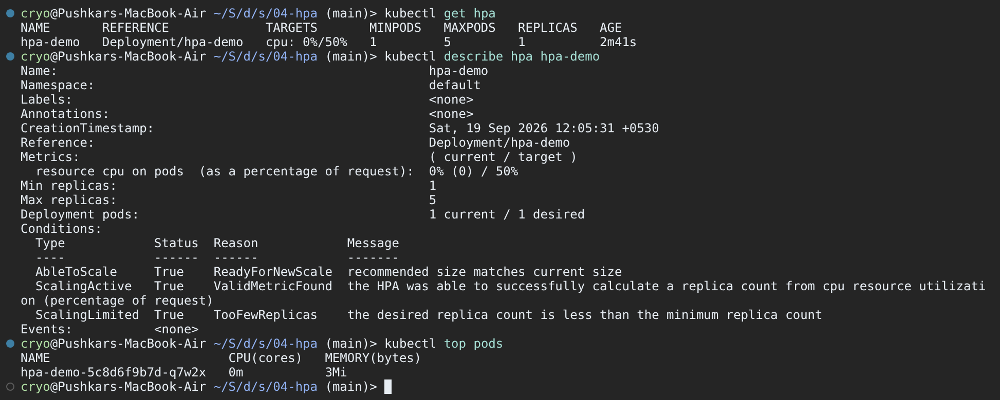

### 2.4 Deploy the load generator

```bash
kubectl run load-generator --image=busybox:1.36 --restart=Never -- /bin/sh -c "while true; do wget -q -O- http://hpa-demo-service; done"
kubectl get pods -o wide
kubectl logs load-generator --tail 3
kubectl top pods
```

The logs show the nginx page coming back, so requests are flowing. The single nginx Pod jumps to `186m`,
which is 186% of its 100m request.

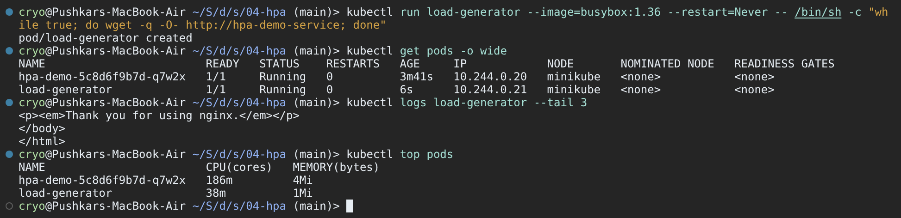

### 2.5 Observe CPU and Pod scaling

```bash
kubectl get hpa hpa-demo -w
kubectl get pods -l app=hpa-demo -o wide
kubectl top pods
kubectl describe hpa hpa-demo
```

The HPA formula is `desired = ceil(current replicas × current% / target%)`:

| HPA age | CPU | Replicas | Why |
|---------|-----|----------|-----|
| 3m50s | 0% | 1 | idle |
| 4m1s | 186% | 1 | load generator started |
| 4m16s | 186% | **4** | ceil(1 × 186 / 50) = ceil(3.72) = 4 |
| 4m31s | 61% | 4 | load now spread over 4 Pods |
| 4m46s | 61% | **5** | ceil(4 × 61 / 50) = ceil(4.88) = 5 (= maxReplicas) |
| 5m1s | 47% | 5 | under target, stable |

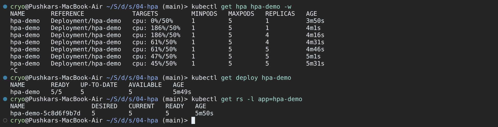

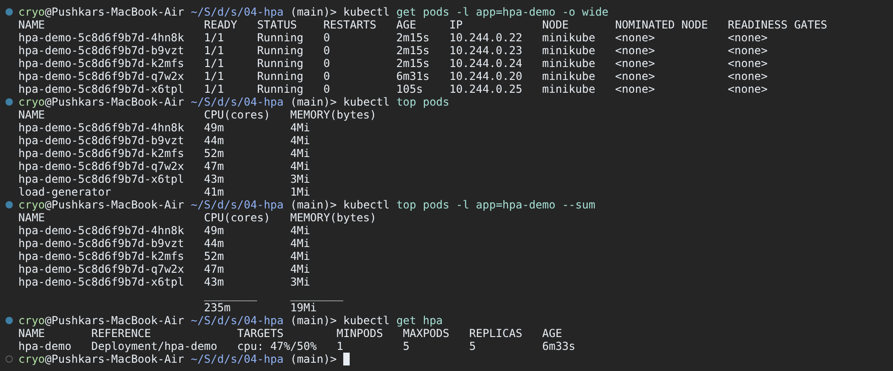

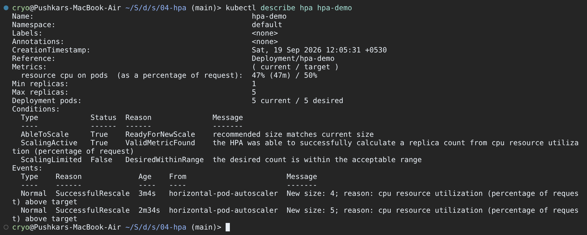

### 2.6 Stop the load and watch scale-down

```bash
kubectl delete pod load-generator
kubectl get hpa hpa-demo -w
kubectl describe hpa hpa-demo | sed -n '/^Events:/,$p'
kubectl delete -f deployment.yaml -f service.yaml -f hpa.yaml
```

CPU drops to 0% within ~30s, but replicas stay at 5 for about **5 minutes**. That is the default
scale-down stabilization window (300s), which stops the HPA from flapping. After that it goes straight
to `New size: 1; reason: All metrics below target`.

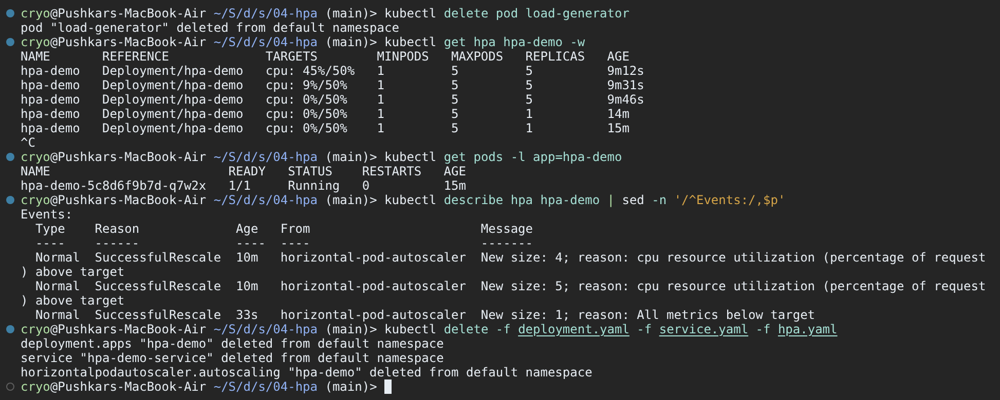

**What I learned:** HPA only works if (1) metrics-server is running and (2) the container has a **CPU
request**. Without a request, utilization cannot be calculated and TARGETS stays `<unknown>`. Scale-up is
fast; scale-down is slow on purpose.

---

## Task 3: Mini Project (Production-Ready Web App)

**What it asks:** complete [mini-project/README.md](mini-project/README.md): deploy a web app that
combines a PVC (persistence), HPA (2–5 replicas at 50% CPU) and startup/readiness/liveness probes, then
verify storage, service access, scaling and probe behaviour.

**Files involved:**

| File | Notes |
|------|-------|
| [namespace.yaml](mini-project/namespace.yaml) | `production-webapp` |
| [pvc.yaml](mini-project/pvc.yaml) | `web-data`, 500Mi RWO, default class `standard` (dynamic) |
| [deployment.yaml](mini-project/deployment.yaml) | 2 × nginx, `Recreate`, requests 100m/64Mi, `/data` from the PVC, 3 probes |
| [service.yaml](mini-project/service.yaml) | `web-service`, ClusterIP port 80 |
| [hpa.yaml](mini-project/hpa.yaml) | `web-app-hpa`, min 2 / max 5, 50% CPU |

```text
                 web-service (ClusterIP :80)
                 │
     ┌───────────┼──────────────┐        web-app-hpa (2–5, 50% CPU)
     ▼           ▼              ▼          ▲ metrics-server
  web-app     web-app   ...  web-app ────┘
  (startup / readiness / liveness probes, cpu request 100m)
     │           │              │
     └──── /data ─ PVC web-data ─ PV pvc-5a3e... (standard, minikube-hostpath)
```

All commands run from `session-13-storage-hpa-probes/mini-project`.

### 3.1 Deploy

```bash
kubectl apply -f namespace.yaml -f pvc.yaml -f deployment.yaml -f service.yaml -f hpa.yaml
kubectl get pvc,deploy,pods,svc,hpa -n production-webapp
```

The order matters. `kubectl apply -f .` would apply `deployment.yaml` before `namespace.yaml`
(alphabetical) and fail with `namespaces "production-webapp" not found`.

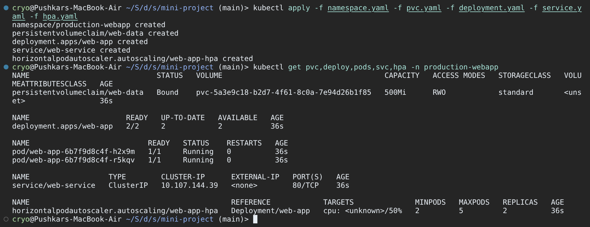

### 3.2 Probes and endpoints

```bash
kubectl describe deploy web-app -n production-webapp | sed -n '/Containers:/,/ReadOnly:/p'
kubectl get endpoints web-service -n production-webapp
kubectl get events -n production-webapp --field-selector reason=Unhealthy
kubectl get hpa -n production-webapp
```

| Probe | Config | Purpose here |
|-------|--------|--------------|
| Startup | `GET /` every 2s, up to 30 failures | gives the app up to 60s to boot; liveness/readiness wait for it |
| Readiness | `GET /` every 5s, 2 failures | removes the Pod from `web-service` endpoints when it fails |
| Liveness | `GET /` every 5s, 3 failures | restarts the container if it hangs |

Both Pod IPs are in the endpoints and there are no `Unhealthy` events.

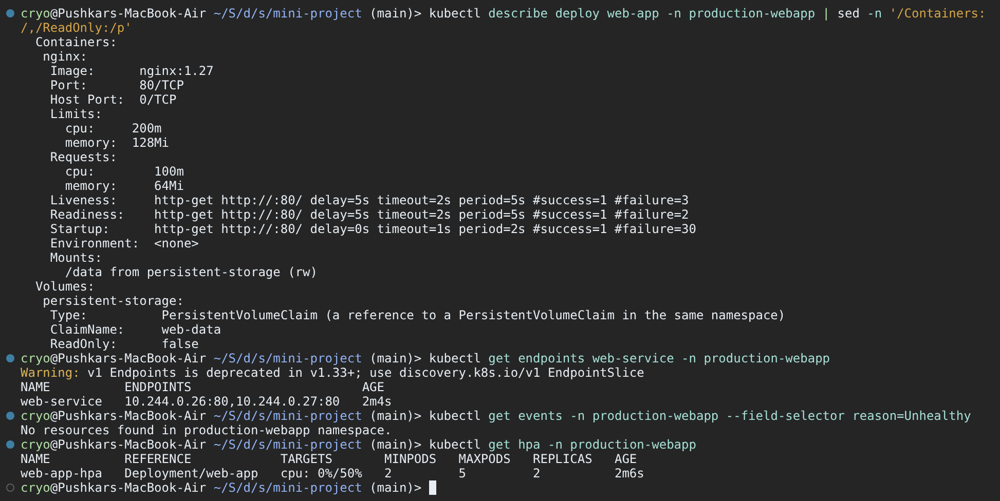

### 3.3 Storage persistence

```fish
set POD (kubectl get pods -n production-webapp -l app=web-app -o jsonpath='{.items[0].metadata.name}')
kubectl exec -n production-webapp $POD -- sh -c 'echo "Student: Pushkar Desai" > /data/student.txt'
kubectl delete pod -n production-webapp $POD
set NEW_POD (kubectl get pods -n production-webapp -l app=web-app --sort-by=.metadata.creationTimestamp -o jsonpath='{.items[-1:].metadata.name}')
kubectl exec -n production-webapp $NEW_POD -- cat /data/student.txt
```

(fish syntax: `set VAR (cmd)` instead of bash's `VAR=$(cmd)`.) The replacement Pod `z8c4w` reads the file
written by the deleted Pod `h2x9m`. Both replicas mount the same RWO volume; that works because they run
on the same (only) node.

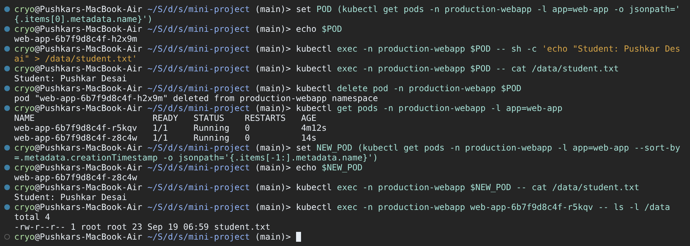

### 3.4 Service access

```bash
kubectl port-forward -n production-webapp svc/web-service 8080:80 &
curl -s http://localhost:8080 | head -n 4
curl -sI http://localhost:8080
kill $last_pid
```

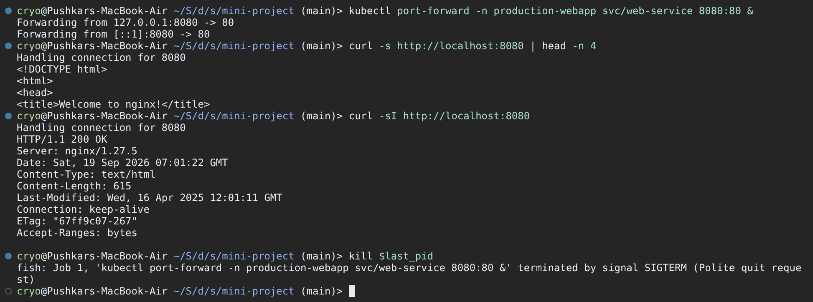

### 3.5 HPA under load

```bash
kubectl run load-generator -n production-webapp --image=busybox:1.36 --restart=Never -- /bin/sh -c "while true; do wget -q -O- http://web-service; done"
kubectl get hpa -n production-webapp -w
kubectl get pods -n production-webapp -o wide
kubectl top pods -n production-webapp
kubectl describe hpa web-app-hpa -n production-webapp
kubectl delete pod load-generator -n production-webapp
kubectl get hpa -n production-webapp            # after ~5 minutes
```

2 → 4 (ceil(2 × 94 / 50) = 4) → 5 (ceil(4 × 58 / 50) = 5, the max). After the load stops it returns to `minReplicas: 2`.

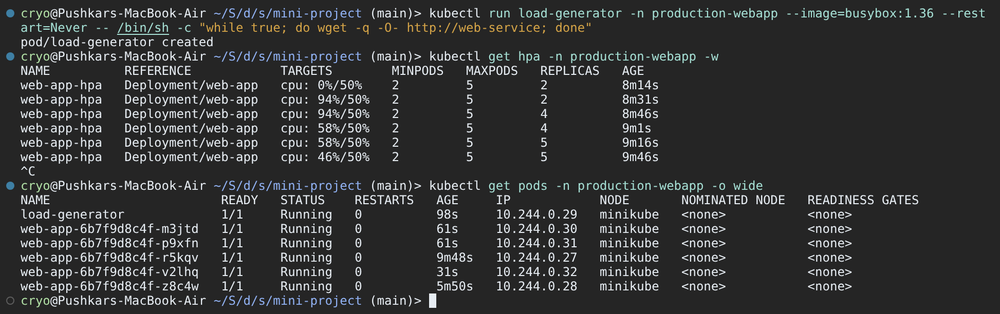

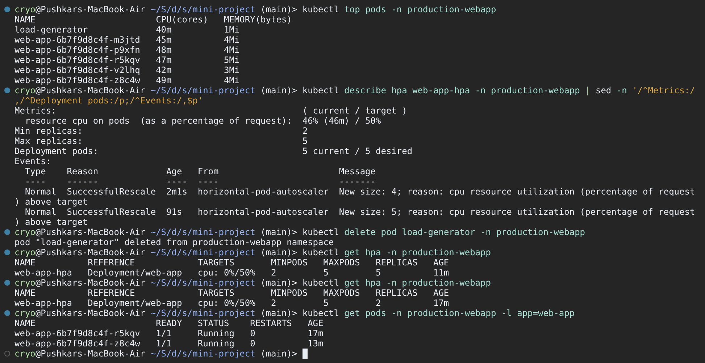

### 3.6 Bonus: readiness gating (challenge 2)

```bash
kubectl patch deploy web-app -n production-webapp --type=json \
  -p '[{"op":"replace","path":"/spec/template/spec/containers/0/readinessProbe/httpGet/path","value":"/does-not-exist"}]'
kubectl get pods -n production-webapp -l app=web-app
kubectl get endpoints web-service -n production-webapp
kubectl describe pod <new-pod> -n production-webapp | sed -n '/^Events:/,$p' | tail -n 3
kubectl rollout undo deploy/web-app -n production-webapp
```

The Pods are `Running` but `0/1` READY, the Service has **no endpoints**, and the events say
`Readiness probe failed: HTTP probe failed with statuscode: 404`. Restarts stay at 0, because readiness
failure ≠ restart. Because the strategy is `Recreate`, all old Pods were killed first, so this was a full
outage. With `RollingUpdate` the old Pods would have kept serving. `rollout undo` restored the service,
and `/data/student.txt` was still there.

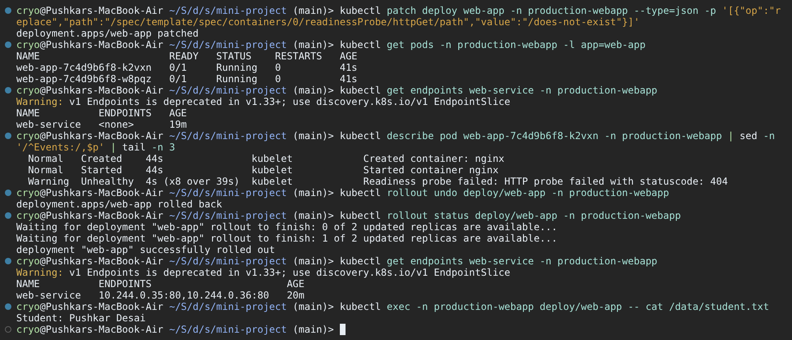

### 3.7 Clean up

```bash
kubectl delete namespace production-webapp
kubectl get pv
kubectl delete pv student-pv
minikube ssh -- ls -l /tmp/student-data
```

Deleting the namespace removed the PVC, and its dynamic PV (`Delete`) went with it. Deleting `student-pv`
(`Retain`) only removed the Kubernetes object; the files are still on the node.

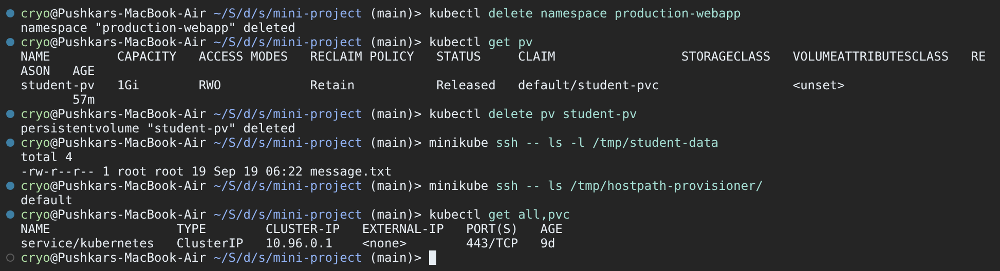

**What I learned:** PVC, HPA and probes solve different problems (state, load and health), and they
interact. HPA needs CPU requests. Every new replica must pass the startup and readiness probes before it
gets traffic. An RWO volume shared by replicas only works on one node. In production I would use
`RollingUpdate`, and a StatefulSet (one PVC per Pod) or RWX storage for shared data.

---

## Deliverables Checklist

| Deliverable | Where |
|-------------|-------|
| Volume documentation | [01-kubernetes-volumes/README.md](01-kubernetes-volumes/README.md), Task 1 (screenshots 01–07) |
| HPA YAML | [04-hpa/hpa.yaml](04-hpa/hpa.yaml), [mini-project/hpa.yaml](mini-project/hpa.yaml) |
| Load generator | `kubectl run load-generator ... busybox:1.36 ... wget` loop, Task 2.4 / 3.5 (screenshots 11, 20) |
| HPA output (`get hpa`, `get pods`, `top pods`, `describe hpa`) | Task 2.3–2.6 (screenshots 10–15), Task 3.5 (20–21) |
| Screenshots | [screenshots/](screenshots) (23 images) |
| Mini-project implementation | [mini-project/](mini-project), Task 3 (screenshots 16–23) |
| README documentation | this file, [01-kubernetes-volumes/README.md](01-kubernetes-volumes/README.md) |
