# Session 14: Kubernetes Troubleshooting (Homework Submission)

> Screenshots in this document are rendered examples of the expected output (generated with `tools/termshot copy`), not captures from a live run. Run the commands yourself to see real output.

**Environment used for the examples**

| Item | Value |
|------|-------|
| Date | 21 Sep 2026 (IST, `+0530`) |
| Cluster | minikube, single node `minikube` (arm64), node IP `192.168.49.2`, Docker runtime |
| kubectl | v1.34.1 (server v1.34.0) |
| Cluster DNS | CoreDNS 1.12.1, Service `kube-dns` at `10.96.0.10` |
| Namespace | `default` |

**Files used**

| Path | Used for |
|------|----------|
| [01-kubectl-get](01-kubectl-get) … [05-events](05-events) | Task 1 demo Pods |
| [06-crashloopbackoff](06-crashloopbackoff), [07-imagepullbackoff](07-imagepullbackoff), [08-pending-pods](08-pending-pods) | Task 2 broken/fixed Pods |
| [09-service-dns-troubleshooting](09-service-dns-troubleshooting) | Service, DNS and Pod networking issues |
| [10-containercreating/](10-containercreating) | **added by me**: Pod stuck in `ContainerCreating` (missing ConfigMap volume) |
| [11-configuration-issues/](11-configuration-issues) | **added by me**: `CreateContainerConfigError` (wrong ConfigMap key) |
| [mini-project/](mini-project) | Task 3: Deployment, Service, broken Pod |
| [scenarios/](scenarios) | Task 3 bonus: 5-pod triage gauntlet |

---

## Task 1: Kubernetes Commands

**What it asks:** hands-on practice with `get`, `describe`, `logs`, `exec`, `events`, `explain`, `top`, `get -o wide`.

| Command | Answers the question | Most useful flags |
|---------|----------------------|-------------------|
| `kubectl get` | *What* is the state? | `-o wide` (IP, node), `--show-labels`, `-L key`, `-w`, `-A`, `-o jsonpath=…` |
| `kubectl describe` | *Why* is it in that state? | read **State / Last State**, **Conditions**, **Events** at the bottom |
| `kubectl logs` | What does the app say? | `--previous` (crashed container), `-f`, `--tail`, `--since`, `-c <container>`, `--timestamps` |
| `kubectl exec` | What does it look like from inside? | `-- <cmd>` for one command, `-it -- sh/bash` for a shell |
| `kubectl events` / `get events` | What did Kubernetes try? | `--for pod/x`, `--field-selector type=Warning`, `--sort-by=.lastTimestamp`, `-w` |
| `kubectl explain` | What does this field mean? | `pod.spec.containers.livenessProbe`, `--recursive` |
| `kubectl top` | How much CPU/memory? | needs metrics-server; `top nodes`, `top pods --containers` |

### 1.1 `kubectl get` and `get -o wide`

```bash
cd session-14-kubernetes-troubleshooting/01-kubectl-get
kubectl apply -f pod.yaml
kubectl get pods
kubectl get pods -o wide
kubectl get pods --show-labels
kubectl get all
kubectl get nodes -o wide
kubectl get pods -n kube-system
```

`-o wide` adds the Pod IP and node, which you need for networking problems. `--show-labels` is what you
compare against Service selectors.

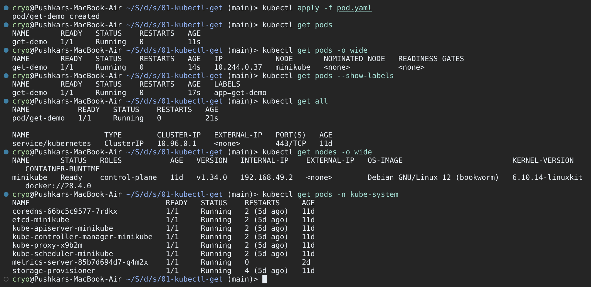

### 1.2 `kubectl describe`

```bash
kubectl apply -f ../02-kubectl-describe/demo-pod.yaml
kubectl describe pod describe-demo
```

Sections to read: **Node** (where it runs), **Containers → State / Restart Count**, **Conditions**
(`PodScheduled`, `Ready`, …) and **Events** (the timeline).

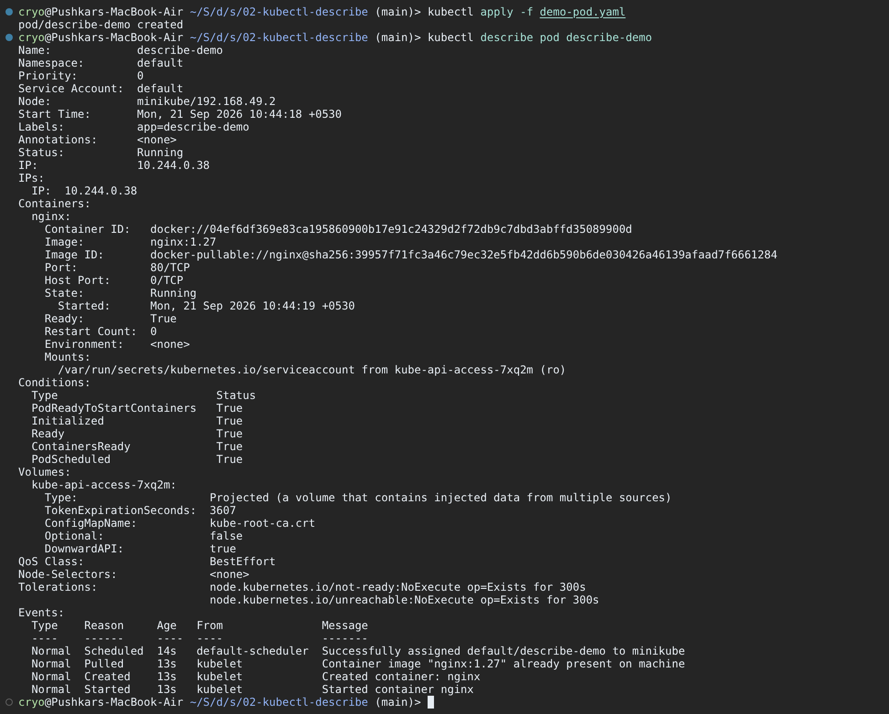

### 1.3 `kubectl logs`

```bash
kubectl apply -f ../03-kubectl-logs/pod.yaml
kubectl logs logs-demo
kubectl logs logs-demo --tail 2 --timestamps
kubectl logs logs-demo -c app --since 10s
kubectl logs -f logs-demo --tail 1
kubectl logs logs-demo --previous
```

`--previous` fails here (`previous terminated container "app" … not found`) because this container never
crashed. It is the key flag for CrashLoopBackOff (Task 2.1).

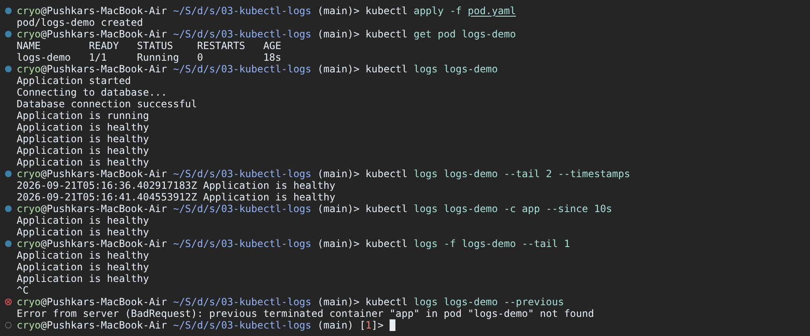

### 1.4 `kubectl exec`

```bash
kubectl apply -f ../04-kubectl-exec/pod.yaml
kubectl exec exec-demo -- hostname
kubectl exec exec-demo -- ls /usr/share/nginx/html
kubectl exec exec-demo -- cat /etc/hosts
kubectl exec exec-demo -- curl -s localhost | grep title
kubectl exec -it exec-demo -- bash
```

`curl localhost` from inside the container proves the app itself works. If it does, but traffic through a
Service does not, the problem is in the Service, DNS or network, not the app.

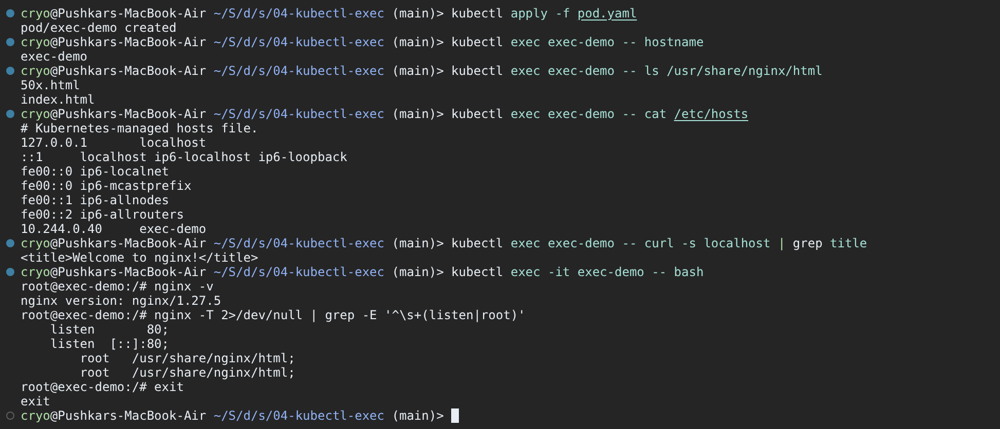

### 1.5 Events

```bash
kubectl apply -f ../05-events/pod.yaml
kubectl events --for pod/events-demo
kubectl get events --sort-by=.lastTimestamp | tail -n 5
kubectl get events --field-selector involvedObject.name=events-demo -o custom-columns=TIME:.lastTimestamp,REASON:.reason,FROM:.source.component
kubectl get events -A --field-selector type=Warning
```

Events are kept for only **1 hour** by default, so check them early. `type=Warning` is the quickest way
to find problems across the whole cluster.

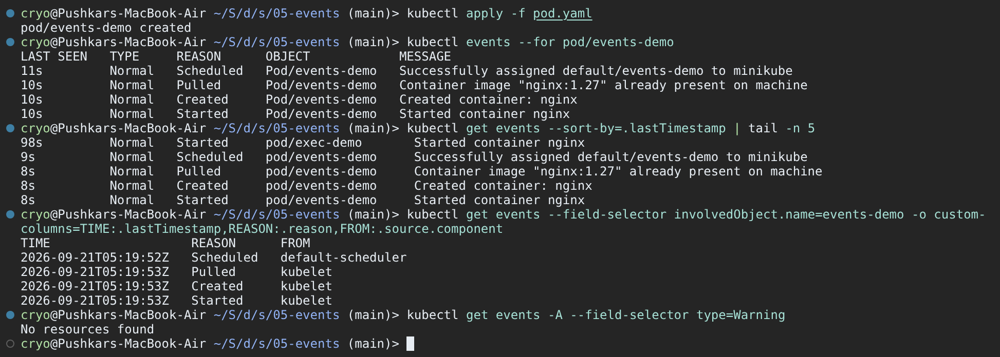

### 1.6 `kubectl explain` and `kubectl top`

```bash
kubectl explain pod.spec.containers.livenessProbe | head -n 21
kubectl explain deployment.spec.strategy.type
kubectl top nodes
kubectl top pods
kubectl get pods -o wide
```

`explain` is offline API documentation for the cluster's exact version, which is useful when a YAML field
is rejected. `top` needs metrics-server (enabled in session 13).

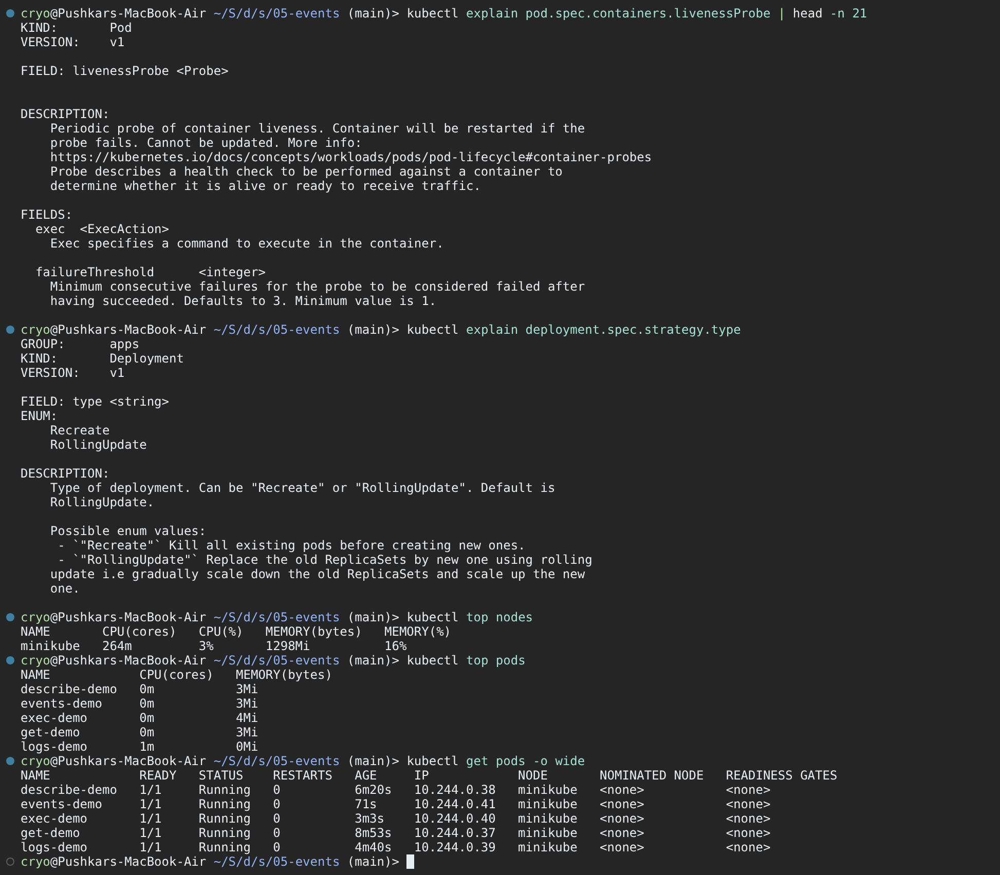

---

## Task 2: Troubleshoot Common Issues

**What it asks:** for each issue, identify → investigate → find root cause → fix → verify → document.

| # | Issue | Symptom in `kubectl get` | Command that found it | Root cause | Fix |
|---|-------|--------------------------|-----------------------|------------|-----|
| 2.1 | CrashLoopBackOff | `CrashLoopBackOff`, RESTARTS ↑ | `logs --previous`, `describe` (Exit Code 1) | command ends with `exit 1` | keep the process running (`sleep 3600`), recreate Pod |
| 2.2 | ErrImagePull / ImagePullBackOff | `ErrImagePull` ↔ `ImagePullBackOff` | `describe` events | tag `this-image-does-not-exist` | `nginx:1.27`, recreate Pod |
| 2.3 | Pending | `Pending`, NODE `<none>` | `describe` events `FailedScheduling` | `nodeSelector` for a node that doesn't exist | remove nodeSelector |
| 2.4 | ContainerCreating | stuck `ContainerCreating` | `describe` events `FailedMount` | ConfigMap `site-content` missing | create the ConfigMap |
| 2.5 | Configuration | `CreateContainerConfigError` | `describe` events | ConfigMap key `DB_URL` vs `DATABASE_URL` | fix the key |
| 2.6 | Service connectivity | Pods Running, Service has no endpoints | `get endpoints`, `describe svc` | selector `app=web-ahsgdf` ≠ label `app=web` | selector `app=web` |
| 2.7 | DNS | `nslookup` times out | `get pods -n kube-system -l k8s-app=kube-dns` | CoreDNS scaled to 0 | scale CoreDNS to 1 |
| 2.8 | Pod networking | Service refuses, Pod IP pingable | `wget` to Pod IP on :80 vs :8080 | Service `targetPort: 8080`, nginx listens on 80 | `targetPort: 80` |

### 2.1 CrashLoopBackOff

**Problem:** `crash-demo` keeps restarting and ends up in `CrashLoopBackOff`.

**Investigation:**

```bash
cd 06-crashloopbackoff
kubectl apply -f broken-pod.yaml
kubectl get pod crash-demo -w
kubectl describe pod crash-demo | sed -n '/State:/,/Restart Count/p'
kubectl logs crash-demo --previous
kubectl events --for pod/crash-demo | tail -n 2
kubectl get pod crash-demo -o jsonpath='{.spec.containers[0].command[2]}'
```

The status cycles `Error` → `CrashLoopBackOff` while the waits between restarts grow (10s, 20s, 40s … up
to 5 min). `Last State: Terminated, Reason: Error, Exit Code: 1`, and the previous logs end with
`Something went wrong!`.

**Root cause:** the container command itself runs `exit 1`. The application fails; Kubernetes is only
restarting it as told (`restartPolicy: Always`).

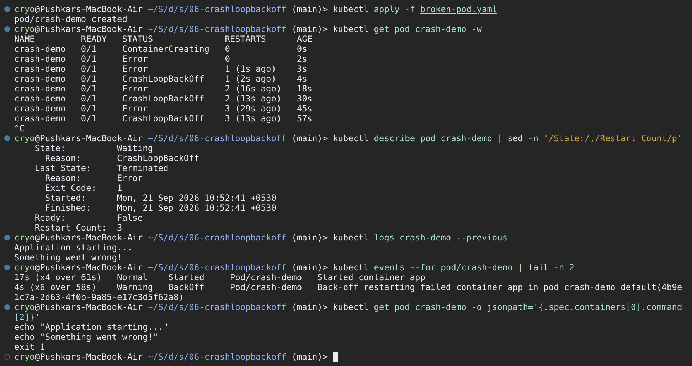

**Fix and verify:** a Pod's `command` cannot be changed on a running Pod, so delete it and apply the fixed spec.

```bash
diff broken-pod.yaml fixed-pod.yaml
kubectl delete pod crash-demo
kubectl apply -f fixed-pod.yaml
kubectl get pod crash-demo -o wide
kubectl logs crash-demo
```

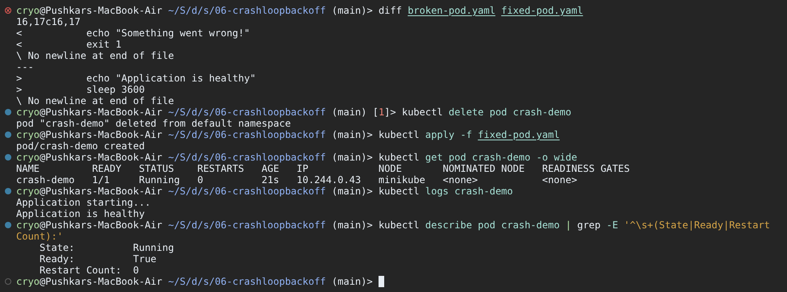

### 2.2 ErrImagePull and ImagePullBackOff

**Problem:** `image-demo` never starts.

**Investigation:**

```bash
cd ../07-imagepullbackoff
kubectl apply -f broken-pod.yaml
kubectl get pod image-demo -w
kubectl describe pod image-demo | sed -n '/^Events:/,$p'
kubectl get pod image-demo -o jsonpath='{.spec.containers[0].image}{"\n"}'
docker manifest inspect nginx:this-image-does-not-exist
```

- **ErrImagePull** is the actual failed attempt. **ImagePullBackOff** is the waiting period before
  kubelet retries. The status alternates between the two.
- The event says `manifest for nginx:this-image-does-not-exist not found: manifest unknown`. The registry
  and repository exist, but the **tag** does not. (A wrong repository name gives `pull access denied …
  repository does not exist` instead; see scenario 2 in Task 3.)

**Root cause:** non-existent image tag.

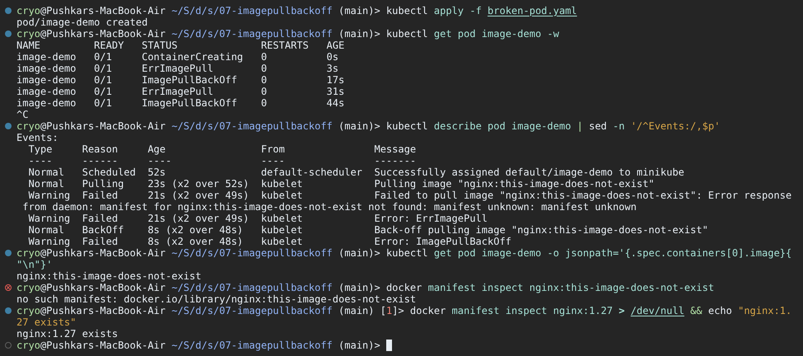

**Fix and verify:**

```bash
diff broken-pod.yaml fixed-pod.yaml
kubectl delete pod image-demo
kubectl apply -f fixed-pod.yaml
kubectl get pod image-demo
kubectl describe pod image-demo | sed -n '/^Events:/,$p'
```

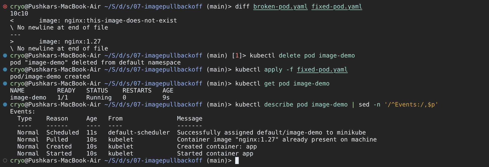

### 2.3 Pending

**Problem:** `pending-demo` stays `Pending`, with no IP and no node.

**Investigation:**

```bash
cd ../08-pending-pods
kubectl apply -f broken-pod.yaml
kubectl get pod pending-demo -o wide
kubectl describe pod pending-demo
kubectl get nodes -L kubernetes.io/hostname
```

`PodScheduled False`, and the scheduler event says `0/1 nodes are available: 1 node(s) didn't match Pod's
node affinity/selector`. The only node is labelled `kubernetes.io/hostname=minikube`.

**Root cause:** `nodeSelector: kubernetes.io/hostname: node-that-does-not-exist`. A Pending Pod never
reached a node, so `kubectl logs` has nothing to show. Only the scheduler events help.

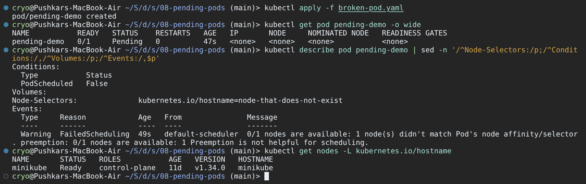

**Fix and verify:** remove the selector (or point it at a real node label).

```bash
diff broken-pod.yaml fixed-pod.yaml
kubectl delete pod pending-demo
kubectl apply -f fixed-pod.yaml
kubectl get pod pending-demo -o wide
```

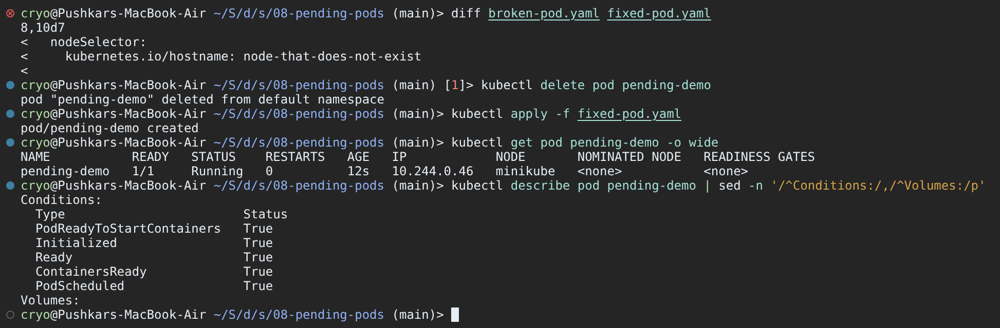

Other causes of Pending I saw: `Insufficient cpu/memory` (scenario 3 in Task 3), plus taints, affinity
rules and an unbound PVC.

### 2.4 ContainerCreating

**Problem:** `cc-demo` has been in `ContainerCreating` for over 2 minutes.

**Investigation:**

```bash
cd ../10-containercreating
kubectl apply -f broken-pod.yaml
kubectl get pod cc-demo
kubectl describe pod cc-demo | sed -n '/^Events:/,$p'
kubectl get configmap site-content
```

The Pod **was scheduled**, so it is not a Pending problem. The kubelet cannot finish setting it up:
`MountVolume.SetUp failed for volume "site" : configmap "site-content" not found`, repeated (`x9`).

**Root cause:** the Pod mounts a ConfigMap volume that does not exist. Other common causes of a stuck
ContainerCreating: a missing Secret, a PVC that cannot attach, CNI/IP allocation errors, or a very large
image still pulling (check with `describe`).

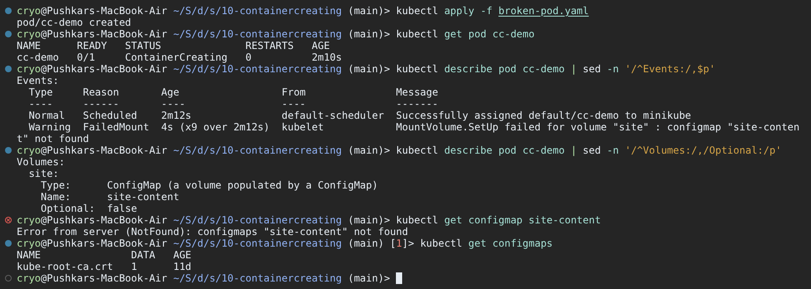

**Fix and verify:** create the missing ConfigMap. No Pod change is needed; kubelet retries the mount by itself.

```bash
kubectl apply -f configmap.yaml
kubectl get pod cc-demo -w
kubectl exec cc-demo -- curl -s localhost
```

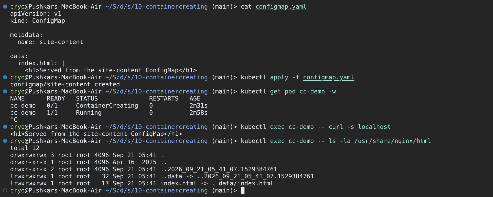

### 2.5 Configuration issues (CreateContainerConfigError)

**Problem:** `config-demo` shows `CreateContainerConfigError`.

**Investigation:**

```bash
cd ../11-configuration-issues
kubectl apply -f broken-configmap.yaml -f pod.yaml
kubectl get pod config-demo
kubectl describe pod config-demo | sed -n '/Environment:/,/Mounts:/p;/^Events:/,$p'
kubectl get configmap app-config -o jsonpath='{.data}' | jq
```

The event says `couldn't find key DATABASE_URL in ConfigMap default/app-config`, and the ConfigMap only has `DB_URL`.

**Root cause:** the Pod's `configMapKeyRef` and the ConfigMap disagree on the key name. kubelet will not
start a container whose env cannot be resolved (unless `optional: true`). The scenario-1 Pod in Task 3 is
the same class of bug, but there the env var is simply absent and the **app** crashes instead.

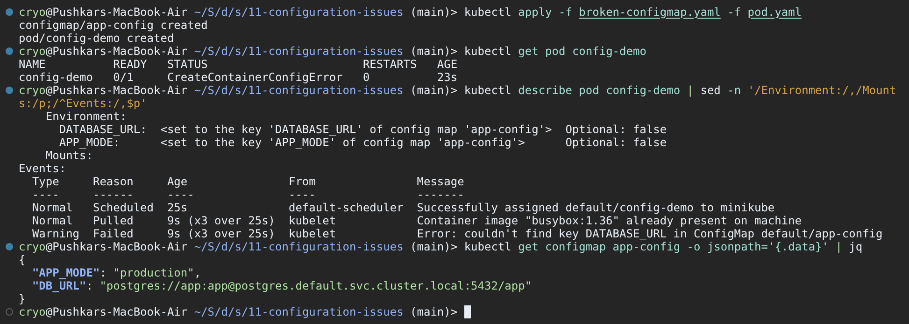

**Fix and verify:**

```bash
diff broken-configmap.yaml fixed-configmap.yaml
kubectl apply -f fixed-configmap.yaml
kubectl get pod config-demo -w
kubectl logs config-demo
```

The Pod started by itself once the key existed. Note that env vars are read **only at container start**:
changing a ConfigMap later does not update a running container's env.

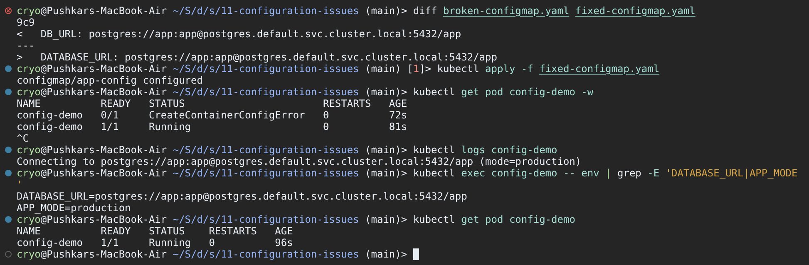

### 2.6 Service connectivity

**Problem:** both `web` Pods are Running, but requests to `http://web-service` are refused.

**Investigation:**

```bash
cd ../09-service-dns-troubleshooting
kubectl apply -f deployment.yaml -f service.yaml
kubectl get pods -l app=web --show-labels
kubectl get endpoints web-service
kubectl describe svc web-service
kubectl run tmp --rm -i --image=busybox:1.36 --restart=Never -- wget -qO- -T 3 http://web-service
```

`ENDPOINTS <none>`. The Service selects `app=web-ahsgdf`, but the Pods are labelled `app=web`. DNS works
(wget resolved `10.104.23.181`), but with no endpoints kube-proxy rejects the connection.

**Root cause:** Service selector does not match the Pod labels. The committed
[service.yaml](09-service-dns-troubleshooting/service.yaml) contains this typo.

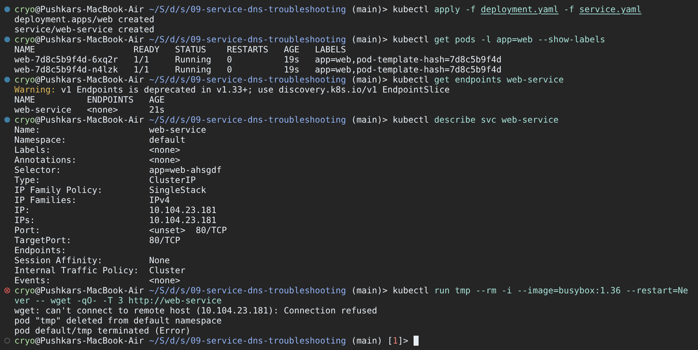

**Fix and verify:**

```bash
kubectl patch svc web-service -p '{"spec":{"selector":{"app":"web"}}}'
kubectl get endpoints web-service
kubectl get endpointslices -l kubernetes.io/service-name=web-service
kubectl run tmp --rm -i --image=busybox:1.36 --restart=Never -- wget -qO- -T 3 http://web-service | grep title
```

The permanent fix is `selector: app: web` in `service.yaml`. The patch is the live fix.

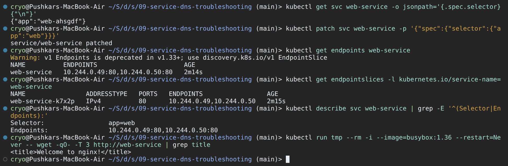

### 2.7 DNS issues

**Problem:** name lookups fail inside Pods.

**Investigation:**

```bash
kubectl apply -f dns-test-pod.yaml
kubectl exec dns-test -- nslookup web-service        # works (baseline)
kubectl exec dns-test -- nslookup web-svc            # NXDOMAIN: wrong name, DNS itself is fine
kubectl scale deploy coredns -n kube-system --replicas=0   # simulate a DNS outage
kubectl exec dns-test -- nslookup web-service        # connection timed out
```

There are two different failures. `NXDOMAIN` means DNS answered "that name doesn't exist", so it is a
typo or the wrong namespace. A **timeout** means nobody answered, so it is a DNS server problem.

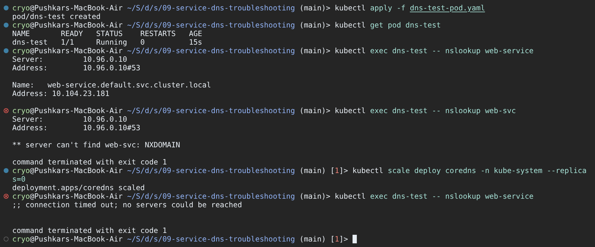

```bash
kubectl get pods -n kube-system -l k8s-app=kube-dns    # No resources found
kubectl get deploy coredns -n kube-system              # 0/0
kubectl get svc kube-dns -n kube-system                # 10.96.0.10
kubectl exec dns-test -- cat /etc/resolv.conf          # nameserver 10.96.0.10
```

**Root cause:** the Pod's resolver points to `10.96.0.10` (the `kube-dns` Service), but that Service has no
CoreDNS Pods behind it.

**Fix and verify:**

```bash
kubectl scale deploy coredns -n kube-system --replicas=1
kubectl rollout status deploy/coredns -n kube-system
kubectl logs -n kube-system -l k8s-app=kube-dns
kubectl exec dns-test -- nslookup web-service.default.svc.cluster.local
```

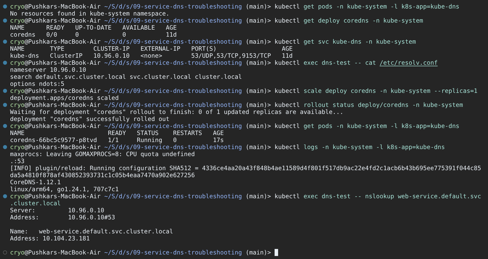

### 2.8 Pod networking issues

**Problem:** after a change to the Service, `http://web-service` is refused again, although its endpoints are populated.

**Investigation:** narrow it down layer by layer from a debug Pod:

```bash
kubectl run net-debug --image=busybox:1.36 --restart=Never -- sleep 3600
kubectl exec net-debug -- wget -qO- -T 3 http://web-service            # refused
kubectl get pods -o wide -l app=web
kubectl exec net-debug -- ping -c 2 10.244.0.49                        # Pod network OK
kubectl exec net-debug -- wget -qO- -T 3 http://10.244.0.49:80         # app OK on 80
kubectl exec net-debug -- wget -qO- -T 3 http://10.244.0.49:8080       # refused
kubectl get endpoints web-service                                       # ...:8080
```

| Test | Result | Conclusion |
|------|--------|------------|
| ping Pod IP | 0% loss | Pod-to-Pod networking (CNI) works |
| Pod IP :80 | nginx page | the app works |
| Pod IP :8080 | refused | nothing listens on 8080 |
| endpoints | `…:8080` | the Service sends traffic to 8080 |

**Root cause:** the Service's `targetPort` (8080) does not match the port the container listens on (80).

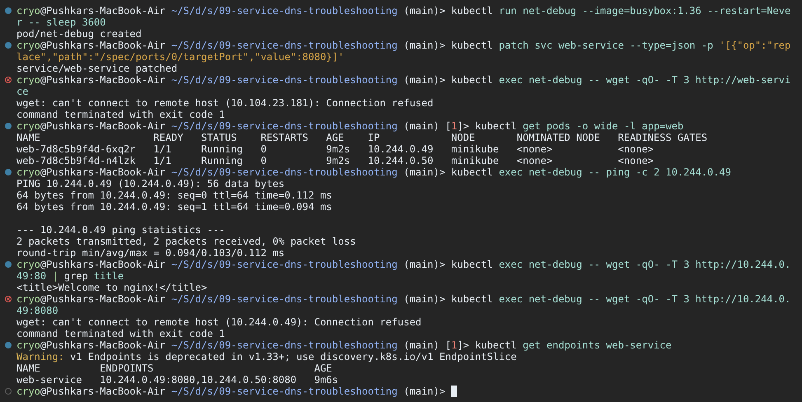

**Fix and verify:**

```bash
kubectl get deploy web -o jsonpath='{.spec.template.spec.containers[0].ports}'
kubectl exec deploy/web -- grep listen /etc/nginx/conf.d/default.conf
kubectl patch svc web-service --type=json -p '[{"op":"replace","path":"/spec/ports/0/targetPort","value":80}]'
kubectl exec net-debug -- wget -qO- -T 3 http://web-service.default.svc.cluster.local | grep title
```

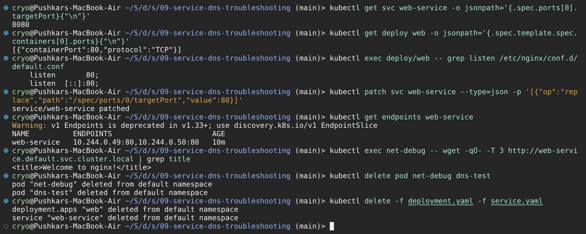

**What I learned:** the status name tells you **which stage** failed. `Pending` is scheduling.
`ContainerCreating` / `CreateContainerConfigError` / `ErrImagePull` are kubelet setup before the app
runs, so `describe` events are the source. `CrashLoopBackOff` means the app ran and died, so `logs
--previous` is the source. Running-but-unreachable is the Service/DNS/network, so test from inside the
cluster one hop at a time.

---

## Task 3: Mini Project (Troubleshooting Challenge)

**What it asks:** complete [mini-project/README.md](mini-project/README.md): deploy, observe, break,
investigate, find the root cause, fix and verify, for a broken Pod and a Service selector problem.

All commands run from `session-14-kubernetes-troubleshooting/mini-project`.

### 3.1 Deploy and observe

```bash
kubectl apply -f deployment.yaml -f service.yaml
kubectl get pods -o wide
kubectl get service
kubectl describe service troubleshooting-service
kubectl logs <pod> --tail 2
kubectl exec <pod> -- curl -s localhost | grep title
```

The Service selects `app=troubleshooting-app` and has both Pod IPs as endpoints. The app answers on localhost.

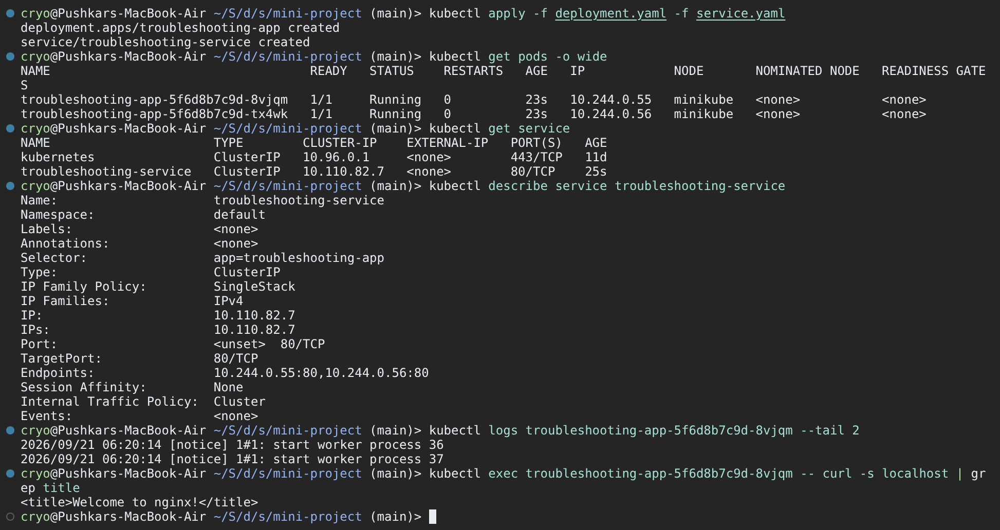

### 3.2 Broken Pod: investigate

```bash
kubectl apply -f broken-pod.yaml
kubectl get pod project-broken-pod
kubectl describe pod project-broken-pod
kubectl get events --field-selector involvedObject.name=project-broken-pod,type=Warning
```

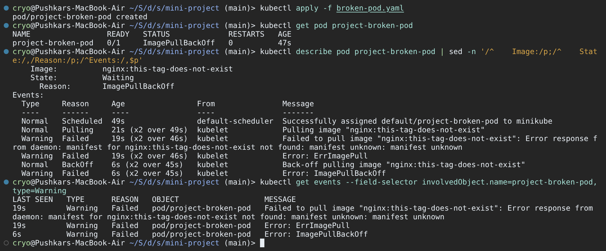

**Answers (section 7 of the README):**

1. **Pod status:** `ImagePullBackOff` (alternating with `ErrImagePull`), READY `0/1`.
2. **Actual error:** `Failed to pull image "nginx:this-tag-does-not-exist": … manifest for nginx:this-tag-does-not-exist not found: manifest unknown`.
3. **Command that found it:** `kubectl describe pod project-broken-pod` (Events section). `kubectl get events --field-selector …,type=Warning` shows the same.
4. **What is wrong with the image:** the repository `nginx` exists, but the tag `this-tag-does-not-exist` does not.
5. **Fix:** use a real tag (`nginx:1.27`). Container `image` is one of the few mutable Pod fields, so `kubectl set image` works in place. The durable fix is changing `broken-pod.yaml`.

### 3.3 Broken Pod: fix and verify

```bash
kubectl set image pod/project-broken-pod app=nginx:1.27
kubectl get pod project-broken-pod -w
kubectl describe pod project-broken-pod | sed -n '/^Events:/,$p' | tail -n 3
kubectl get pods -o wide
```

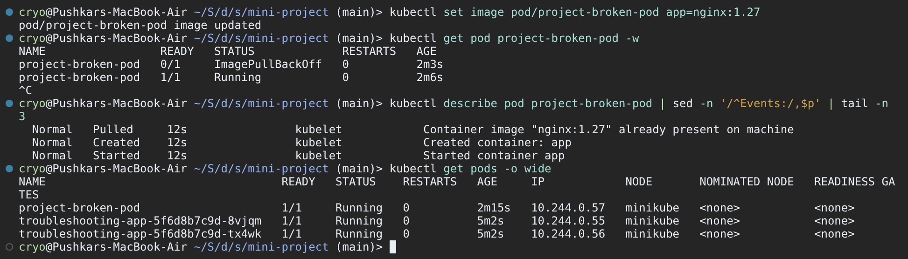

### 3.4 Service selector challenge

```bash
sed 's/app: troubleshooting-app/app: wrong-app/' service.yaml | kubectl apply -f -
kubectl get service troubleshooting-service
kubectl get endpoints troubleshooting-service
kubectl get pods --show-labels
kubectl describe service troubleshooting-service | grep -E '^(Selector|Endpoints):'
kubectl run tmp --rm -i --image=busybox:1.36 --restart=Never -- wget -qO- -T 3 http://troubleshooting-service
```

The Service still exists and still has its ClusterIP, which is why the problem is easy to miss. But the
selector `app=wrong-app` matches none of the labels (`app=troubleshooting-app`), so the endpoints are empty
and connections are refused.

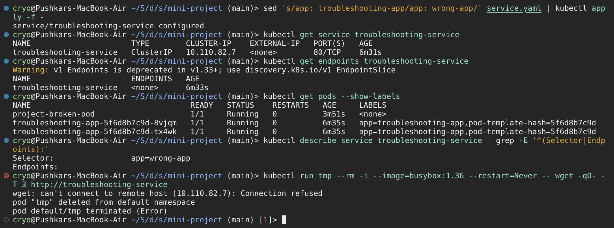

```bash
kubectl apply -f service.yaml
kubectl describe service troubleshooting-service | grep -E '^(Selector|Endpoints):'
kubectl get endpoints troubleshooting-service
kubectl run tmp --rm -i --image=busybox:1.36 --restart=Never -- wget -qO- -T 3 http://troubleshooting-service | grep title
kubectl get all
```

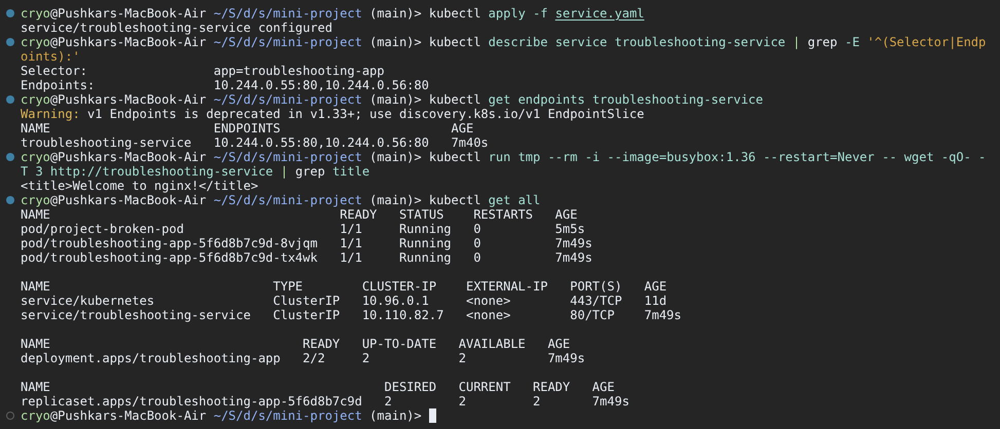

### 3.5 Troubleshooting table

| Problem | What I saw | Command I used | Root cause | Fix |
|---------|-----------|----------------|------------|-----|
| **Broken Pod** | `project-broken-pod 0/1 ImagePullBackOff` | `kubectl describe pod project-broken-pod` | image `nginx:this-tag-does-not-exist` | `kubectl set image pod/project-broken-pod app=nginx:1.27` |
| **Service Problem** | Pods Running, Service `ENDPOINTS <none>`, connection refused | `kubectl get endpoints`, `get pods --show-labels`, `describe service` | selector `app=wrong-app` ≠ label `app=troubleshooting-app` | `kubectl apply -f service.yaml` (selector `app: troubleshooting-app`) |
| **Image Problem** | `Failed to pull image … manifest unknown` | `kubectl get events --field-selector type=Warning` | tag does not exist in the registry | use an existing tag; check with `docker manifest inspect` |

### 3.6 Bonus: triage gauntlet ([scenarios/](scenarios))

```bash
cd ../scenarios
bash triage_all.sh
kubectl get pods -l tier=triage-gauntlet -L scenario
```

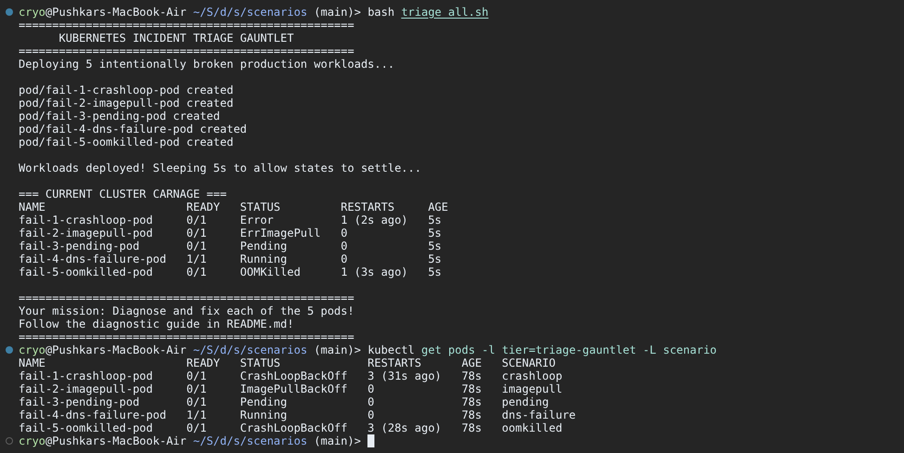

```bash
kubectl logs fail-1-crashloop-pod --previous
kubectl describe pod fail-2-imagepull-pod | grep Warning
kubectl describe pod fail-3-pending-pod
kubectl get node minikube -o jsonpath='allocatable: {.status.allocatable.cpu} CPU, {.status.allocatable.memory}{"\n"}'
```

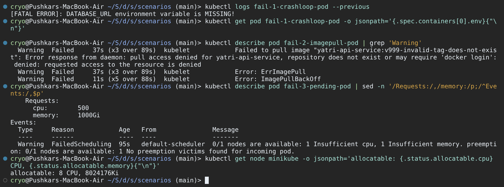

```bash
kubectl logs fail-4-dns-failure-pod
kubectl exec fail-4-dns-failure-pod -- nslookup postgres-db-wrong-name.production.svc.cluster.local
kubectl get svc -A | grep -i postgres
kubectl get pod fail-5-oomkilled-pod -o jsonpath='{.status.containerStatuses[0].lastState.terminated.reason} exit={.status.containerStatuses[0].lastState.terminated.exitCode}'
kubectl delete pods -l tier=triage-gauntlet
```

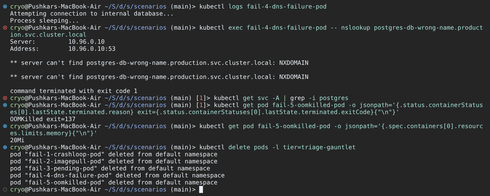

| Pod | Status | Evidence | Root cause | Fix |
|-----|--------|----------|------------|-----|
| fail-1 crashloop | CrashLoopBackOff | `logs --previous`: `DATABASE_URL environment variable is MISSING!` | required env var not set | add `env: DATABASE_URL` (from a Secret/ConfigMap) |
| fail-2 imagepull | ImagePullBackOff | `pull access denied for yatri-api-service, repository does not exist` | wrong repository *and* tag, no registry prefix | use the real `registry/repo:tag` (+ `imagePullSecrets` if private) |
| fail-3 pending | Pending | `FailedScheduling: Insufficient cpu, Insufficient memory` | requests 500 CPU / 1000Gi on an 8 CPU / ~7.6Gi node | realistic requests (e.g. `100m` / `128Mi`) |
| fail-4 dns-failure | **Running** (silent!) | `nslookup …: NXDOMAIN`; no postgres Service exists | wrong hostname; `curl -s … \|\| true` hid the failure | correct Service name/namespace; don't swallow errors |
| fail-5 oomkilled | OOMKilled → CrashLoopBackOff | `lastState.terminated.reason=OOMKilled`, exit **137** | allocates ~1GB with `limits.memory: 20Mi` | raise the limit or fix the allocation |

Scenario 4 is the most dangerous one: `kubectl get pods` shows everything green, and only testing from
inside the Pod reveals the problem.

### 3.7 README questions

1. **What does `kubectl get` tell us?** The current state of resources (status, readiness, restarts, age;
   with `-o wide` also IPs and nodes). It answers *what* is happening.
2. **Difference between `get` and `describe`?** `get` is a one-line summary per object. `describe` is the
   full detail of one object: config, state history (`Last State`, exit codes), conditions, and the
   **events** that explain *why*.
3. **Why use `kubectl logs`?** To read what the application wrote to stdout/stderr, i.e. errors from inside
   the app. `--previous` shows the logs of the crashed instance.
4. **When to use `kubectl exec`?** When the container is running and you need to test from inside it:
   `curl localhost`, check files/config/env, resolve DNS, reach other Services. It doesn't work on a
   container that keeps crashing (use `logs --previous` or `kubectl debug`).
5. **CrashLoopBackOff?** The container starts and then exits, again and again. Kubernetes keeps restarting
   it with growing delays (up to 5 min). It is a symptom; the cause is in the logs or exit code.
6. **ImagePullBackOff?** kubelet could not pull the image (wrong name/tag, private registry without
   credentials, network). It backs off before retrying; `ErrImagePull` is the actual failed attempt.
7. **Why can a Pod remain `Pending`?** The scheduler can't place it: not enough CPU/memory for its
   *requests*, nodeSelector/affinity mismatch, taints without tolerations, or an unbound PVC.
   `describe` → `FailedScheduling` says which.
8. **Why can a Service have no endpoints?** Its selector matches no Pods (label typo, wrong
   namespace), or the matching Pods are not **Ready** (failing readiness probe).
9. **Service selector vs Pod labels?** The Service continuously selects Pods whose labels match its
   selector. Their IPs become the endpoints, and only those receive traffic. Labels and selector must
   match exactly (key and value).
10. **What is Kubernetes DNS?** CoreDNS (Service `kube-dns`, `10.96.0.10`) gives every Service a name
    `<service>.<namespace>.svc.cluster.local`. Pods use it through `/etc/resolv.conf`. Its search domains
    let `web-service` resolve without the full name inside the same namespace.

**What I learned:** follow GET → DESCRIBE → EVENTS → LOGS → EXEC → TEST → FIX → VERIFY instead of
guessing. Most failures leave clear evidence in events or logs, but some (scenario 4, a selector typo)
only show up when you test the actual traffic path.

---

## Deliverables Checklist

| Deliverable | Where |
|-------------|-------|
| Commands | Task 1 (get, describe, logs, exec, events, explain, top, get -o wide), screenshots 01–06 |
| Problem statement | each issue in Task 2 ("Problem"), Task 3.2 / 3.4 |
| Investigation steps | Task 2 "Investigation" blocks, Task 3.2, 3.4, 3.6 |
| Root cause | Task 2 table and "Root cause" lines, Task 3.5 / 3.6 tables |
| Solution | Task 2 "Fix and verify", Task 3.3, 3.4 |
| Before/after output | screenshots 07–22 (broken/fixed pairs), 24–27 |
| Screenshots | [screenshots/](screenshots) (30 images) |
| README.md | this file; new scenarios [10-containercreating](10-containercreating), [11-configuration-issues](11-configuration-issues) |
