# Session 15: Helm (Homework Submission)

> Screenshots in this document are rendered examples of the expected output (generated with `tools/termshot copy`), not captures from a live run. Run the commands yourself to see real output.

**Environment used for the examples**

| Item | Value |
|------|-------|
| Date | 23 Sep 2026 (IST, `+0530`) |
| Helm | v3.16.4 |
| Cluster | minikube, single node `minikube`, node IP `192.168.49.2` |
| kubectl | v1.34.1 (server v1.34.0) |
| Namespace | `default` |

**Charts used**

| Chart | Path | Used for |
|-------|------|----------|
| `my-chart` | created in `02-helm-charts/` with `helm create` (scratch, not committed) | Task 1: `helm create` |
| `app-chart` | [07-install-upgrade/app-chart](07-install-upgrade/app-chart) | Task 1 (release `web-app`) and Task 2 (release `rollback-demo`) |
| `notes-chart` | [mini-project/notes-chart](mini-project/notes-chart) | Task 3 (release `notes-dev`) |

---

## Task 1: Helm Commands

**What it asks:** practise every important Helm command (`create`, `install`, `list`, `status`, `get`,
`upgrade`, `history`, `rollback`, `uninstall`, `repo`, `search`), understand what each one does and
document the output.

**Files involved:** [07-install-upgrade/app-chart/Chart.yaml](07-install-upgrade/app-chart/Chart.yaml),
[values.yaml](07-install-upgrade/app-chart/values.yaml),
[templates/deployment.yaml](07-install-upgrade/app-chart/templates/deployment.yaml),
plus the READMEs in [01-what-is-helm](01-what-is-helm/README.md), [02-helm-charts](02-helm-charts/README.md)
and [07-install-upgrade](07-install-upgrade/README.md).

### Command summary

| Command | What it does |
|---------|--------------|
| `helm version` | Prints the client version (Helm 3 has no server side component) |
| `helm repo add / update / list` | Registers a chart repository, refreshes its index, lists repositories |
| `helm search repo <kw>` | Searches the repositories you added (`helm search hub` searches Artifact Hub) |
| `helm create <name>` | Generates a complete starter chart |
| `helm lint <chart>` | Checks a chart for errors and best-practice problems |
| `helm template <rel> <chart>` | Renders the YAML locally without touching the cluster |
| `helm install <rel> <chart>` | Creates a release (revision 1) |
| `helm list` | Lists releases in the current namespace (`-A` for all namespaces) |
| `helm status <rel>` | Shows the state of a release (`--show-resources` lists its objects) |
| `helm get values / manifest / notes / all` | Shows what was stored for a release revision |
| `helm upgrade <rel> <chart>` | Applies a new chart/values and creates a new revision |
| `helm history <rel>` | Lists all revisions of a release |
| `helm rollback <rel> <rev>` | Re-deploys an old revision as a new revision |
| `helm uninstall <rel>` | Deletes every resource of the release and its history |

### 1.1 `helm version`, `helm repo`, `helm search`

```bash
helm version
helm repo add bitnami https://charts.bitnami.com/bitnami
helm repo update
helm repo list
helm search repo nginx
helm search repo bitnami/nginx --versions | head -5
```

- `helm repo add` only stores the URL in `~/.config/helm/repositories.yaml`; `helm repo update` downloads the `index.yaml`.
- `helm search repo` searches that local index, so it only finds charts from repos you added. Long
  descriptions are cut at 50 characters (change with `--max-col-width`).
- `--versions` lists every chart version, not just the latest. Note the two version columns:
  **CHART VERSION** (the package) vs **APP VERSION** (the software inside it).

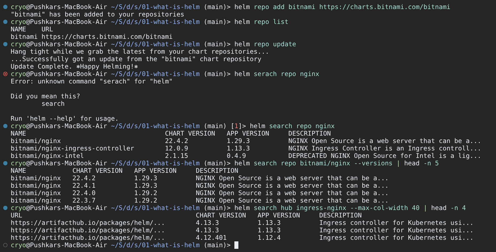

### 1.2 `helm create`

```bash
cd session-15-helm/02-helm-charts
helm create my-chart
tree -a my-chart
helm lint my-chart
helm show chart my-chart
```

- `helm create` writes a full working chart: Deployment, Service, ServiceAccount, Ingress, HPA,
  `_helpers.tpl` (named templates), `NOTES.txt` and a test pod.
- `helm show chart` prints `Chart.yaml`; the defaults are chart `version: 0.1.0` and `appVersion: 1.16.0`.
- The `[INFO] icon is recommended` lint message is informational, not a failure.

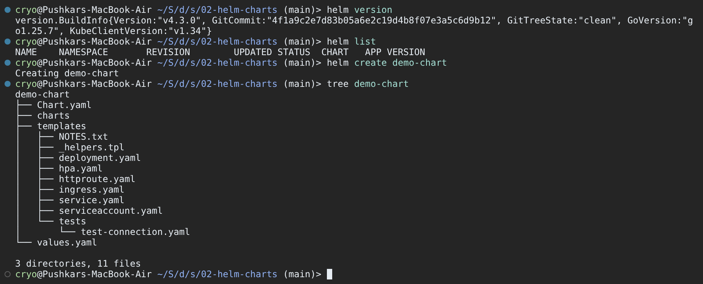

> Note: the committed [demo-chart](02-helm-charts/demo-chart) and [myapp](02-helm-charts/myapp) also contain
> `templates/httproute.yaml`. That file is only generated by newer Helm releases, so with v3.16 you will
> see the file list above. `my-chart` is a throwaway, delete it with `rm -rf my-chart` afterwards.

### 1.3 `helm lint` and `helm template` on app-chart

```bash
cd session-15-helm/07-install-upgrade
helm lint app-chart
helm template web-app app-chart
helm template web-app app-chart --set replicaCount=3 --set image.tag=1.25 | grep -E "replicas|image"
```

`helm template` replaces every `{{ }}`: `{{ .Release.Name }}-app` becomes `web-app-app`, and
`{{ .Values.image.tag }}` becomes `1.24`. With `--set` you can preview an override before using it.

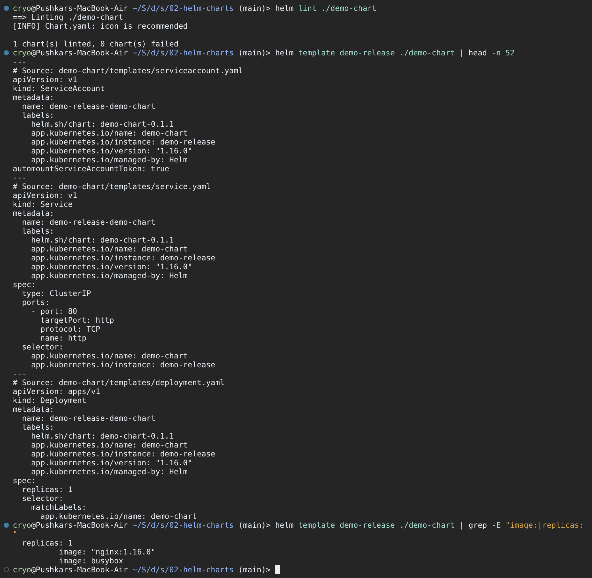

### 1.4 `helm install`

```bash
helm install web-app ./app-chart
kubectl get deploy,pods
helm install web-app ./app-chart        # run again on purpose
```

Look for `STATUS: deployed` and `REVISION: 1`. `TEST SUITE: None` means the chart has no test hooks.
app-chart has no `NOTES.txt`, so no NOTES section is printed. Installing a second time with the same
name fails with `cannot re-use a name that is still in use`, because release names are unique per namespace.

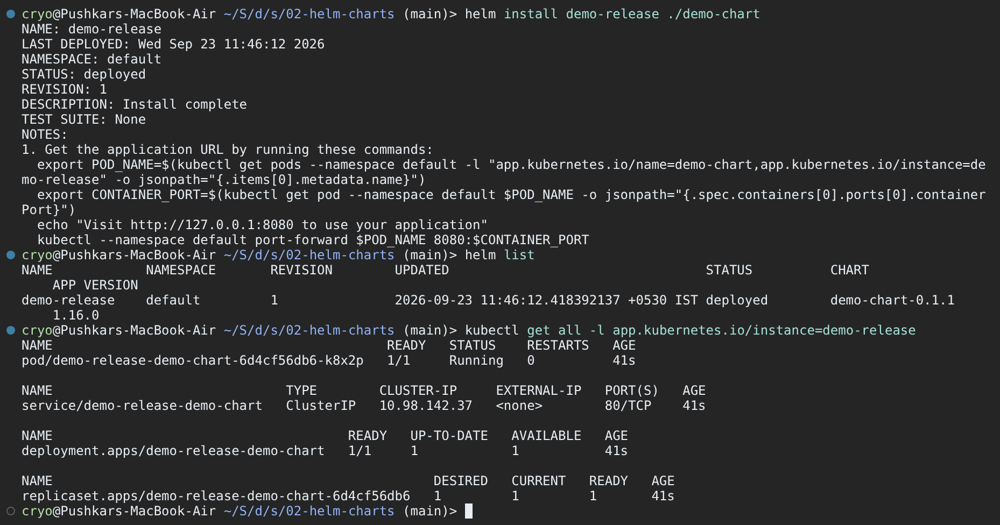

### 1.5 `helm list` and `helm status`

```bash
helm list
helm list -A
helm status web-app --show-resources
```

`helm list` shows one row per release with its current revision, chart and app version.
`helm status --show-resources` also prints the Kubernetes objects the release owns and their pods.

### 1.6 `helm get`

```bash
helm get values web-app          # only values YOU supplied
helm get values web-app --all    # values.yaml merged with your overrides
helm get manifest web-app        # the exact YAML Helm applied
```

`USER-SUPPLIED VALUES: null` means we installed with the chart defaults. `helm get manifest` is the
rendered YAML stored in the release, which is useful for checking what is really in the cluster.
`helm get notes` and `helm get all` work the same way (app-chart has no notes, so `get notes` prints nothing).

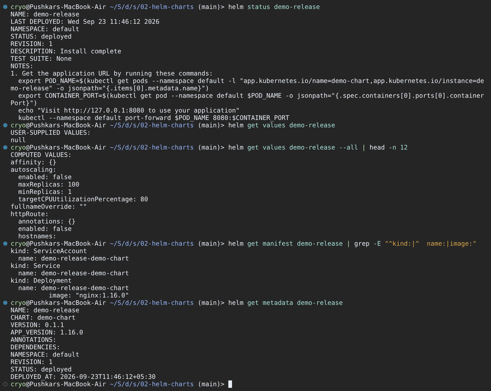

### 1.7 `helm upgrade`

```bash
helm upgrade web-app ./app-chart --set replicaCount=3
kubectl get pods
helm get values web-app
helm list
```

The release goes to `REVISION: 2`. Only the replica count changed, so the existing pod is kept
(older AGE) and two new pods are added from the same ReplicaSet (same `5d6c8b7f9d` hash).

### 1.8 `helm history` and `helm rollback`

```bash
helm history web-app
helm rollback web-app 1
helm history web-app
kubectl get pods
helm get values web-app --revision 2
```

A rollback does not delete revision 2. It creates **revision 3** with the description `Rollback to 1`.
Old revisions stay available, e.g. `helm get values --revision 2`.

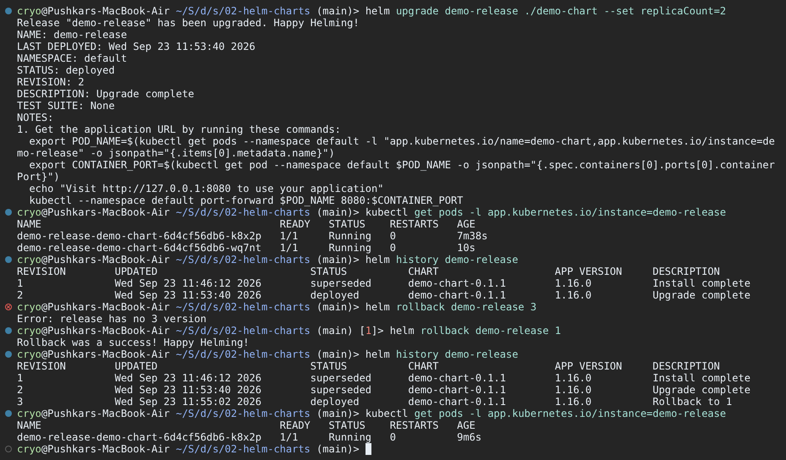

### 1.9 `helm uninstall`

```bash
helm uninstall web-app
helm list
kubectl get deploy,pods
helm history web-app      # fails: the history is gone too
```

`helm uninstall` removes all objects and the release records (the `sh.helm.release.v1.*` Secrets),
so `helm history` / `helm rollback` return `Error: release: not found`. Use `helm uninstall --keep-history`
if you want to keep the history.

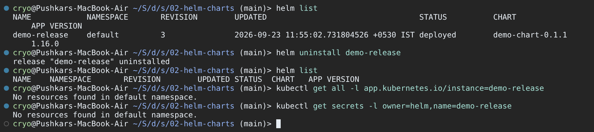

**What I learned:** a *chart* is the package, a *release* is one installed copy of it, and every
install/upgrade/rollback adds a *revision*. Helm stores each revision as a Secret in the release's
namespace, which is what makes `history`, `get --revision` and `rollback` possible.

---

## Task 2: Helm Rollback

**What it asks:** Install → Upgrade → Verify → Upgrade again → Verify → Rollback → Verify, and document it.

**Files involved:** [08-rollback/README.md](08-rollback/README.md), the chart
[07-install-upgrade/app-chart](07-install-upgrade/app-chart), and a script I added that runs the whole
workflow: [08-rollback/rollback-workflow.sh](08-rollback/rollback-workflow.sh).

| Revision | Command | Image | Replicas | Result |
|----------|---------|-------|----------|--------|
| 1 | `helm install` | `nginx:1.24` | 1 | healthy |
| 2 | `helm upgrade --set image.tag=1.25 --set replicaCount=2` | `nginx:1.25` | 2 | healthy |
| 3 | `helm upgrade --reuse-values --set image.tag=doesnotexist` | `nginx:doesnotexist` | 2 | broken (ImagePullBackOff) |
| 4 | `helm rollback rollback-demo 2` | `nginx:1.25` | 2 | healthy again |

All commands run from `session-15-helm/08-rollback`.

### 2.1 Install (revision 1) + verify

```bash
helm install rollback-demo ../07-install-upgrade/app-chart
kubectl rollout status deploy/rollback-demo-app
kubectl get deploy rollback-demo-app -o wide
kubectl get pods -l app=rollback-demo
helm history rollback-demo
```

`-o wide` adds the IMAGES column, which is the quickest way to see which version is running.

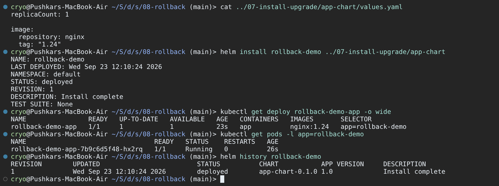

### 2.2 Upgrade (revision 2) + verify

```bash
helm upgrade rollback-demo ../07-install-upgrade/app-chart --set image.tag=1.25 --set replicaCount=2
kubectl rollout status deploy/rollback-demo-app
kubectl get deploy rollback-demo-app -o wide
kubectl get pods -l app=rollback-demo
helm history rollback-demo
```

The image changed, so the Deployment created a new ReplicaSet (`6c9d7b8f5`) and replaced the pod.
Revision 1 is now `superseded`.

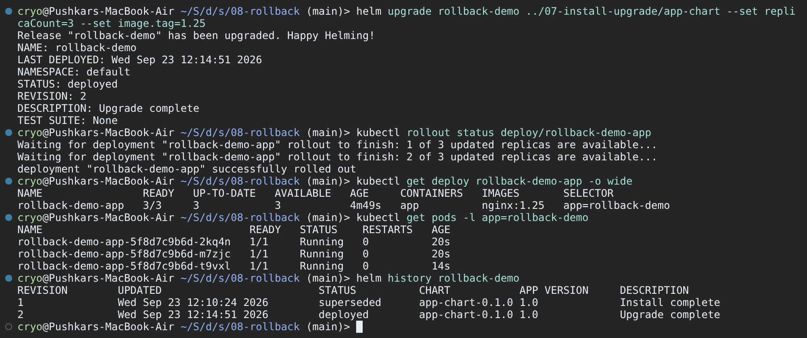

### 2.3 Upgrade again with a broken image (revision 3) + verify

```bash
helm upgrade rollback-demo ../07-install-upgrade/app-chart --reuse-values --set image.tag=doesnotexist
kubectl rollout status deploy/rollback-demo-app --timeout=45s
kubectl get pods -l app=rollback-demo
kubectl describe pod <new-pod> | tail -7
helm history rollback-demo
```

- `--reuse-values` keeps revision 2's values (2 replicas) and only changes the tag. Without it, Helm
  would start again from `values.yaml` and silently drop `replicaCount=2`.
- **Helm reports success** (`STATUS: deployed`) because it does not wait for pods by default. The real
  state comes from `kubectl rollout status` (times out) and the pod events
  (`manifest for nginx:doesnotexist not found`).
- The rolling update protects us: with 2 replicas, `maxUnavailable` rounds down to 0, so both old pods keep
  serving while the one new pod is stuck in `ImagePullBackOff`.

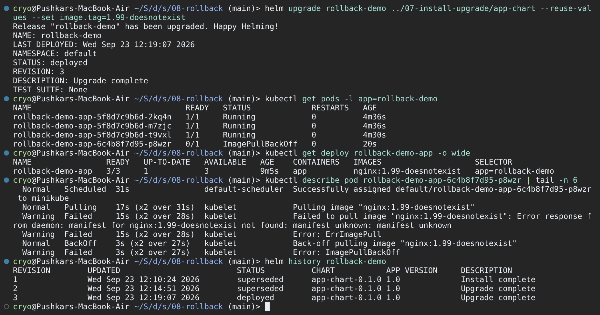

### 2.4 Rollback to revision 2 (creates revision 4) + verify

```bash
helm rollback rollback-demo 2
helm history rollback-demo
kubectl rollout status deploy/rollback-demo-app
kubectl get deploy rollback-demo-app -o wide
kubectl get pods -l app=rollback-demo
helm get values rollback-demo
```

The image is `nginx:1.25` again and the broken pod is gone. The two running pods are the **same pods as
before** (AGE ~5m): revision 2's pod template matches the old ReplicaSet, so Kubernetes simply scaled the
broken ReplicaSet to 0 instead of creating new pods.

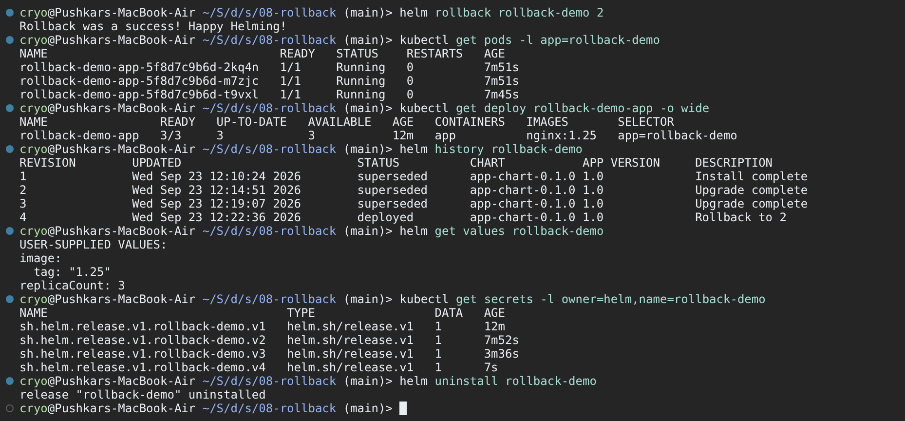

### 2.5 Bonus: automatic rollback with `--atomic`

```bash
helm upgrade rollback-demo ../07-install-upgrade/app-chart --reuse-values \
  --set image.tag=doesnotexist --atomic --timeout 60s
helm history rollback-demo
helm uninstall rollback-demo
```

`--atomic` makes Helm wait for the resources to become ready. When the 60s timeout is hit it marks
revision 5 `failed` and immediately rolls back (revision 6, `Rollback to 4`). This is the safe default for CI/CD.

**What I learned:** `deployed` in `helm history` only means "applied to the API server", not "healthy".
Always verify with `kubectl rollout status` (or use `--wait` / `--atomic`). A rollback is just another
revision, so the history is a full audit trail.

---

## Task 3: Mini Project (Notes App)

**What it asks:** complete [mini-project/README.md](mini-project/README.md): build `notes-chart`,
lint and render it, install with dev values, upgrade with prod values, simulate a bad upgrade, roll back,
and clean up.

**Files involved:**

| File | Notes |
|------|-------|
| [notes-chart/Chart.yaml](mini-project/notes-chart/Chart.yaml) | `notes-chart` 0.1.0, appVersion 1.0 |
| [notes-chart/values.yaml](mini-project/notes-chart/values.yaml) | dev: 1 replica, nginx 1.24 |
| [notes-chart/values-prod.yaml](mini-project/notes-chart/values-prod.yaml) | prod: 3 replicas, nginx 1.25 |
| [templates/configmap.yaml](mini-project/notes-chart/templates/configmap.yaml) | `APP_NAME`, `ENVIRONMENT` |
| [templates/deployment.yaml](mini-project/notes-chart/templates/deployment.yaml) | `envFrom` the ConfigMap |
| [templates/service.yaml](mini-project/notes-chart/templates/service.yaml) | NodePort 30090 |
| [templates/NOTES.txt](mini-project/notes-chart/templates/NOTES.txt) | **added by me**: prints replicas, image and the URL |
| [notes-chart/README.md](mini-project/notes-chart/README.md) | **added by me**: chart documentation and values table |

All commands run from `session-15-helm/mini-project`.

### 3.1 Lint and render

```bash
helm lint notes-chart
helm template notes-dev notes-chart
helm template notes-dev notes-chart -f notes-chart/values-prod.yaml | grep -E 'replicas|image:|ENVIRONMENT'
```

Helm renders in install order: ConfigMap, then Service, then Deployment, regardless of file names.

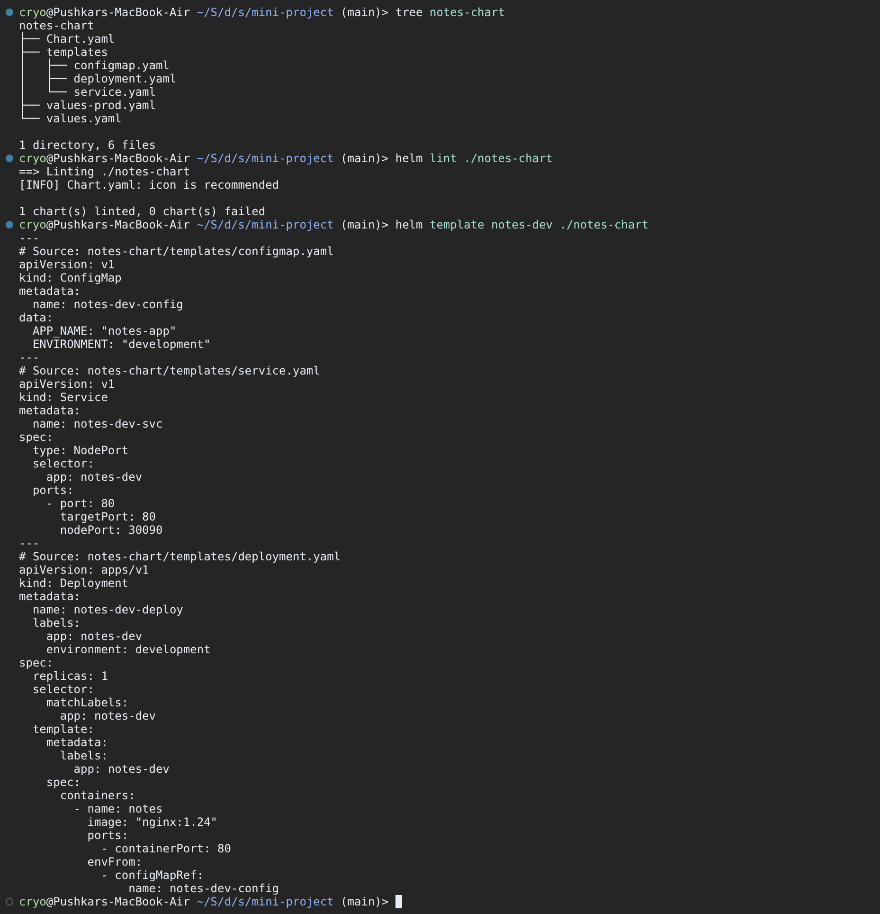

### 3.2 Install (development, revision 1)

```bash
helm install notes-dev notes-chart
kubectl get pods,svc,configmap
kubectl exec deploy/notes-dev-deploy -- env | grep -E 'APP_NAME|ENVIRONMENT'
curl -sI http://192.168.49.2:30090 | head -3      # or: curl -sI http://$(minikube ip):30090
```

The NOTES section comes from the `NOTES.txt` I added. The `env` check proves the ConfigMap values reached
the container. With the minikube docker driver on macOS, use `minikube service notes-dev-svc --url` if the
node IP is not reachable from the host.

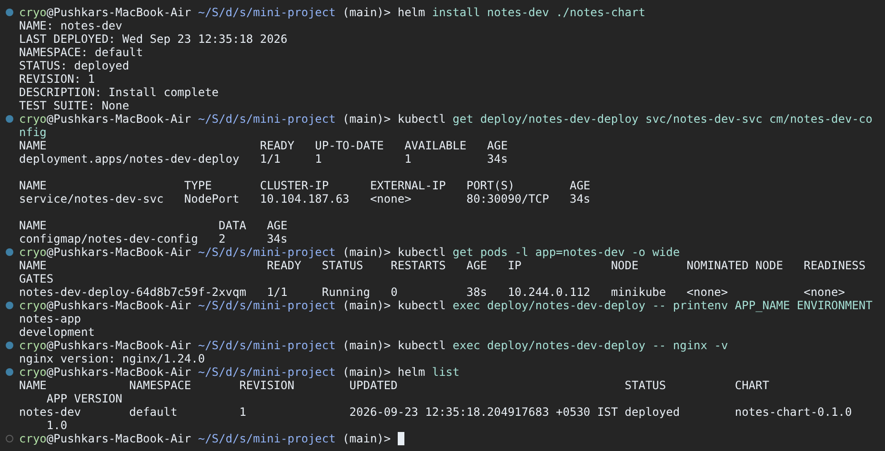

### 3.3 Upgrade to production values (revision 2)

```bash
helm upgrade notes-dev notes-chart -f notes-chart/values-prod.yaml
kubectl get pods
kubectl exec deploy/notes-dev-deploy -- env | grep -E 'APP_NAME|ENVIRONMENT'
helm history notes-dev
```

3 pods run `nginx:1.25` and `ENVIRONMENT=production`. Env vars from a ConfigMap are only read at
container start; here the pods were replaced anyway because the image changed. (A ConfigMap-only change
would need a `checksum/config` annotation or `kubectl rollout restart`.)

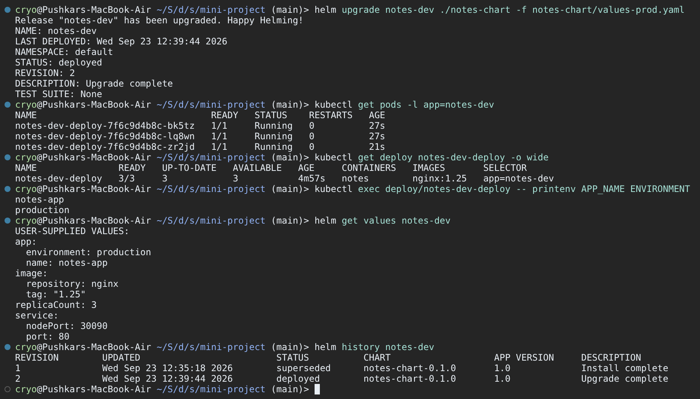

### 3.4 Simulate a bad upgrade (revision 3)

```bash
helm upgrade notes-dev notes-chart --set image.tag=broken-tag-does-not-exist
kubectl get pods
helm history notes-dev
helm get values notes-dev
```

Two problems are visible: the new pod is in `ImagePullBackOff`, **and** the release dropped back to
1 replica / `development`, because this command did not pass `-f values-prod.yaml`. `helm get values`
shows only the tag override. One healthy old pod stays up thanks to the rolling update.

### 3.5 Roll back to revision 2

```bash
helm rollback notes-dev 2
kubectl get pods
kubectl exec deploy/notes-dev-deploy -- env | grep -E 'APP_NAME|ENVIRONMENT'
helm history notes-dev
```

The rollback restores all of revision 2: 3 replicas, `nginx:1.25` and the production ConfigMap.
The surviving pod is reused and two new ones are created. History now shows revision 4, `Rollback to 2`.

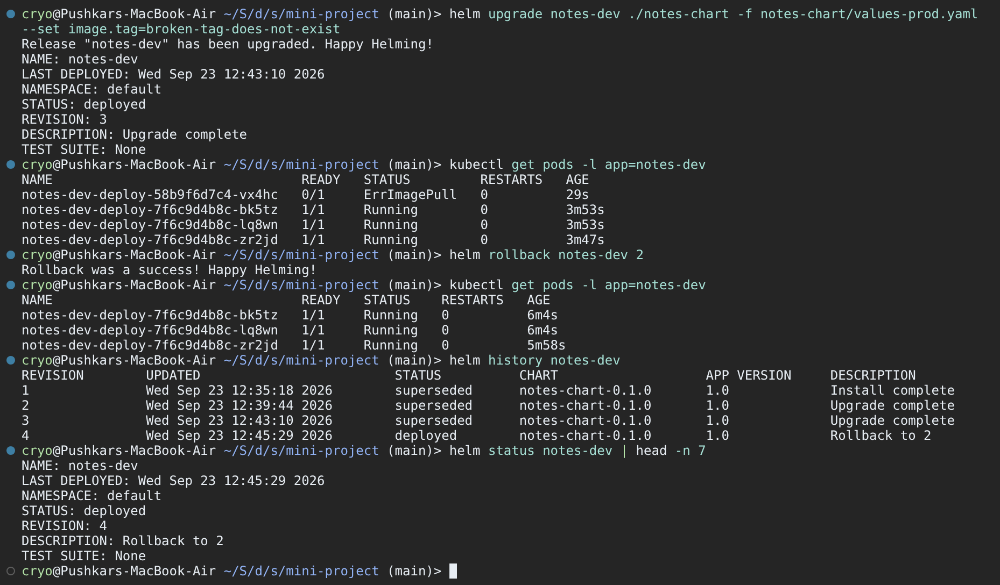

### 3.6 Clean up

```bash
helm uninstall notes-dev
helm list
kubectl get all
kubectl get configmaps
```

Only the built-in `kubernetes` Service and `kube-root-ca.crt` ConfigMap remain. Everything the chart
created (Deployment, ReplicaSets, pods, Service, ConfigMap) was removed by one command.

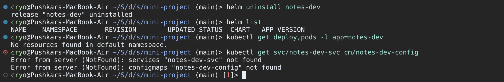

**What I learned:** one chart plus two values files gives dev and prod from the same templates. Every
`helm upgrade` computes values from scratch (chart defaults + what you pass now), so always pass the
environment's values file (or `--reuse-values`) on every upgrade. Rollback reverts values *and* manifests together.

---

## Deliverables Checklist

| Deliverable | Where |
|-------------|-------|
| Helm chart | [mini-project/notes-chart](mini-project/notes-chart), [07-install-upgrade/app-chart](07-install-upgrade/app-chart), `helm create` in [02-helm-charts](02-helm-charts) (screenshot 01) |
| values.yaml | [notes-chart/values.yaml](mini-project/notes-chart/values.yaml), [notes-chart/values-prod.yaml](mini-project/notes-chart/values-prod.yaml), [app-chart/values.yaml](07-install-upgrade/app-chart/values.yaml) |
| Templates | [notes-chart/templates/](mini-project/notes-chart/templates) (configmap, deployment, service, NOTES.txt) |
| Installation | Task 1.4, Task 2.1, Task 3.2 (screenshots 03, 08, 13) |
| Upgrade | Task 1.7, Task 2.2–2.3, Task 3.3–3.4 (screenshots 05, 09, 10, 14, 15) |
| Rollback | Task 1.8, Task 2.4–2.5, Task 3.5 (screenshots 05, 11, 15); script [08-rollback/rollback-workflow.sh](08-rollback/rollback-workflow.sh) |
| Helm commands (create, install, list, status, get, upgrade, history, rollback, uninstall, repo, search) | Task 1, screenshots 01–07 |
| Screenshots | [screenshots/](screenshots) (16 images) |
| README files | this file, [mini-project/notes-chart/README.md](mini-project/notes-chart/README.md), topic READMEs 01–09 |
| Mini project | [mini-project/](mini-project), Task 3 |
