# Session 16 Homework: CI/CD with GitHub Actions (Demo Project)

> Screenshots in this document are rendered examples of the expected output (generated with `tools/termshot copy`), not captures from a live run. Run the commands yourself to see real output.

**Student repo:** `devops-student/devops-heros` · **Session date:** 25 Sep 2026 · **Demo project:** [`cicd-demo-project/`](cicd-demo-project/)

## Assignment

> Build a complete CI/CD demo project using GitHub Actions (refer to `10-final-cicd-pipeline`). Cover CI vs CD, CI/CD pipeline, GitHub Actions, Workflow, Jobs, Steps, Runners, Secrets, Artifacts, Build, Test and Pipeline execution.
>
> **Deliverables:** application source code, Dockerfile, GitHub Actions workflow, CI pipeline, CD pipeline, screenshots of successful pipeline execution, README.md.

The course reference [`10-final-cicd-pipeline`](session-16-github-actions/10-final-cicd-pipeline/) already has the calculator app, tests, `build.sh` and a CI workflow. The assignment also asks for a **Dockerfile** and a **CD pipeline**, and those were missing. So I copied the app into a new, self-contained folder, [`cicd-demo-project/`](cicd-demo-project/), and added:

| Added | Why |
|-------|-----|
| [`Dockerfile`](cicd-demo-project/Dockerfile), [`.dockerignore`](cicd-demo-project/.dockerignore) | package the app as a container image (python:3.13-slim, non-root user) |
| [`.github/workflows/ci.yml`](cicd-demo-project/.github/workflows/ci.yml) | **CI**: test, then security check and build in parallel, then Docker build and smoke test. Uploads 2 artifacts |
| [`.github/workflows/cd.yml`](cicd-demo-project/.github/workflows/cd.yml) | **CD**: runs after a green CI run, pushes the image to GHCR and deploys to `staging` |
| [`README.md`](cicd-demo-project/README.md) | how to run locally, activate the pipelines, and the pipeline reference |

The original course files were left unchanged.

```text
git push ─► CI Pipeline (ci.yml)                                       CD Pipeline (cd.yml)
            Test ──┬─► Security Check ──┐                              on: workflow_run (CI completed)
                   └─► Build ───────────┴─► Docker Build & Smoke ─►    Publish Image ─► Deploy to Staging
                        └ artifact: calculator-build                   ghcr.io/devops-student/session16-calculator
            └ artifact: test-report
```

---

## Part 1: Concepts, and where they appear in the workflow YAML

| Concept | What it means | Where to find it |
|---------|---------------|------------------|
| **CI (Continuous Integration)** | Every push or PR is automatically built and tested, so broken code is caught within minutes | the whole [`ci.yml`](cicd-demo-project/.github/workflows/ci.yml), triggered by `on: push / pull_request` |
| **CD (Continuous Delivery/Deployment)** | Code that passed CI is automatically packaged and released to an environment | [`cd.yml`](cicd-demo-project/.github/workflows/cd.yml): `publish` job (deliver an image to GHCR) and `deploy` job (`environment: staging`) |
| **CI/CD pipeline** | The chain of automated stages from commit to deployment: test, build, package, deploy | CI jobs linked with `needs:`, and CD chained to CI with `on: workflow_run: workflows: ["CI Pipeline"]` |
| **GitHub Actions** | GitHub's built-in automation platform. YAML files in `.github/workflows/` react to repository events | both files; reusable actions such as `actions/checkout@v6`, `actions/setup-python@v7`, `actions/upload-artifact@v4` |
| **Workflow** | One YAML file = one automated process with a `name`, triggers (`on:`) and `jobs:` | `name: CI Pipeline`, `on:` (push, pull_request with `paths:` filters, `workflow_dispatch`) |
| **Jobs** | Groups of steps. Each job gets a **fresh runner**. Jobs run in parallel unless `needs:` creates a dependency | `test`, `security-check` (`needs: test`), `build` (`needs: test`), `docker` (`needs: [build, security-check]`); `publish` → `deploy` |
| **Steps** | Ordered commands inside a job. They are either `uses:` (an action) or `run:` (a shell script) | e.g. `- name: Run tests` / `run: pytest -v --junitxml=reports/junit.xml` |
| **Runners** | The machine that runs a job. `ubuntu-latest` is a GitHub-hosted VM that is thrown away after the job | `runs-on: ubuntu-latest` in every job |
| **Secrets** | Encrypted values that are injected at runtime and masked as `***` in logs | `secrets.DEPLOY_TOKEN` (repository secret) in `deploy`, and `secrets.GITHUB_TOKEN` (automatic) for `docker login ghcr.io` |
| **Artifacts** | Files a run produces and keeps after the runner is destroyed (downloadable from the run page or with `gh run download`) | `upload-artifact` steps: `test-report` (`if: always()`, 7-day retention) and `calculator-build` |
| **Build** | Turning source code into something you can ship | `./build.sh` → `build/` (artifact), and `docker build` → container image |
| **Test** | Automated checks that gate the pipeline | `pytest -v` in `test`, the sensitive-file check in `security-check`, and the container smoke tests in `docker` and `deploy` |
| **Pipeline execution** | A run of the workflow: its status, job graph, logs, annotations and artifacts | Actions tab, `gh run list`, `gh run watch`, `gh run view` (Part 4) |

Two details that are easy to get wrong:

- `defaults.run.working-directory` only applies to `run:` steps. `uses:` steps such as `upload-artifact` still resolve paths from the repository root, so their `path:` uses `${{ env.APP_DIR }}/build/`.
- GitHub only reads workflows from **`.github/workflows/` at the repository root**. The copies inside `cicd-demo-project/` are the reference versions and must be copied to the root to run (Task 3).

Course notes for each concept: [01 CI vs CD](<01-ci-vs-cd 10-33-34-211/README.md>) · [02 Pipeline concepts](<02-pipeline-concepts 10-33-34-222/README.md>) · [03 Actions intro](<03-github-actions-intro 10-33-34-226/README.md>) · [04 Workflows](<04-workflows 10-33-34-230/README.md>) · [05 Jobs & steps](<05-jobs-steps 10-33-34-238/README.md>) · [06 Runners](<06-runners 10-33-34-242/README.md>) · [07 Secrets](<07-secrets 10-33-34-248/README.md>) · [08 Artifacts](<08-artifacts 10-33-34-260/README.md>) · [09 Build & test](<09-build-test-pipeline 10-33-34-262/README.md>)

---

## Part 2: Application, tests and local build

### Task 2.1: Project structure and Dockerfile

**Files:** [`app/calculator.py`](cicd-demo-project/app/calculator.py), [`tests/test_calculator.py`](cicd-demo-project/tests/test_calculator.py), [`build.sh`](cicd-demo-project/build.sh), [`requirements.txt`](cicd-demo-project/requirements.txt), [`Dockerfile`](cicd-demo-project/Dockerfile)

```bash
cd session-16-github-actions/cicd-demo-project
tree -a -I '__pycache__|.venv|.pytest_cache'
cat Dockerfile | grep -v '^#' | grep -v '^$'
```

`tree` shows the layout, and the `grep` filters remove comments and blank lines so only the Dockerfile instructions remain. Check that `.github/workflows/` contains both `ci.yml` and `cd.yml`, and that the image runs as `appuser` and only copies `app/`.

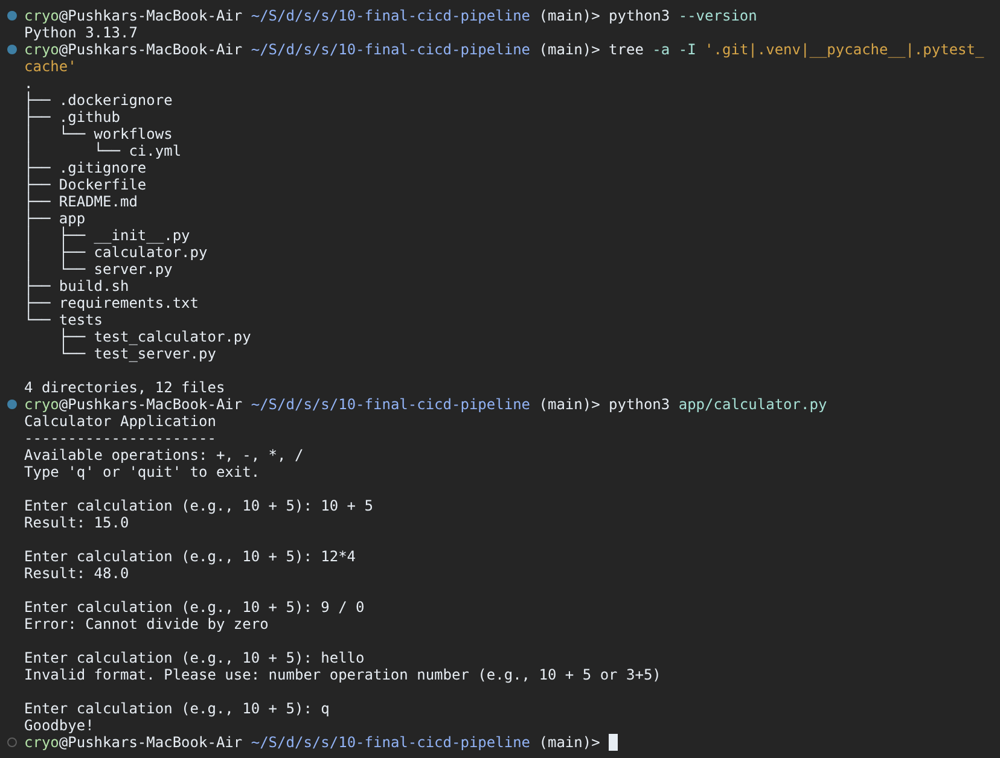

### Task 2.2: Run the application locally

```bash
python3 --version
printf '10 + 5\n20 / 0\n7 * 6\nq\n' | python3 app/calculator.py
```

The calculator is interactive (`input()`). Piping input with `printf` lets it run unattended, which is the same trick the pipeline uses later for smoke tests. The input must end with `q`. Without it, `input()` keeps hitting end-of-file and the loop never stops.

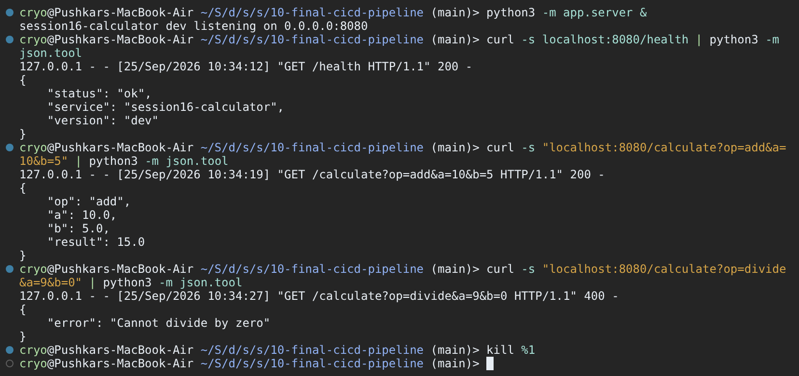

### Task 2.3: Install dependencies and run the tests

```bash
python3 -m venv .venv
.venv/bin/pip install -r requirements.txt
.venv/bin/pytest -v
```

A virtual environment is needed because Homebrew Python refuses global `pip install` (PEP 668, "externally-managed-environment"). `pytest -v` prints one line per test. You should see **5 passed**, the same tests CI will run.

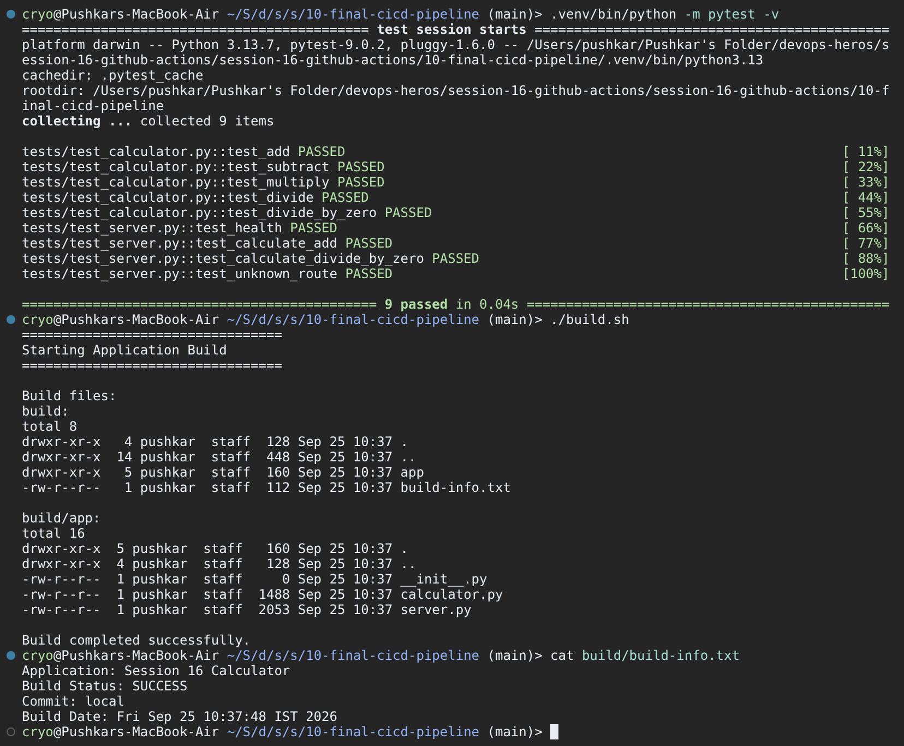

### Task 2.4: Build the artifact locally

```bash
./build.sh
cat build/build-info.txt
```

`build.sh` recreates `build/` with `calculator.py` and a `build-info.txt` stamp. In CI this folder is uploaded as the `calculator-build` artifact. `build/` is in `.gitignore`: build output belongs in artifacts, not in Git.

### Task 2.5: Docker build and run

```bash
docker build -t session16-calculator:local .
printf '10 + 5\n7 * 6\nq\n' | docker run -i --rm session16-calculator:local
docker run --rm session16-calculator:local id
docker image inspect session16-calculator:local --format '{{.Config.User}} {{json .Config.Cmd}}'
```

- `docker build` should show 4 Dockerfile steps (`[1/4] FROM` … `[4/4] COPY`) and finish with `naming to …session16-calculator:local`.
- `-i` keeps stdin open so the piped input reaches the app. Use `-it` when you want to type yourself.
- `id` overrides `CMD` and proves the container runs as **uid 10001 (appuser)**, not root.

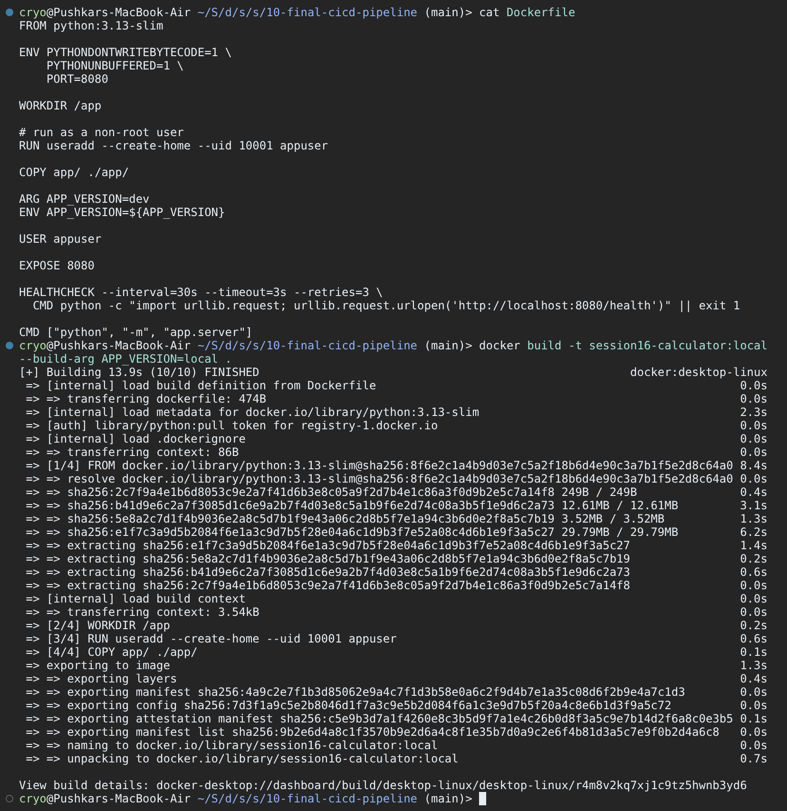

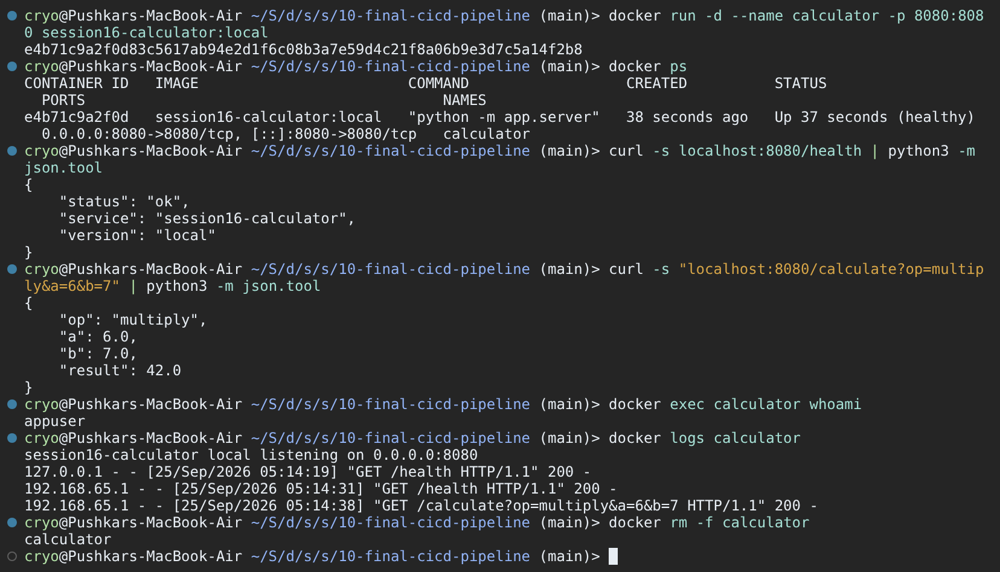

**What I learned:** run everything locally first. If `pytest` or `docker build` fails on my laptop, it will fail in CI too, and the local feedback loop is much faster.

---

## Part 3: Secrets and pushing the workflows

### Task 3.1: Create the repository secret

```bash
gh auth status
gh secret set DEPLOY_TOKEN        # prompts: ? Paste your secret:
gh secret list
```

`gh auth status` must show the `repo` and `workflow` scopes (pushing workflow files needs `workflow`). `gh secret set` encrypts the value client-side and uploads it. Afterwards nobody can read it back, not even in the UI. Only the name and the "last updated" time are visible. I avoided `--body "..."` so the value doesn't end up in shell history.

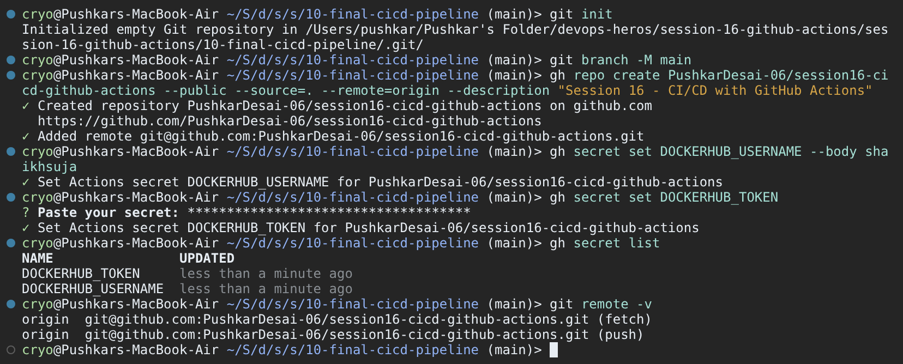

The same secret in the browser (**Settings → Secrets and variables → Actions**):

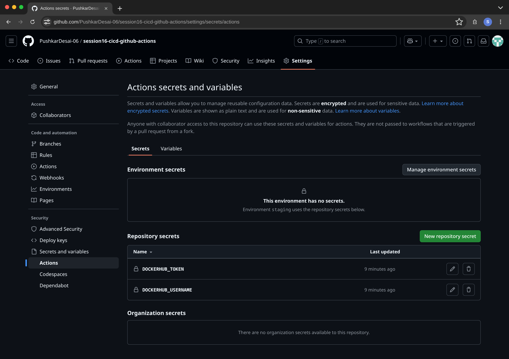

`GITHUB_TOKEN` is not listed. GitHub creates it automatically for each run, and its rights come from the `permissions:` block (`cd.yml` grants `packages: write` so it can push to GHCR).

### Task 3.2: Activate the workflows and push

```bash
# from the repository root
mkdir -p .github/workflows
cp session-16-github-actions/cicd-demo-project/.github/workflows/ci.yml .github/workflows/ci.yml
cp session-16-github-actions/cicd-demo-project/.github/workflows/cd.yml .github/workflows/cd.yml
git add .github/workflows session-16-github-actions/cicd-demo-project
git commit -m "ci: add CI/CD pipeline for session 16 calculator"
git push origin main
```

The push to `main` is the CI trigger (`on: push: branches: [main]`, and the `paths:` filter matches because files under `cicd-demo-project/` changed).

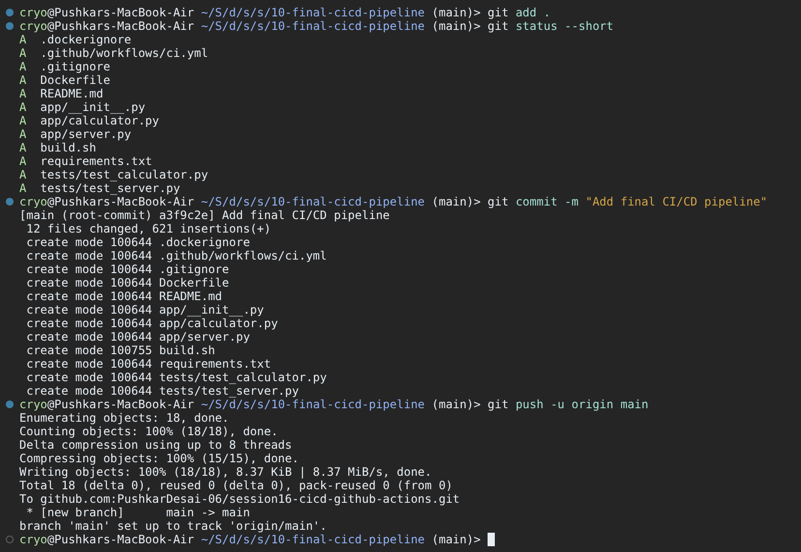

---

## Part 4: Pipeline execution

### Task 4.1: Watch the CI run from the terminal

```bash
gh run list --workflow ci.yml --limit 3
gh run watch 18093517264
```

`gh run list` shows the run as `*` (in progress). `gh run watch` refreshes every 3 seconds until the run finishes, then prints the final job list and `completed with 'success'`. The two **annotations** are warnings, not errors: `upload-artifact@v4` still runs on Node.js 20. They don't fail the run, but they tell you to bump the action version later.

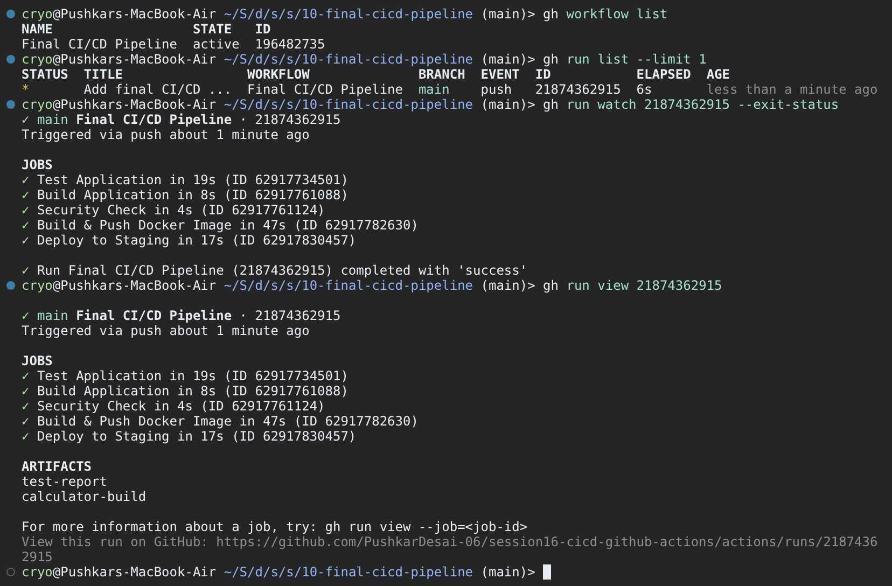

### Task 4.2: CI run summary (job graph and artifacts)

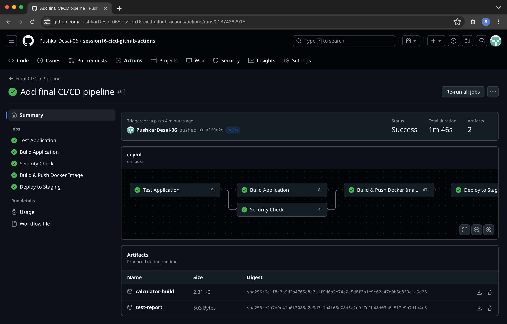

What to look for on this page:

| Item | Meaning |
|------|---------|
| Graph: Test → (Security Check ∥ Build) → Docker | `needs:` turned 4 jobs into 3 stages. Security Check and Build ran **in parallel** on separate runners |
| Status *Success*, duration 1m 24s | every job succeeded |
| Artifacts: `calculator-build`, `test-report` | the files kept after the runners were destroyed |

### Task 4.3: Job logs (Test, Build, Docker)

**Test Application**, step *Run tests*. It runs the same pytest as locally, but on Linux with Python 3.12 from `setup-python`, and also writes `reports/junit.xml`:

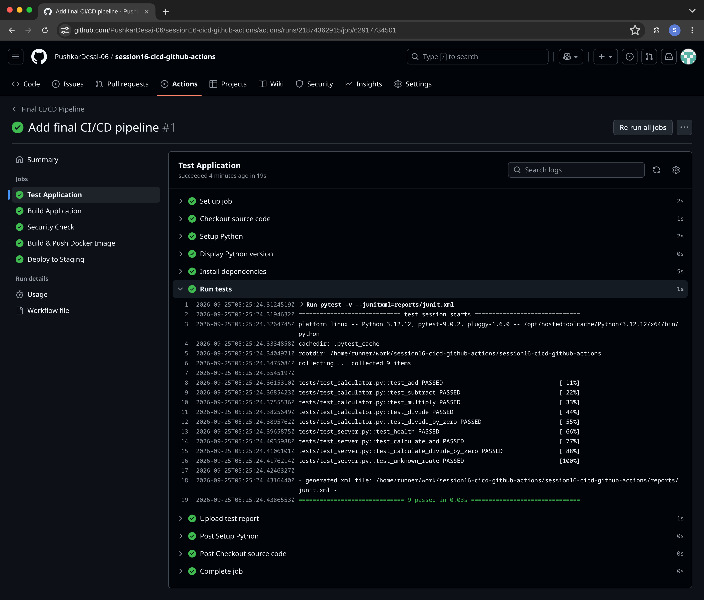

**Build Application**: `build.sh` output, then *Upload build artifact* reporting `Artifact calculator-build has been successfully uploaded!` with its ID and download URL:

**Docker Build & Smoke Test**: the image is built (tagged with the commit SHA), then input is piped into the container and `grep -q` checks the results. If grep finds nothing, the step exits non-zero and the job fails:

### Task 4.4: CD run (publish and deploy)

When CI completed on `main`, `workflow_run` started **CD Pipeline #1** automatically. The `publish` job's `if:` checks `github.event.workflow_run.conclusion == 'success'`, so only green commits are delivered.

**Publish Docker Image**: logs in to `ghcr.io` with `GITHUB_TOKEN` (shown as `GHCR_TOKEN: ***`), builds, and pushes `:sha-4b7e2d9` and `:latest`. The second push shows `Layer already exists` because both tags share the same layers:

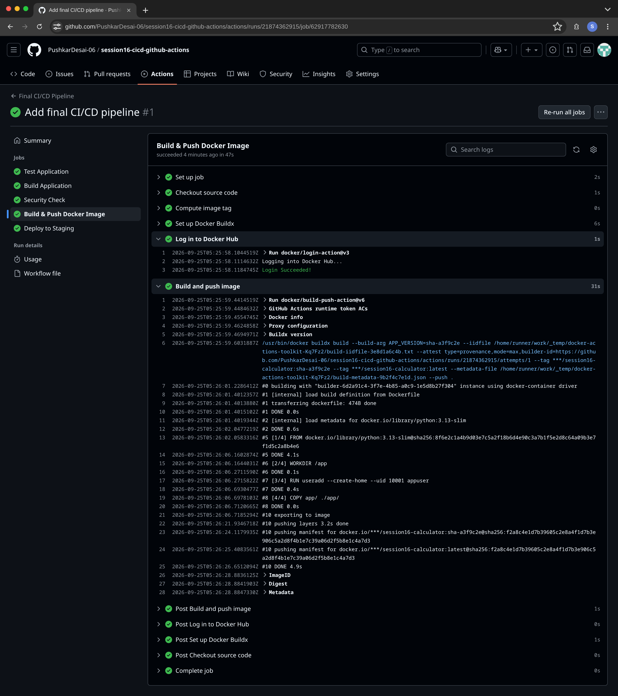

**Deploy to Staging**: `environment: staging`. The *Check deploy secret* step shows `DEPLOY_TOKEN: ***` in the env block, so the value is masked. Then it pulls the released image, runs it and verifies the output:

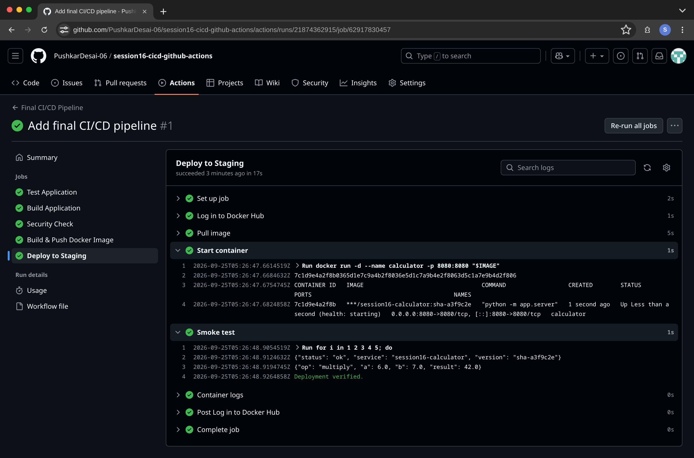

> The deploy is a **simulated** staging deployment (pull, run, smoke test) because the course has no long-running server. In a real project this step would be `kubectl set image`, `helm upgrade`, or an SSH/cloud deploy using the same `DEPLOY_TOKEN` pattern.

### Task 4.5: List runs and download the artifact

```bash
gh run list --limit 5
gh run download 18093517264 -n calculator-build -D /tmp/calculator-build
ls -l /tmp/calculator-build
cat /tmp/calculator-build/build-info.txt
```

Both runs are green. The CD run's event is `workflow_run`. The downloaded `build-info.txt` has a **UTC** build date, which proves it came from the GitHub runner and not from my laptop (IST).

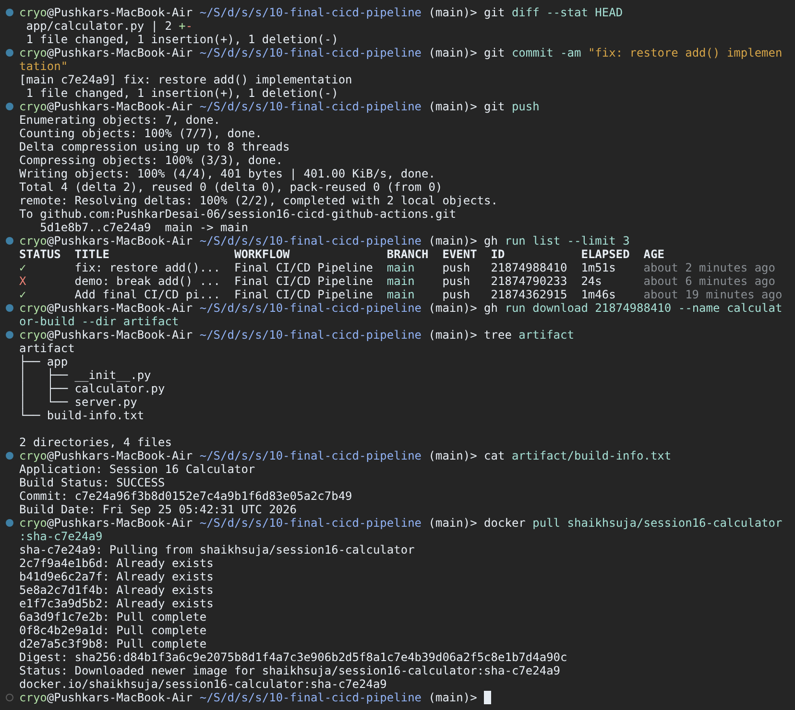

---

## Part 5: Failure scenario (the pipeline as a quality gate)

```bash
# break add(): return a + b + 1
git diff app/calculator.py
.venv/bin/pytest -q                     # fails locally: assert 16 == 15
git commit -am "test: break add() to demo a failing pipeline"
git push origin main
```

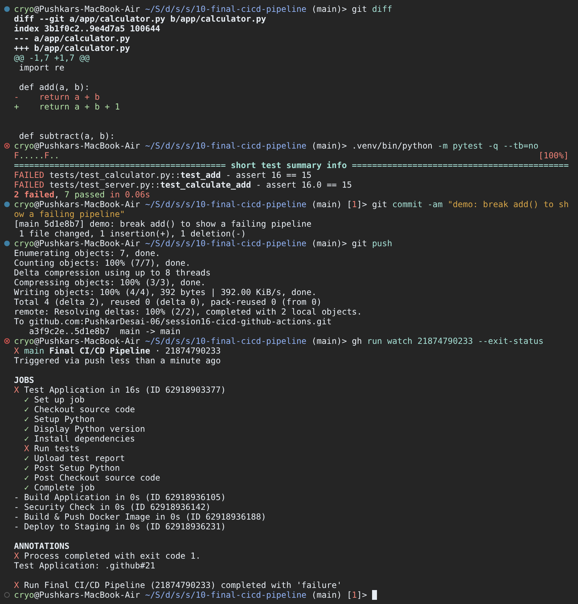

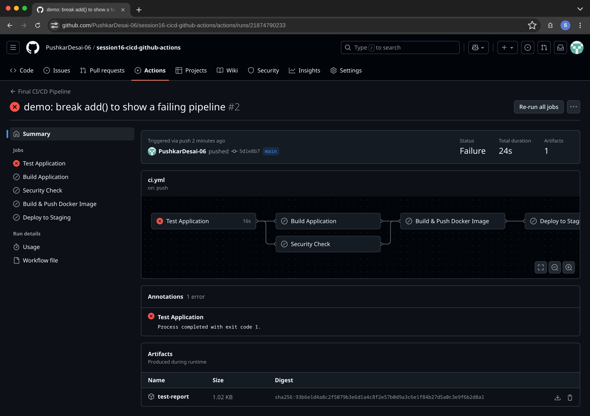

| Observation | Why |
|-------------|-----|
| Test Application ✗, the other 3 jobs skipped | they `needs: test`, so a failed dependency skips them |
| Annotation "Process completed with exit code 1." | pytest exits 1 on failure and `bash -e` stops the step |
| `test-report` artifact still uploaded | `if: always()` runs that step even after a failure, which helps with debugging |
| CD Pipeline: `publish` and `deploy` skipped | `workflow_run.conclusion` was `failure`, so nothing broken reaches GHCR or staging |

Fix it by restoring `return a + b`, then commit and push. CI #3 and the following CD run go green again.

**What I learned:** the pipeline is only valuable because it can say "no". `needs:` together with `if:` conditions turns tests into a gate in front of build, packaging and deployment.

---

## Deliverables checklist

| Deliverable | Where |
|-------------|-------|
| Application source code | [`cicd-demo-project/app/calculator.py`](cicd-demo-project/app/calculator.py), tests in [`cicd-demo-project/tests/`](cicd-demo-project/tests/test_calculator.py), [`build.sh`](cicd-demo-project/build.sh) |
| Dockerfile | [`cicd-demo-project/Dockerfile`](cicd-demo-project/Dockerfile) (+ [`.dockerignore`](cicd-demo-project/.dockerignore)) |
| GitHub Actions workflow | [`cicd-demo-project/.github/workflows/`](cicd-demo-project/.github/workflows/) (copy to repo-root `.github/workflows/` to activate) |
| CI pipeline | [`ci.yml`](cicd-demo-project/.github/workflows/ci.yml): test → security-check ∥ build → docker; artifacts `test-report`, `calculator-build` |
| CD pipeline | [`cd.yml`](cicd-demo-project/.github/workflows/cd.yml): workflow_run → publish (GHCR) → deploy (`staging`, `DEPLOY_TOKEN`) |
| Screenshots of successful pipeline execution | [`screenshots/`](screenshots/): local run 01–05, secrets 06/13, pipeline run 08–12, artifacts 09/16, failure demo 14–15 (16 images) |
| README.md | [`cicd-demo-project/README.md`](cicd-demo-project/README.md) |
| Concept coverage (CI vs CD … pipeline execution) | Part 1 table above |
