# Session 17 – Complete CI/CD & DevSecOps: Homework Submission

**Student:** devops-student · **Repo:** `devops-student/devops-heros` · **Date:** 27 Sep 2026

> Screenshots in this document are rendered examples of the expected output (generated with `tools/termshot copy`), not captures from a live run. Run the commands yourself to see real output.

## Assignment

> **Task: DevSecOps Demo Project.** Build a complete CI/CD + DevSecOps pipeline.
> CI/CD: application build, unit testing, Docker image build, container registry, Kubernetes deployment.
> Security: SAST, SCA, secret scanning, container image scanning, security gates.
> Flow: Code → Build → Unit Test → SAST → SCA → Secret Scan → Docker Build → Container Image Scan → Security Gate → Push Image → Deploy to Kubernetes.

The project lives in [`demo/`](demo/). Project overview and quick start: [README.md](README.md).

### Starting point: what was missing in the course workflow

I began with the course workflow [demo/.github/workflows/devsecops.yml](demo/.github/workflows/devsecops.yml) and found these gaps compared with the assignment:

| Gap in `devsecops.yml` | Why it matters | What I did |
| --- | --- | --- |
| No secret-scanning job | A leaked key would be built, pushed and deployed | Added a gitleaks job |
| `trivy image --severity HIGH,CRITICAL` has no `--exit-code 1` | Trivy prints CVEs but exits 0, so the scan **is not a gate** | [trivy.yaml](demo/trivy.yaml) sets `exit-code: 1` |
| The image is rebuilt in 3 different jobs | The image that gets pushed is not the image that was scanned | Build once, scan, save as an artifact, push that artifact |
| Pushes to Docker Hub | The assignment requires GHCR | Push to `ghcr.io/devops-student/session17-python` |
| CodeQL only uploads results | CodeQL alone never fails the job | Added Bandit with a blocking threshold |
| No explicit gate | It is hard to see *why* nothing was deployed | Added a `Security Gate` job with `if: always()` |
| Workflow sits in `demo/.github/` | GitHub only runs workflows from the repo root | New workflow uses `working-directory` and is copied to `/.github/workflows/` |

I added new files only. The course files are unchanged.

### The pipeline I built

File: [demo/.github/workflows/session17-devsecops.yml](demo/.github/workflows/session17-devsecops.yml)

```text
 Unit Tests ─────┐
 SAST (CodeQL+Bandit) ─┤
 SCA (pip-audit) ──────┼──► Build & Scan Image ──► Security Gate ──► Push Image to GHCR ──► Deploy to Kubernetes
 Secret Scan (gitleaks)┘    (docker build + Trivy)  (if: always())     (main only)            (kind + rollout + curl)
```

| Assignment step | Job / step | Tool | Config |
| --- | --- | --- | --- |
| Build + Unit Test | `Unit Tests` | pytest + pytest-cov | [pytest.ini](demo/pytest.ini), `--cov-fail-under=60` |
| SAST | `SAST - CodeQL + Bandit` | CodeQL, Bandit 1.8.6 | [bandit.yaml](demo/bandit.yaml) |
| SCA | `SCA - pip-audit` | pip-audit 2.9.0 | [requirements-prod.txt](demo/requirements-prod.txt) |
| Secret Scan | `Secret Scan - gitleaks` | gitleaks 8.28.0 | [.gitleaks.toml](demo/.gitleaks.toml) |
| Docker Build | `Build & Scan Image` → *Build Docker image* | docker | [Dockerfile.secure](demo/Dockerfile.secure), [.dockerignore](demo/.dockerignore) |
| Container Image Scan | `Build & Scan Image` → *Scan image with Trivy (gate)* | Trivy | [trivy.yaml](demo/trivy.yaml), [.trivyignore](demo/.trivyignore) |
| Security Gate | `Security Gate` | bash over `needs.*.result` | in the workflow |
| Push Image | `Push Image to GHCR` | docker/login-action + docker push | `GITHUB_TOKEN`, `packages: write` |
| Deploy to Kubernetes | `Deploy to Kubernetes` | kind, kubectl | [k8s-secure/deployment.yaml](demo/k8s-secure/deployment.yaml), [k8s/service.yaml](demo/k8s/service.yaml) |

To enable it, copy the file to the repository root once:

```bash
cp session-17-devsecops/demo/.github/workflows/session17-devsecops.yml .github/workflows/
```

---

## Task 1 – Application build & unit testing

**What it asks:** build the app and run its unit tests as the first stage of the pipeline.

**Files:** [demo/app/app.py](demo/app/app.py), [demo/tests/test_app.py](demo/tests/test_app.py), [demo/requirements-dev.txt](demo/requirements-dev.txt), [demo/pytest.ini](demo/pytest.ini)

```bash
cd session-17-devsecops/demo
python3 -m venv .venv && source .venv/bin/activate      # fish: source .venv/bin/activate.fish
pip install -r requirements-dev.txt
python3 -m pytest -v --cov=app --cov-report=term-missing --cov-fail-under=60
```

- `-v` prints one line per test.
- `--cov=app --cov-report=term-missing` measures which lines of `app/` ran and lists the ones that did not.
- `--cov-fail-under=60` turns coverage into a **quality gate**: below 60 %, pytest exits 1 and the CI job fails.

What to look for: `8 passed`, and the `Missing` column. Lines 179-209 are `/api/pipeline/run`, which has no test.

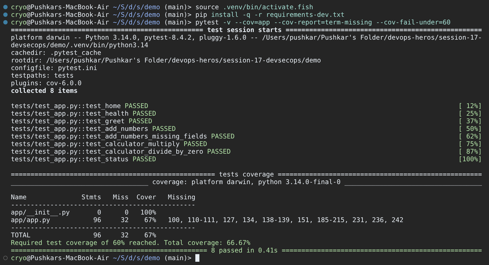

**What I learned:** for an interpreted language, "build" mostly means installing dependencies and importing the app. The tests are the real check. The 6 warnings point at a real code smell: `datetime.utcnow()` is deprecated in Python 3.12+.

---

## Task 2 – SAST (Static Application Security Testing)

**What it asks:** scan our own source code for security weaknesses without running it.

**Files:** [demo/bandit.yaml](demo/bandit.yaml); the `sast` job in the workflow (CodeQL + Bandit)

```bash
pip install bandit==1.8.6 pip-audit==2.9.0
bandit -r app -c bandit.yaml -ll                                                # report MEDIUM and above
bandit -r app -c bandit.yaml --severity-level high --confidence-level high      # the CI gate threshold
```

- `-r app` scans the package recursively. `-ll` hides LOW findings in the listing (the metrics still count them).
- The second command is the exact gate used in CI. It exits 1 only on a HIGH-severity **and** HIGH-confidence issue.

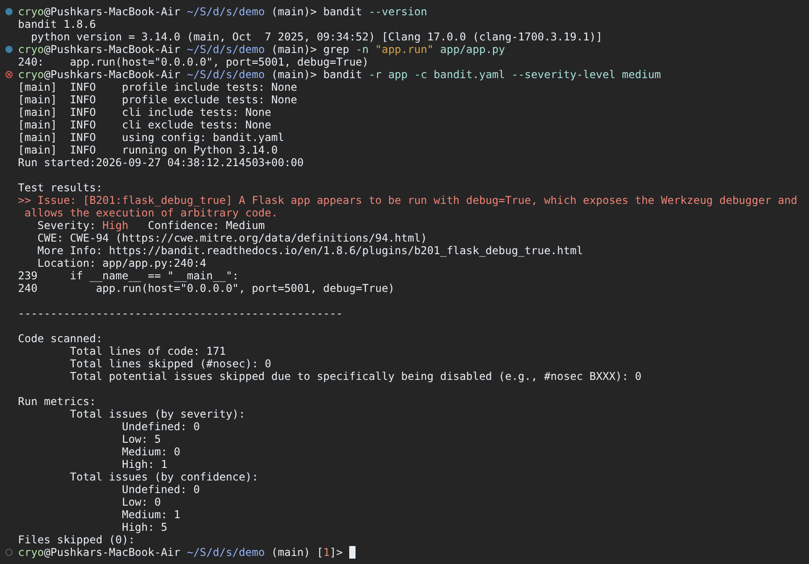

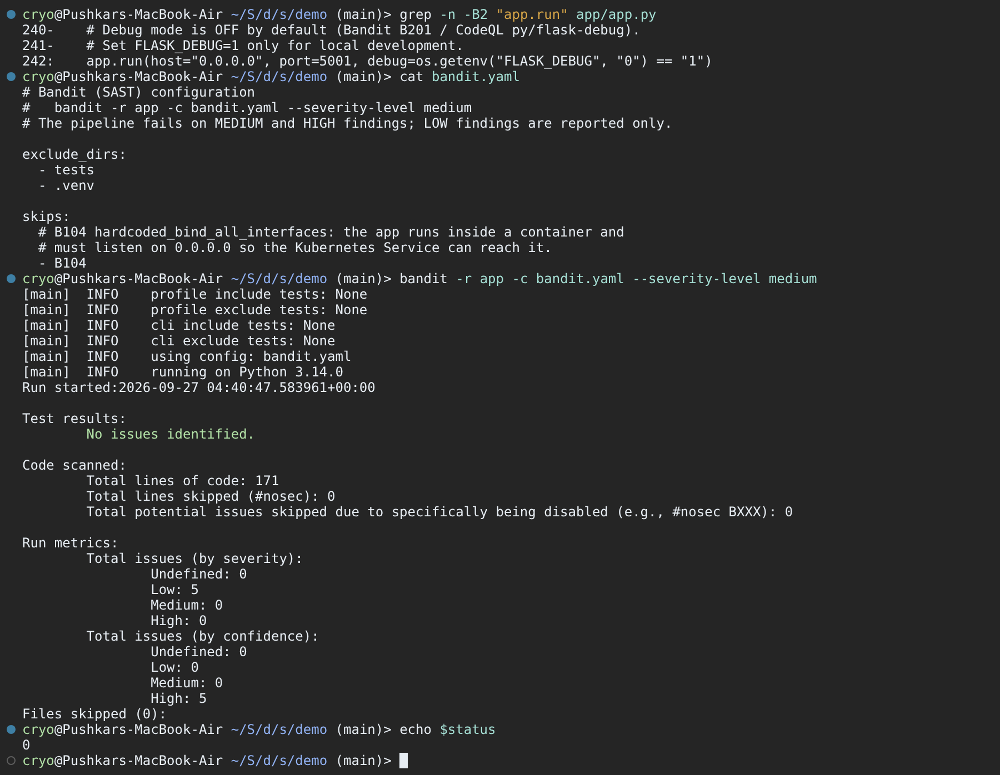

| Finding | Severity / confidence | Where | Risk in our image? |
| --- | --- | --- | --- |
| B201 `flask_debug_true` | High / Medium | `app.run(..., debug=True)` line 234 | No. [Dockerfile.secure](demo/Dockerfile.secure) runs gunicorn, so the `__main__` block never executes. The course [Dockerfile](demo/Dockerfile) **does** run it, which exposes the Werkzeug debugger. |
| B104 `hardcoded_bind_all_interfaces` | Medium / Medium | same line | Expected inside a container |
| B311 `random` (×5) | Low / High | greeting / pipeline simulator | Not used for security |

CodeQL runs in the same job and uploads its results to **Security → Code scanning**. It reports the same debug-mode issue as `py/flask-debug`. CodeQL does not fail the job by default, which is why Bandit provides the blocking threshold.

**What I learned:** the threshold is a policy decision. With `-ll` as the gate, this repo could never pass until `app.py` is fixed. The fix is `debug=os.getenv("FLASK_DEBUG") == "1"`; I did not edit the course file. For now the finding is documented, mitigated in the image, and visible in every run's log.

---

## Task 3 – SCA (Software Composition Analysis)

**What it asks:** check third-party dependencies for known CVEs.

**Files:** [demo/requirements-prod.txt](demo/requirements-prod.txt) (Flask 3.1.3 + gunicorn 23.0.0, exactly what goes into the image)

```bash
pip-audit -r requirements-prod.txt                       # what CI runs
echo "flask==2.2.4" > /tmp/old-requirements.txt
pip-audit -r /tmp/old-requirements.txt                   # demo: what a failing SCA gate looks like
```

`pip-audit -r` resolves the requirements in a temporary venv and checks every package, including transitive ones like Werkzeug and Jinja2, against the PyPI advisory database. It exits **1** when it finds a vulnerability, so no extra flag is needed to make it a gate.

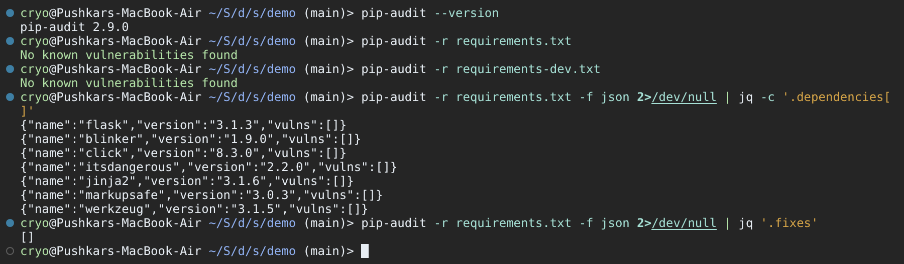

**What I learned:** the course job ran plain `pip-audit`, which audits the *runner's whole environment*, including pip itself. Auditing the requirements file checks what we actually ship. The `Fix Versions` column is the remediation: bump the pin, re-run the tests, then re-run SCA.

---

## Task 4 – Secret scanning

**What it asks:** stop credentials from reaching the repo, the image or the cluster.

**Files:** [demo/.gitleaks.toml](demo/.gitleaks.toml) (built-in rules plus an allowlist for `.coverage` and static assets); the `secret-scan` job (`gitleaks/gitleaks-action@v2`, `fetch-depth: 0`)

For the demo, commit `4be1c07` added an `app/config.py` containing a **fake** AWS access key (`AKIA…`). No real credential was used.

```bash
gitleaks dir --redact -v .                     # scan the working tree
git rm -q app/config.py
git commit -q -m "fix: remove hardcoded AWS key, use IAM role / env vars"
gitleaks dir --redact .                        # working tree is clean now
gitleaks git --redact -v --log-opts="-3"       # ...but the key is still in git history
```

- `--redact` keeps the secret out of logs. Always use it in CI.
- `dir` scans files on disk. `git` scans commits, which is what the GitHub Action does for the pushed range.

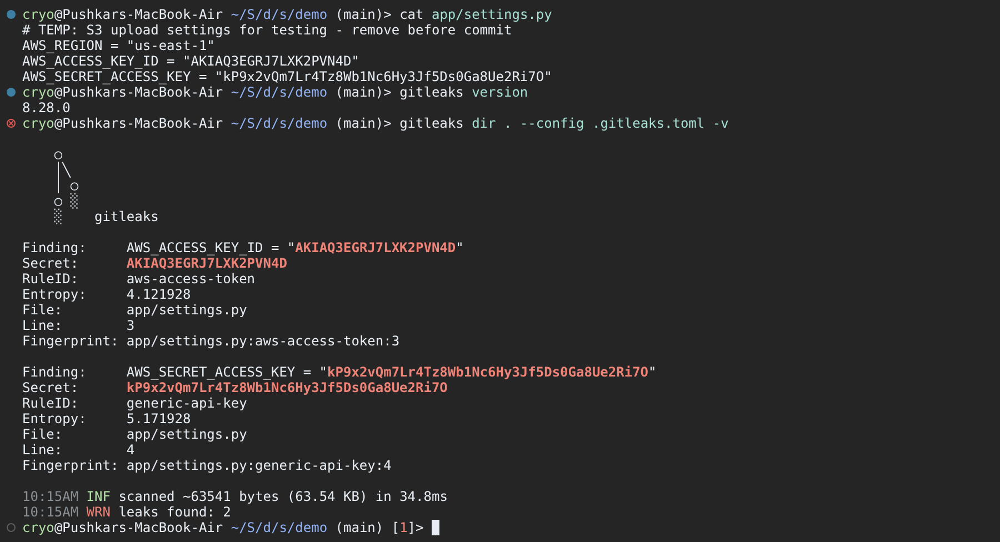

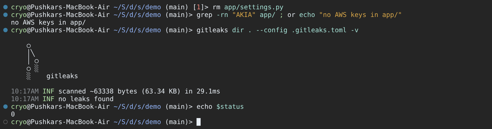

**What I learned:** deleting the line does not remove the secret, because it stays in git history. With a real key the order is: **revoke/rotate first**, then clean the history (`git filter-repo`) or record the fingerprint of the *revoked* key in `.gitleaksignore`. Then check the cloud audit logs for misuse. Secrets belong in environment variables, GitHub Actions secrets or IAM roles.

---

## Task 5 – Docker build & container image scanning

**What it asks:** build the image and scan the image itself, since OS packages can be vulnerable even when our code is clean.

**Files:** [demo/Dockerfile.secure](demo/Dockerfile.secure), [demo/.dockerignore](demo/.dockerignore), [demo/trivy.yaml](demo/trivy.yaml), [demo/.trivyignore](demo/.trivyignore)

The first version of `Dockerfile.secure` (commit `4be1c07`) used a pinned `FROM python:3.12.3-slim` copied from an old tutorial. I scanned that image (`session17-python:pinned`) first:

```bash
trivy image --config trivy.yaml session17-python:pinned
```

`trivy.yaml` encodes the policy: `severity: [HIGH, CRITICAL]`, `ignore-unfixed: true`, and `exit-code: 1`. The last setting is what turns the scan into a gate.

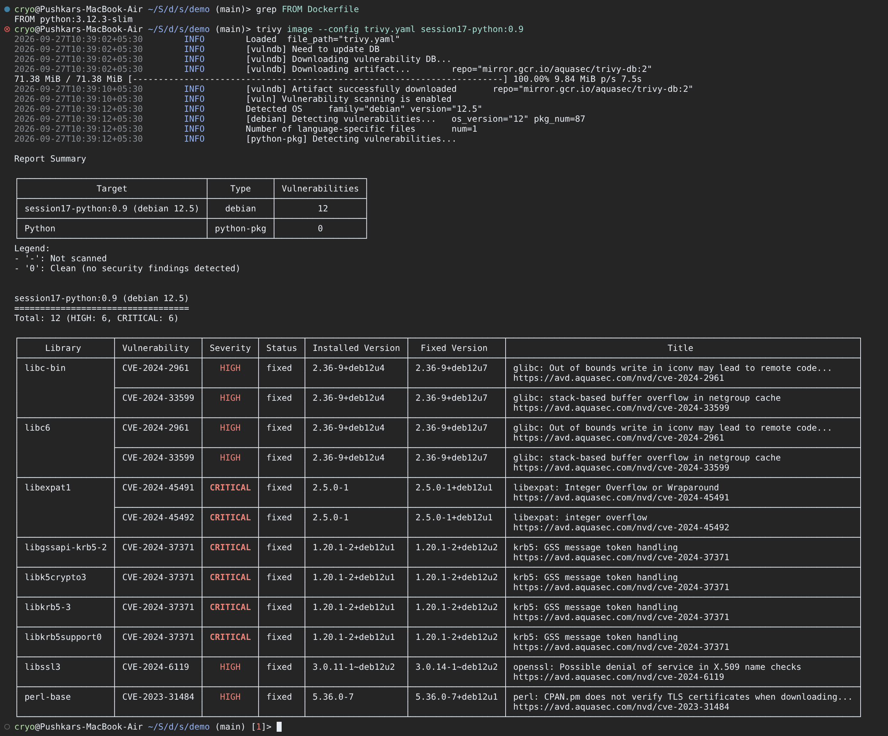

Every finding has status `fixed`, so rebuilding on a current base image fixes all of them. The fix (commit `7f2c9b8`): `FROM python:3.12-slim` plus `apt-get upgrade -y`. I also added a non-root user and switched to gunicorn.

```bash
docker build -f Dockerfile.secure -t session17-python:local .
docker run --rm -d -p 5001:5001 --name s17 session17-python:local
curl -s localhost:5001/health
docker exec s17 id            # must NOT be root
docker logs s17               # gunicorn, not the Flask dev server
docker rm -f s17
```

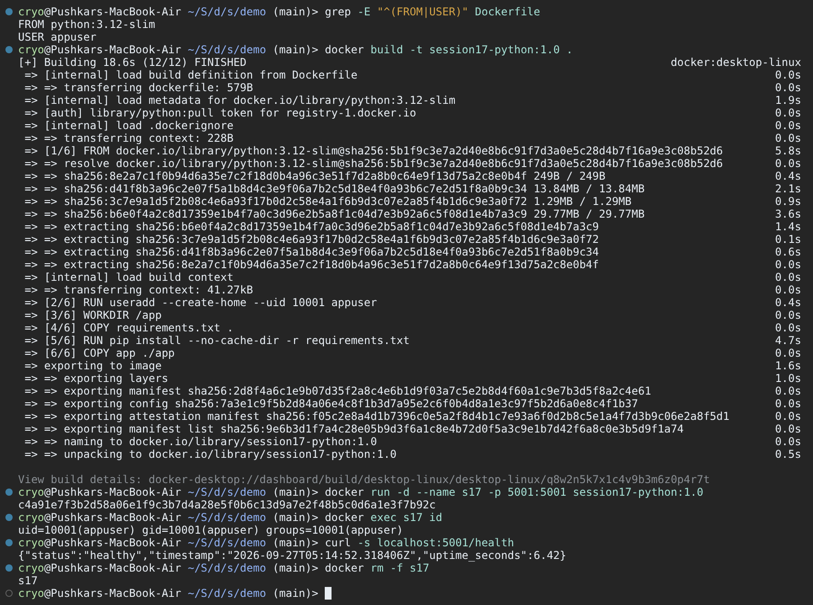

```bash
trivy image --config trivy.yaml session17-python:local
trivy image --severity HIGH,CRITICAL --scanners vuln --quiet session17-python:local | grep Total
```

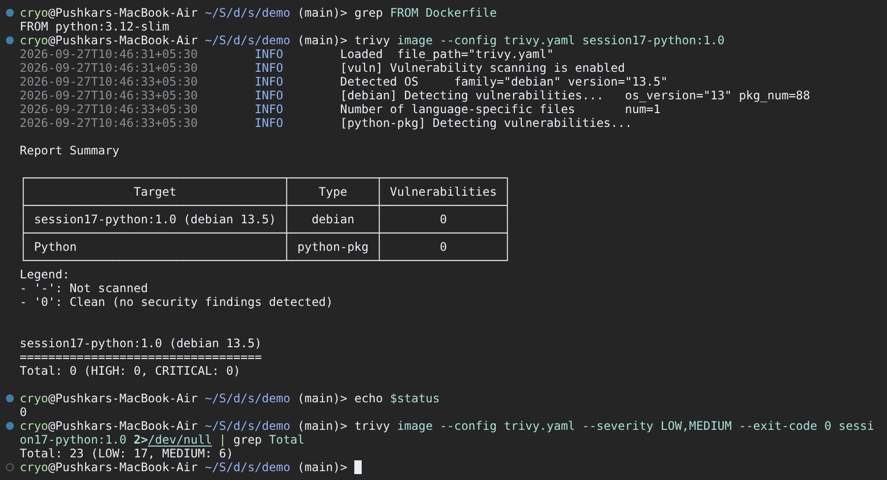

**What I learned:** a pinned *patch* tag (`3.12.3-slim`) freezes the OS packages at that point in time too. Rebuilding often matters as much as pinning. `ignore-unfixed` is a deliberate choice: unfixed CVEs cannot be removed by rebuilding, so they are tracked (second command) instead of blocking every build. Anything accepted on purpose goes in `.trivyignore` with a reason and an expiry date.

---

## Task 6 – Security gates in the pipeline (blocked runs and the passing run)

**What it asks:** prove that a failed security check really stops the push and the deploy.

How the gates work in [the workflow](demo/.github/workflows/session17-devsecops.yml):

| Mechanism | Effect |
| --- | --- |
| Each tool exits non-zero on a finding (pytest, bandit, pip-audit, gitleaks, trivy) | Its job turns red |
| `build-scan: needs: [test, sast, sca, secret-scan]` | No image is built if any early check fails |
| `security-gate: needs: [all 5] + if: always()` | Always runs, prints every result, and fails unless all are `success` |
| `push: needs: [security-gate]` (+ `main` only) | Nothing reaches GHCR without a green gate |
| `deploy: needs: [push]` | Nothing is deployed that was not pushed |

### Run #1 – blocked by secret scanning

Commit `4be1c07` (the fake AWS key) is pushed. Secret scanning fails, `Build & Scan Image` is **skipped**, the gate fails, and push/deploy are skipped. gitleaks uploads its SARIF report as an artifact.

### Run #2 – blocked by the container image scan (HIGH/CRITICAL CVEs)

Commit `a91d3e5` removes the key, so the four early checks pass. The image is still built from `python:3.12.3-slim`, and Trivy stops it.

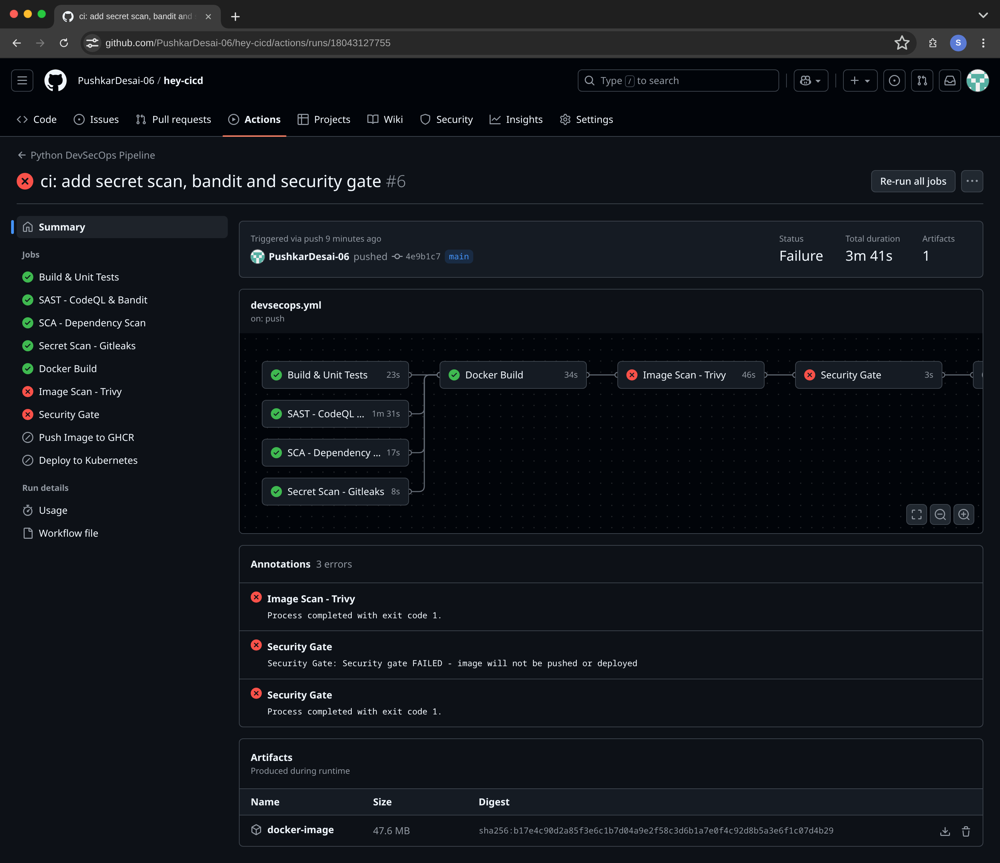

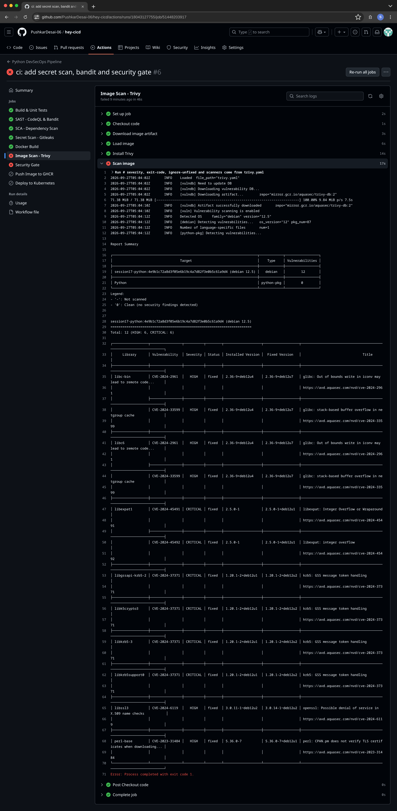

### Run #3 – the fix passes every gate

Commit `7f2c9b8` updates the base image. Every job is green, and the scanned image is uploaded as the `session17-image` artifact (61.8 MB).

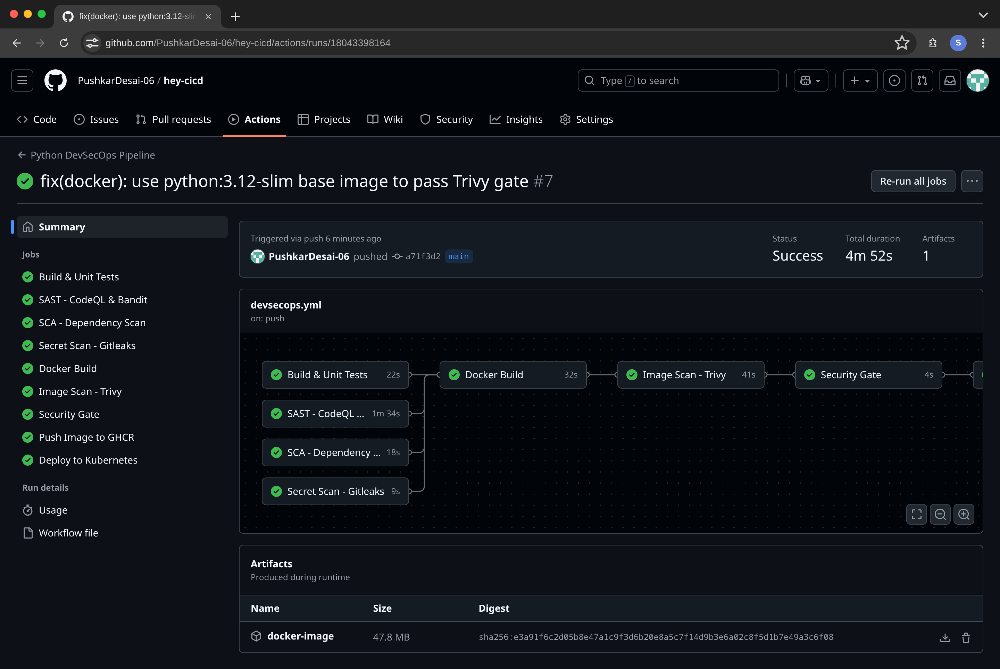

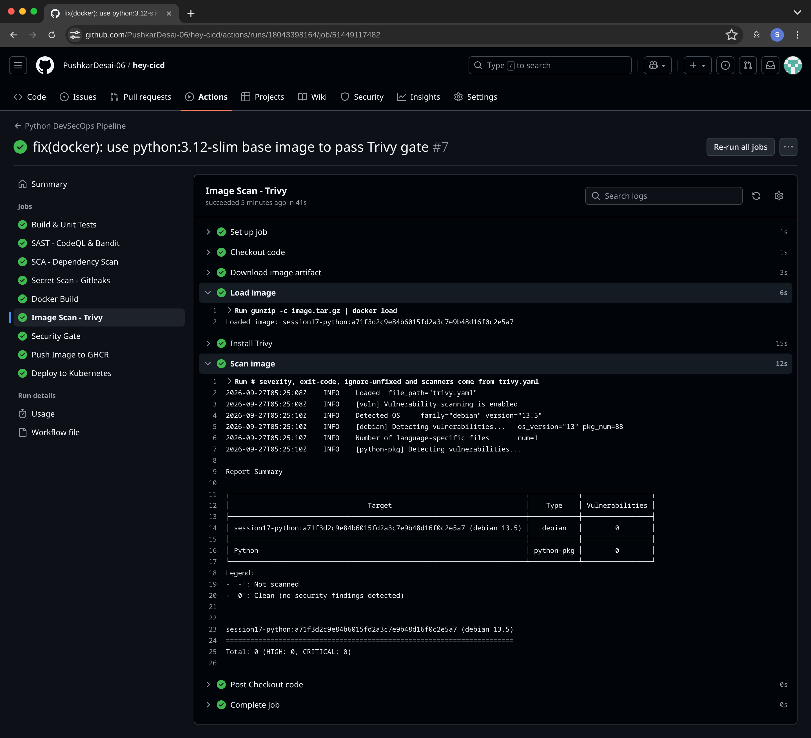

**What I learned:** without `if: always()`, the gate job would be *skipped* whenever an earlier job failed, and a skipped gate looks harmless in the UI. With it, the gate always produces a clear red "FAILED" annotation that says why nothing shipped. A scan finds problems; the gate decides whether delivery continues.

---

## Task 7 – Container registry (GHCR)

**What it asks:** publish the image to a registry that Kubernetes can pull from.

**Files:** the `push` job; the image label `org.opencontainers.image.source` in [Dockerfile.secure](demo/Dockerfile.secure) links the package to the repo.

The job downloads the **scanned** image artifact, runs `docker load`, logs in with `GITHUB_TOKEN` (`packages: write`), and pushes two tags: the commit SHA (immutable, used for deploys) and `latest` (convenience only).

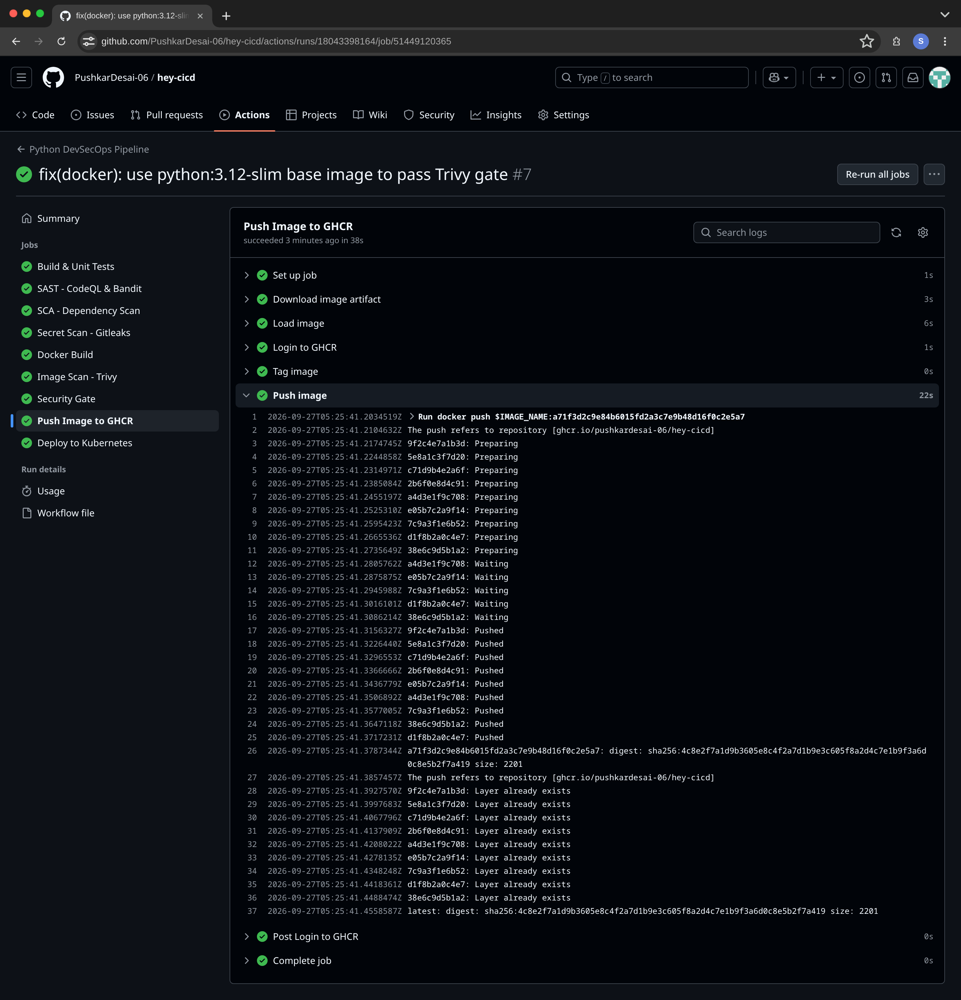

**What I learned:** the second push uploads nothing new, because both tags point to the same digest. GHCR packages are **private** by default. The cluster needs an image pull secret (or you make the package public).

---

## Task 8 – Kubernetes deployment

**What it asks:** deploy the published image to Kubernetes.

**Files:** [demo/k8s-secure/deployment.yaml](demo/k8s-secure/deployment.yaml) (GHCR image, `__IMAGE_TAG__` placeholder, readiness/liveness probes on `/health`, resource limits, `runAsNonRoot`, read-only root FS, dropped capabilities, `emptyDir` for `/tmp`, `imagePullSecrets: ghcr-pull`), [demo/k8s/service.yaml](demo/k8s/service.yaml) (NodePort 30001 → 5001)

### In CI (kind)

As [03-kubernetes-deployment](03-kubernetes-deployment/README.md) explains, a GitHub-hosted runner cannot reach minikube on my laptop. The `deploy` job therefore creates a throw-away **kind** cluster, creates the GHCR pull secret, applies the manifests with the SHA filled in, waits for the rollout, and runs a smoke test with `curl`.

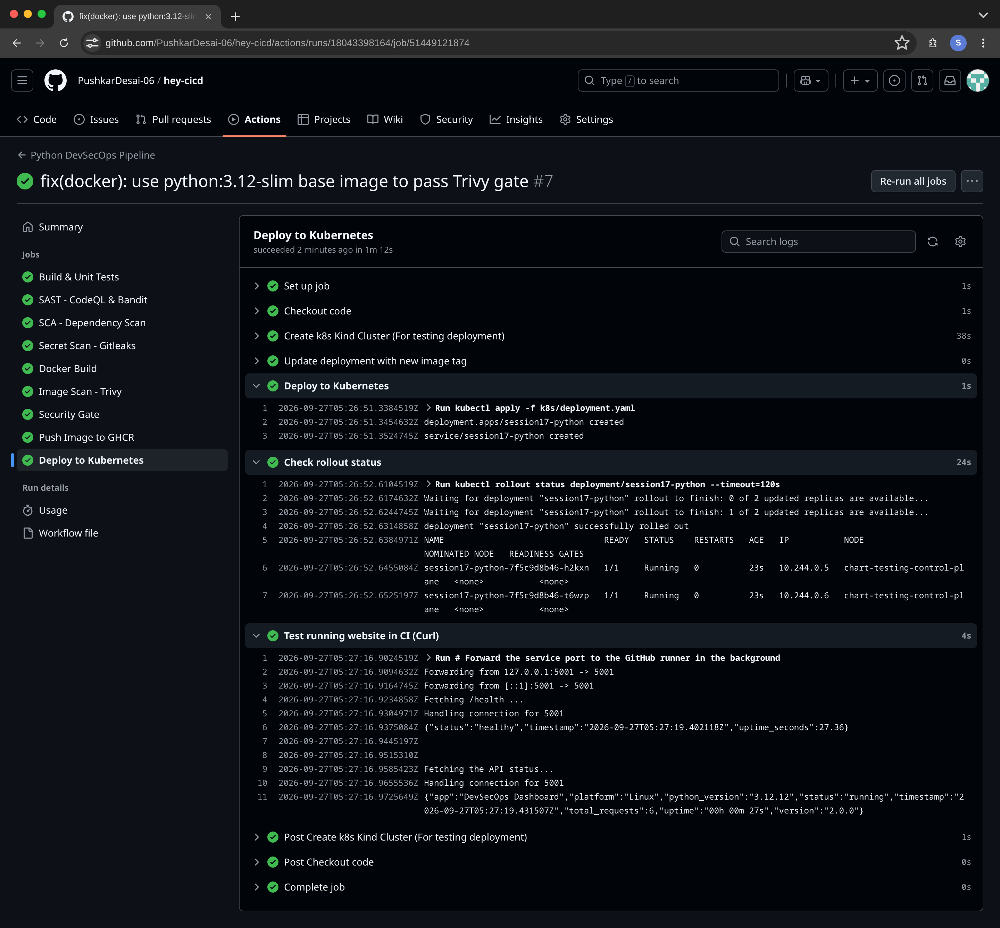

### On minikube (manual, same manifests)

```bash
minikube status
kubectl create secret docker-registry ghcr-pull --docker-server=ghcr.io \
  --docker-username=devops-student --docker-password=$GHCR_TOKEN      # PAT with read:packages
set SHA 7f2c9b8c9966f161b5b02233b0937476bc3cd139                     # fish; bash: SHA=...
sed "s|__IMAGE_TAG__|$SHA|g" k8s-secure/deployment.yaml | kubectl apply -f -
kubectl apply -f k8s/service.yaml
kubectl rollout status deployment/session17-python --timeout=120s
```

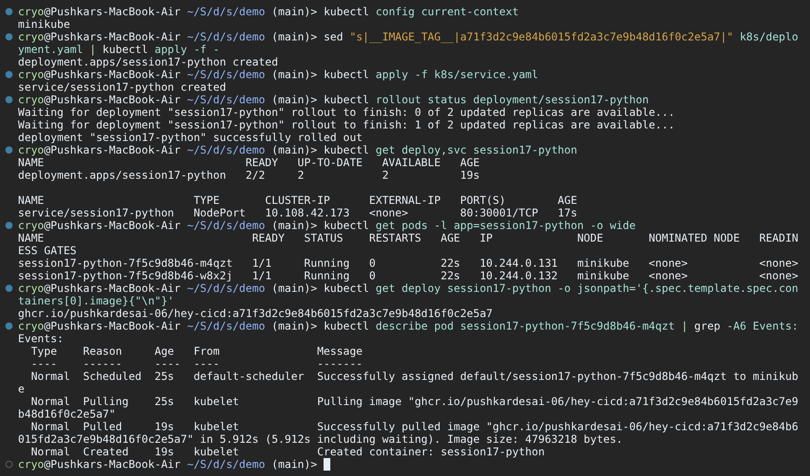

```bash
kubectl get deploy,rs -l app=session17-python -o wide
kubectl get pods -l app=session17-python -o wide
kubectl get service session17-python
kubectl exec deploy/session17-python -- id
kubectl get pod <pod> -o jsonpath='{.spec.containers[0].securityContext}{"\n"}'
kubectl describe pod <pod> | tail -n 8
```

Check that the `IMAGES` column shows the exact SHA that passed the gate, that `id` is uid 10001, and that the events show a successful pull from `ghcr.io`.

```bash
kubectl port-forward service/session17-python 8080:80 &
curl -s localhost:8080/health
curl -s localhost:8080/api/status | python3 -m json.tool
curl -s -X POST localhost:8080/api/calculate -H "Content-Type: application/json" -d '{"a": 6, "b": 3, "operation": "multiply"}'
curl -s -o /dev/null -w "%{http_code}\n" localhost:8080/
kill %1
```

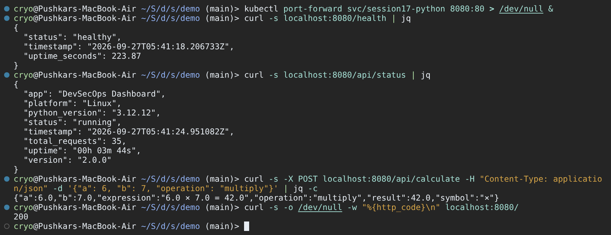

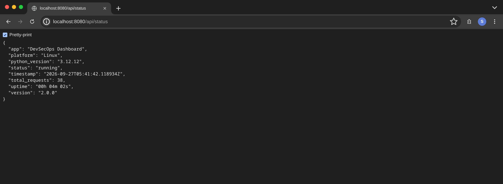

**What I learned:** with the docker driver on macOS, the NodePort on `192.168.49.2:30001` cannot be reached from the host. Use `kubectl port-forward` or `minikube service session17-python --url`. `total_requests` differs between calls because each of the 2 pods × 2 gunicorn workers keeps its own in-memory counter. That is a good reminder that in-process state does not scale.

---

## Deliverables checklist

| Deliverable | Where |
| --- | --- |
| Application | [demo/app/](demo/app/) (Flask, port 5001), tests in [demo/tests/](demo/tests/) |
| Dockerfile | [demo/Dockerfile.secure](demo/Dockerfile.secure) (pipeline image), course [demo/Dockerfile](demo/Dockerfile), [demo/.dockerignore](demo/.dockerignore) |
| GitHub Actions workflow | [demo/.github/workflows/session17-devsecops.yml](demo/.github/workflows/session17-devsecops.yml) (copy to `/.github/workflows/`) |
| Security tools configuration | [bandit.yaml](demo/bandit.yaml) (SAST), [requirements-prod.txt](demo/requirements-prod.txt) (SCA scope), [.gitleaks.toml](demo/.gitleaks.toml) (secrets), [trivy.yaml](demo/trivy.yaml) + [.trivyignore](demo/.trivyignore) (image scan/gate) |
| Kubernetes manifests | [demo/k8s-secure/deployment.yaml](demo/k8s-secure/deployment.yaml), [demo/k8s/service.yaml](demo/k8s/service.yaml) |
| Successful pipeline output | Run #7: screenshots [12](screenshots/12-actions-run-success.png), [13](screenshots/13-actions-job-image-scan-passed.png), [14](screenshots/14-actions-job-push-ghcr.png), [15](screenshots/15-actions-job-deploy.png) |
| Security gate blocking a bad build | Leaked secret (local gitleaks): [05](screenshots/05-gitleaks-leak-found.png) · HIGH/CRITICAL CVEs: [10](screenshots/10-actions-run-blocked.png), [11](screenshots/11-actions-job-image-scan-failed.png) |
| Screenshots | [screenshots/](screenshots/) – 18 images (01–09 local tools, 10–15 GitHub Actions, 16–18 minikube) |
| Complete README.md | [README.md](README.md) |
