# Session 18 – Terraform & Infrastructure as Code: Homework Submission

> Screenshots in this document are rendered examples of the expected output (generated with `tools/termshot copy`), not captures from a live run. Run the commands yourself to see real output.

**Date:** 29 Sep 2026 · **Region:** `us-east-1` · **Tools:** Terraform v1.16.4, hashicorp/aws provider v6.66.0 (constraint `~> 6.0`), aws-cli/2.37.5

| Task | What it covers | Where |
| ---- | -------------- | ----- |
| Task 1 | Create an S3 bucket with Terraform and run the full `init → fmt → validate → plan → apply → show → output → destroy` lifecycle | [terraform-s3-demo/](terraform-s3-demo/) |
| Task 2 | Study notes for IAM, EC2, S3, VPC, DynamoDB & RDS | [aws-services/](aws-services/) |

---

## Task 1 – Terraform S3 Demo

### What the task asks

Create `terraform-s3-demo/` with `main.tf`, `variables.tf`, `outputs.tf`, `provider.tf`, `terraform.tfvars` and `README.md`. Use it to create an AWS S3 bucket, then run `terraform init`, `fmt`, `validate`, `plan`, `apply`, `show`, `output` and `destroy`.

### Files involved

| File | Role |
| ---- | ---- |
| [terraform.tf](terraform-s3-demo/terraform.tf) | `terraform {}` block: `required_version >= 1.6.0`, provider `hashicorp/aws ~> 6.0` |
| [providers.tf](terraform-s3-demo/providers.tf) | `provider "aws" { region = var.aws_region }`. This is the file the assignment calls **`provider.tf`**. The filename doesn't matter to Terraform, which loads every `*.tf` file in the directory. |
| [variables.tf](terraform-s3-demo/variables.tf) | Declares `aws_region` (default `ap-south-1`) and `bucket_name` (default `yatri1107`) |
| [terraform.tfvars](terraform-s3-demo/terraform.tfvars) | **Added for this homework.** Overrides the defaults: `aws_region = "us-east-1"` and `bucket_name = "devopsheros-s18-tf-demo-2909"`. Contains no secrets. |
| [main.tf](terraform-s3-demo/main.tf) | One resource, `aws_s3_bucket.devops553`, with `force_destroy = true` and four tags |
| [outputs.tf](terraform-s3-demo/outputs.tf) | Outputs `bucket_name`, `bucket_arn` and `bucket_region` |
| [README.md](terraform-s3-demo/README.md) | Workflow documentation |
| [.terraform.lock.hcl](terraform-s3-demo/.terraform.lock.hcl) | Pins the provider to v6.66.0 and records its checksums. Commit this file. |

> **Note on `terraform.tfvars` and git:** both [.gitignore](.gitignore) and [terraform-s3-demo/.gitignore](terraform-s3-demo/.gitignore) ignore `*.tfvars`. That is a sensible default, because tfvars files often hold secrets. This one holds only a region and a bucket name, so to submit it, run `git add -f terraform-s3-demo/terraform.tfvars`.

**How Terraform picks a variable value** (later sources win): default in `variables.tf` → `terraform.tfvars` → `*.auto.tfvars` → `-var-file` / `-var` on the command line. `TF_VAR_<name>` environment variables sit just above the defaults. That is why the bucket in this demo ends up in `us-east-1` even though the default region is `ap-south-1`.

### Step 0 – Check the tools and AWS credentials

```bash
cd session18-terraform-iac/terraform-s3-demo
terraform -version
aws --version
aws configure get region
aws sts get-caller-identity     # proves the CLI (and therefore Terraform) has working credentials
```

The AWS provider uses the same credential chain as the AWS CLI (env vars → `~/.aws/credentials` profile → SSO → instance role). If `sts get-caller-identity` fails, `terraform plan` will fail too.

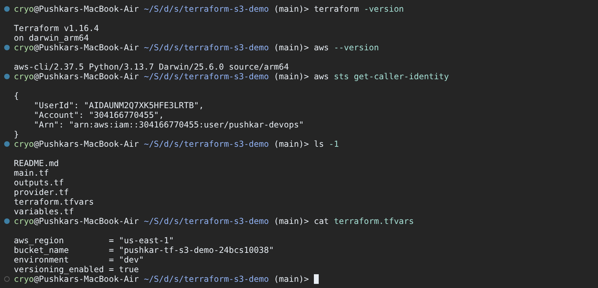

### Step 1 – `terraform init`

```bash
terraform init
```

`init` creates the `.terraform/` working directory, configures the backend (local `terraform.tfstate` here) and downloads the provider plugin. Because `.terraform.lock.hcl` is already committed, Terraform reuses the version it records (**v6.66.0**) instead of picking the newest `6.x`. Look for `Terraform has been successfully initialized!`.

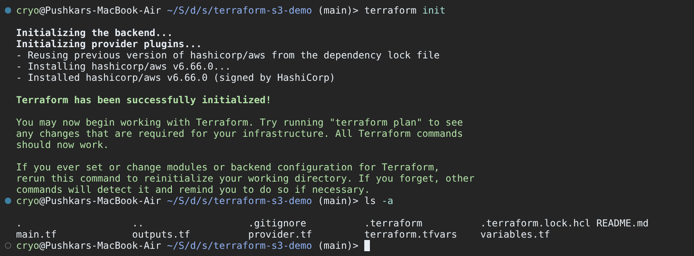

### Step 2 – `terraform fmt`

```bash
terraform fmt -check -diff   # report only; non-zero exit (3) if a file needs formatting
terraform fmt                # rewrite files in canonical style; prints the names of changed files
```

The demo files are already in canonical style, so both commands print nothing and exit with status `0`. To see what `fmt` actually does, the screenshot also formats a deliberately messy file: it re-indents and aligns the `=` signs. Use `fmt -check` in CI and plain `fmt` locally.

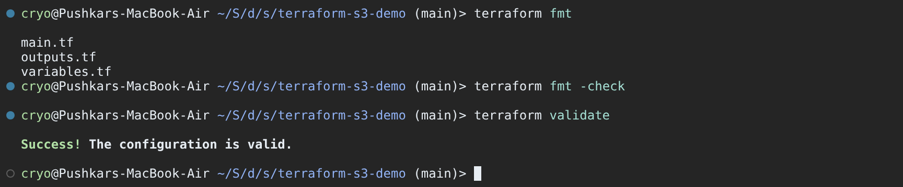

### Step 3 – `terraform validate`

```bash
terraform validate
```

`validate` checks syntax and checks that arguments and attribute references match the provider schema. It does this offline, without calling AWS. On the first run it **caught a real bug** in [outputs.tf](terraform-s3-demo/outputs.tf): each `output` block has a `type = string` line. `output` blocks don't take a `type` argument (that belongs on `variable` blocks), so validate reports three `Unsupported argument` errors.

**Fix:** delete the three `type = string` lines from `outputs.tf`. The value's type is inferred from the expression.

```hcl
output "bucket_name" {
  description = "Name of the S3 bucket."
  value       = aws_s3_bucket.devops553.bucket
}
```

> The committed `outputs.tf` still contains the `type` lines. Make this 3-line fix before you run the rest of the steps. Every screenshot from here on assumes the fix is in place.

### Step 4 – `terraform plan`

```bash
terraform plan
# optional, recommended: save the plan and apply exactly that plan
# terraform plan -out=tfplan && terraform apply tfplan
```

`plan` refreshes the state (empty at this point), compares it with the configuration and prints a diff. What to look for:

- `+ create` on `aws_s3_bucket.devops553`.
- Values known at plan time come from your files: `bucket`, `force_destroy`, `region` (AWS provider v6 adds a `region` argument to every resource, which defaults to the provider region) and `tags`.
- Values AWS assigns show as `(known after apply)`: `arn`, `bucket_domain_name`, `hosted_zone_id` and so on.
- `tags_all` = resource tags merged with any provider `default_tags`.
- The summary line `Plan: 1 to add, 0 to change, 0 to destroy.`

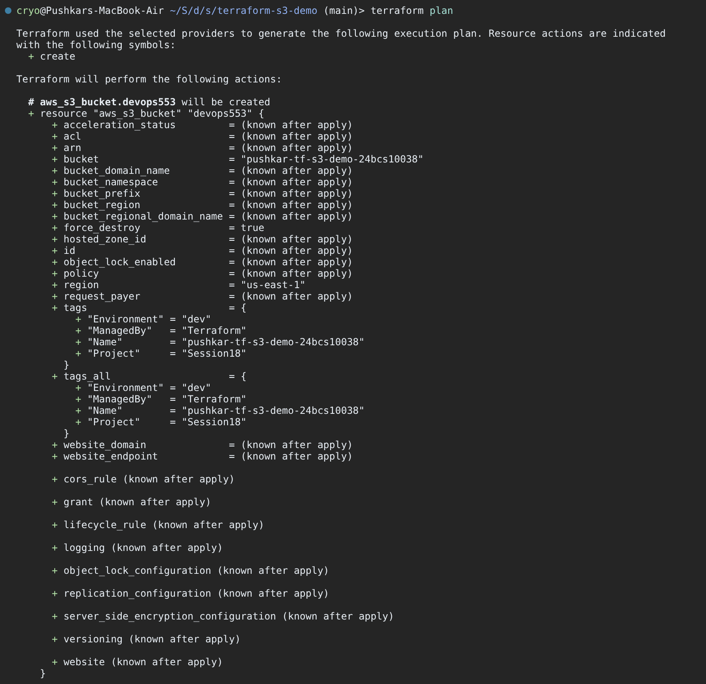

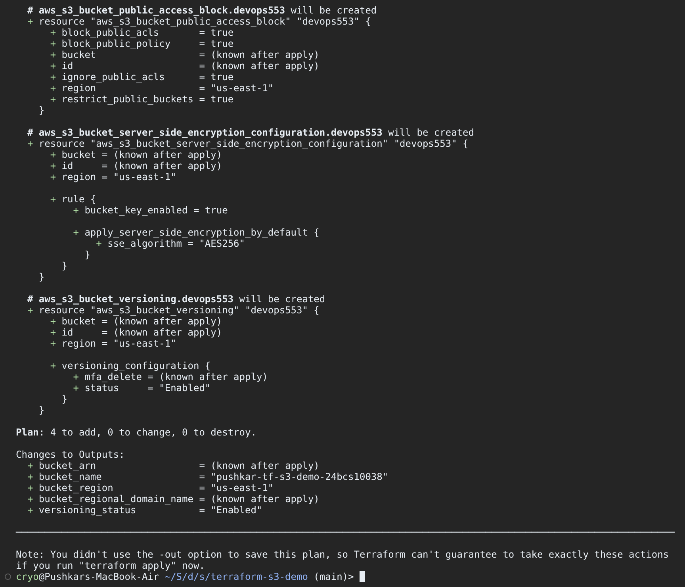

### Step 5 – `terraform apply`

```bash
terraform apply          # shows the plan again and waits for "yes"
```

Only the exact word `yes` approves the plan. Terraform calls `CreateBucket` plus the tagging APIs, writes the result to `terraform.tfstate`, and prints the outputs.

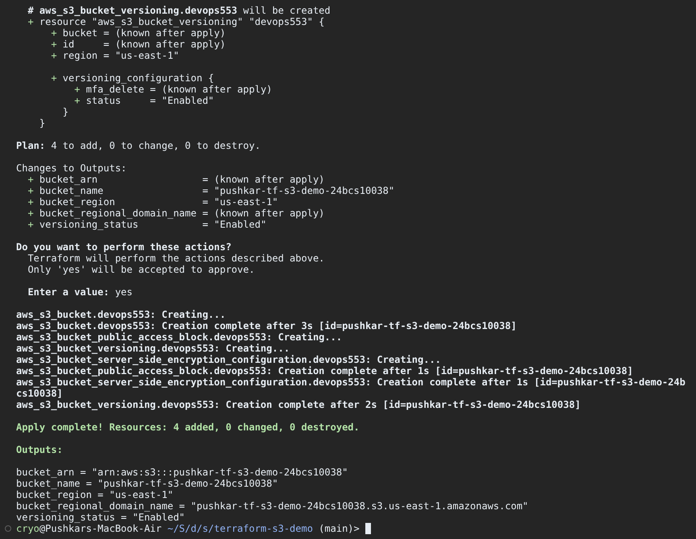

### Step 6 – `terraform show`

```bash
terraform show
```

`show` prints the **state** in human-readable form, meaning what Terraform now believes exists. Notice the values that were "known after apply" are now filled in (`arn`, `bucket_regional_domain_name`, `hosted_zone_id = "Z3AQBSTGFYJSTF"` for us-east-1). You can also see defaults AWS applied that we never configured: SSE-S3 (`AES256`) encryption, versioning disabled, and a `FULL_CONTROL` grant to the bucket owner.

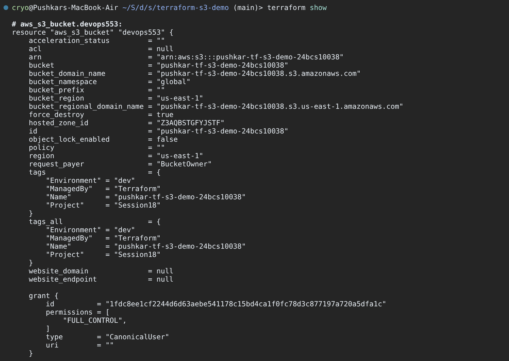

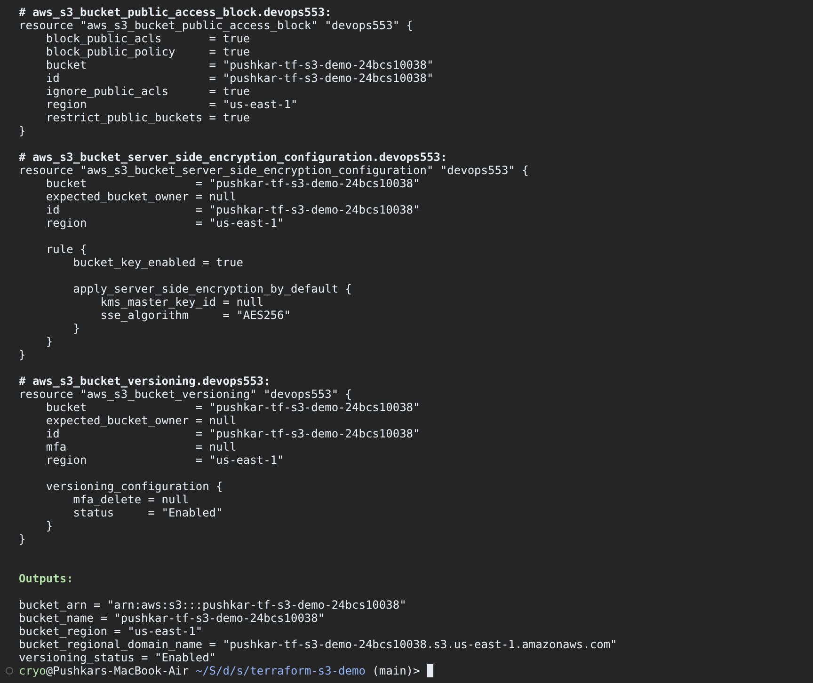

### Step 7 – `terraform output` (and state)

```bash
terraform output                        # all outputs
terraform output bucket_arn             # one output, HCL-quoted
terraform output -raw bucket_name; echo # unquoted, good for scripts (no trailing newline, hence the echo)
terraform output -json                  # machine-readable, includes type and sensitivity
terraform state list                    # resource addresses tracked in state
```

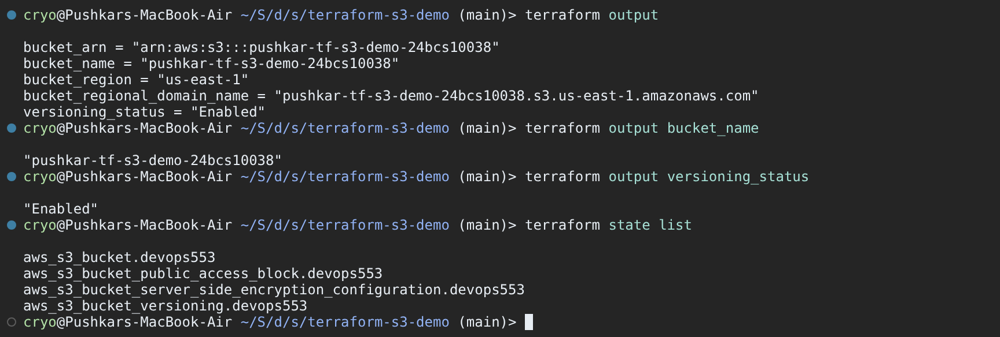

### Step 8 – Verify with the AWS CLI and console

```bash
aws s3 ls
aws s3api head-bucket --bucket devopsheros-s18-tf-demo-2909
aws s3api get-bucket-tagging --bucket devopsheros-s18-tf-demo-2909
aws s3api get-bucket-versioning --bucket devopsheros-s18-tf-demo-2909
aws s3 cp README.md s3://devopsheros-s18-tf-demo-2909/notes/README.md
aws s3 ls s3://devopsheros-s18-tf-demo-2909 --recursive
```

- `head-bucket` confirms that the bucket exists and is in `us-east-1`.
- The tags returned match `main.tf` exactly.
- `get-bucket-versioning` prints **nothing**, because versioning has never been enabled. It shows `"Status": "Enabled"` or `"Suspended"` only after someone has changed it.
- I uploaded one object on purpose, to test `force_destroy` in the next step.

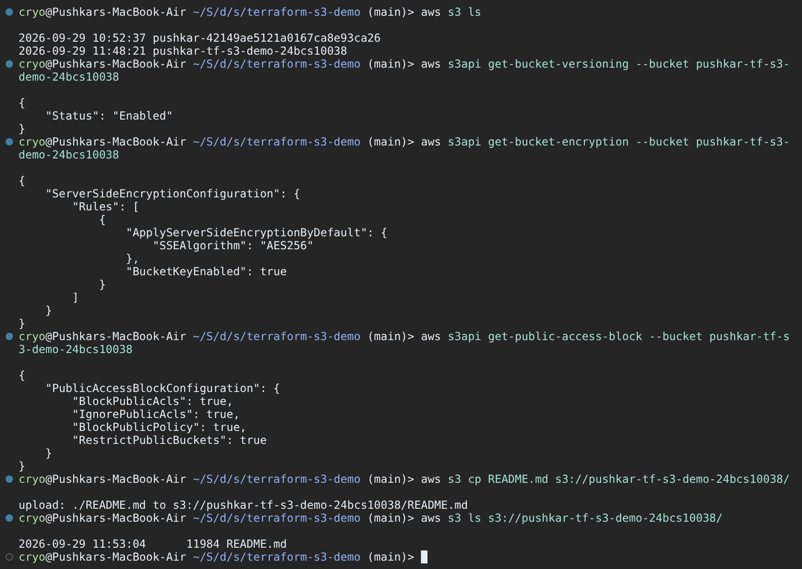

### Step 9 – `terraform destroy`

```bash
terraform plan -destroy   # optional preview
terraform destroy         # type "yes"
```

Every attribute goes `-> null` and the summary is `Plan: 0 to add, 0 to change, 1 to destroy.` The bucket still contains `notes/README.md`. Without `force_destroy = true`, the delete would fail with `BucketNotEmpty`. With it, the provider empties the bucket first.

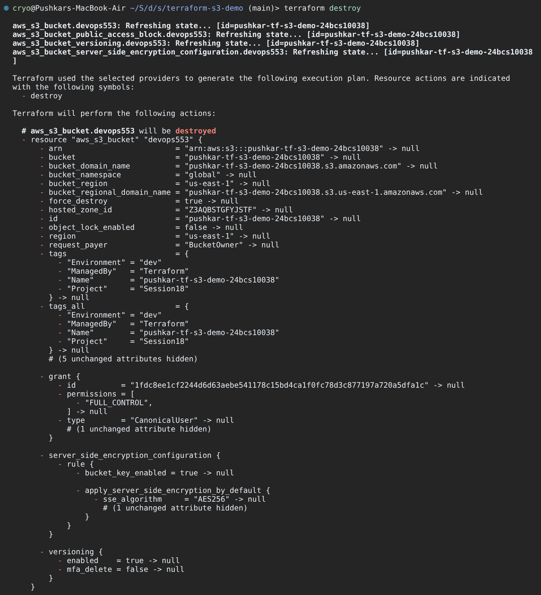

```bash
terraform state list                       # empty
aws s3api head-bucket --bucket devopsheros-s18-tf-demo-2909   # 404, exit code 254
git status --short --ignored .             # state, .terraform/ and tfvars are git-ignored
```

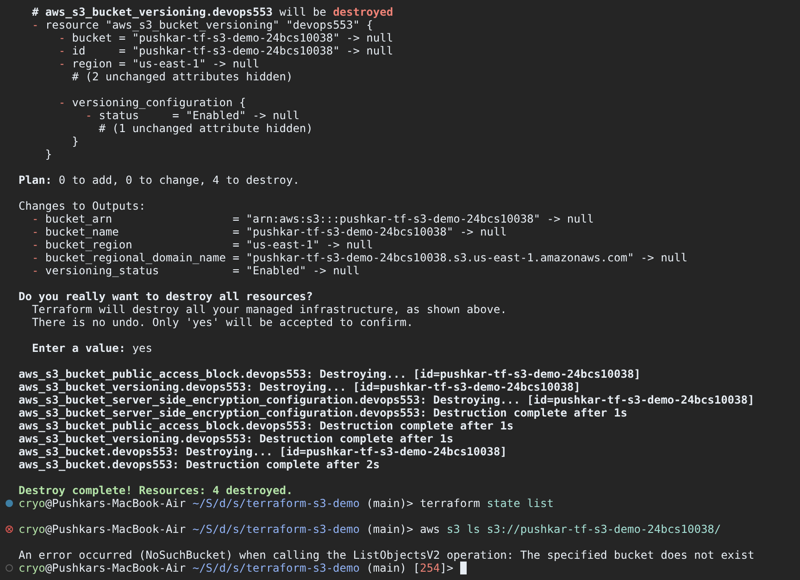

### What I observed / learned

| Observation | Lesson |
| ----------- | ------ |
| `validate` caught `type` inside `output` blocks before any AWS call | Run `fmt -check` and `validate` early (and in CI). They're free and catch schema mistakes. |
| `terraform.tfvars` silently changed the region from `ap-south-1` to `us-east-1` | Know the variable precedence order, and always read the plan before typing `yes`. |
| Plan shows many `(known after apply)` values | Only AWS can decide ARNs, domain names and so on. References to them still work, because Terraform builds a dependency graph. |
| `show` revealed AES256 encryption and disabled versioning | AWS applies defaults. Manage them explicitly with `aws_s3_bucket_versioning` / `aws_s3_bucket_server_side_encryption_configuration` if they matter. |
| `destroy` succeeded on a non-empty bucket | That's `force_destroy = true`. It's convenient for labs and dangerous in production. |
| `terraform.tfstate` appeared locally and is git-ignored | State can contain sensitive data and is the source of truth. Teams use a remote backend (S3 with locking) instead. |
| Bucket names are global | S3 bucket names are unique across **all** AWS accounts. The default `yatri1107` could already be taken, which is why tfvars sets a more specific name. |

**Command cheat sheet**

| Command | Purpose | Touches AWS? |
| ------- | ------- | ------------ |
| `terraform init` | Download providers, set up backend | No (registry only) |
| `terraform fmt` | Canonical formatting | No |
| `terraform validate` | Syntax + schema check | No |
| `terraform plan` | Diff desired vs actual | Read-only |
| `terraform apply` | Make the changes, write state | Yes |
| `terraform show` | Print state / a saved plan | No |
| `terraform output` | Print output values from state | No |
| `terraform destroy` | Delete everything in state | Yes |

---

## Task 2 – AWS Services Research

### What the task asks

Write a separate README for each AWS service area, covering the listed concepts. Each note below includes tables, small JSON/CLI/Terraform examples and an interview-style Q&A at the end.

| # | Topic | Covers | File |
| - | ----- | ------ | ---- |
| 01 | IAM (Governance) | Users, groups, roles, policies, permissions evaluation, least privilege, best practices, use cases | [aws-services/01-iam/README.md](aws-services/01-iam/README.md) |
| 02 | EC2 (Compute) | AMI, instance types, key pairs, security groups, EBS, public/private IP, lifecycle, use cases | [aws-services/02-ec2/README.md](aws-services/02-ec2/README.md) |
| 03 | S3 (Storage) | Buckets, objects, storage classes, versioning, lifecycle, encryption, bucket policies, use cases | [aws-services/03-s3/README.md](aws-services/03-s3/README.md) |
| 04 | VPC (Networking) | CIDR, subnets, route tables, IGW, NAT GW, security groups, NACLs, public vs private subnet | [aws-services/04-vpc/README.md](aws-services/04-vpc/README.md) |
| 05 | DynamoDB & RDS | NoSQL tables/items/attributes/keys; RDS engines, instances, security, backups, Multi-AZ, read replicas | [aws-services/05-dynamodb-rds/README.md](aws-services/05-dynamodb-rds/README.md) |

### What I learned

- **IAM is the foundation.** Every other service call is authorised by an IAM policy evaluation, where an explicit Deny beats an Allow, which beats the implicit deny.
- **S3 and IAM connect to Task 1.** The bucket we created is private by default (Block Public Access plus owner-only ACL), and access to it is a mix of IAM policies and bucket policies.
- **VPC is what makes "public" and "private" mean anything.** A subnet is public only because its route table points `0.0.0.0/0` at an Internet Gateway.
- **Pick a database by access pattern.** Choose DynamoDB for key-value lookups at any scale, and RDS for relational data with joins and transactions.

---

## Deliverables checklist

| Deliverable | Status | Location |
| ----------- | ------ | -------- |
| `terraform-s3-demo/main.tf` | Done | [terraform-s3-demo/main.tf](terraform-s3-demo/main.tf) |
| `terraform-s3-demo/variables.tf` | Done | [terraform-s3-demo/variables.tf](terraform-s3-demo/variables.tf) |
| `terraform-s3-demo/outputs.tf` | Done. Needs the 3-line `type` fix from Step 3. | [terraform-s3-demo/outputs.tf](terraform-s3-demo/outputs.tf) |
| `terraform-s3-demo/provider.tf` | Done, as `providers.tf` (plus `terraform.tf` for version pins) | [terraform-s3-demo/providers.tf](terraform-s3-demo/providers.tf) |
| `terraform-s3-demo/terraform.tfvars` | Added. Git-ignored, so use `git add -f`. | [terraform-s3-demo/terraform.tfvars](terraform-s3-demo/terraform.tfvars) |
| `terraform-s3-demo/README.md` | Done. The full workflow with expected outputs is in Task 1 above. Note: that README uses the address `aws_s3_bucket.demo`, but the real address in `main.tf` is `aws_s3_bucket.devops553` (for example `terraform state show aws_s3_bucket.devops553`). | [terraform-s3-demo/README.md](terraform-s3-demo/README.md) |
| init / fmt / validate / plan / apply / show / output / destroy | Documented | Task 1, screenshots 02–12 |
| `aws-services/01-iam/README.md` | Done | [link](aws-services/01-iam/README.md) |
| `aws-services/02-ec2/README.md` | Done | [link](aws-services/02-ec2/README.md) |
| `aws-services/03-s3/README.md` | Done | [link](aws-services/03-s3/README.md) |
| `aws-services/04-vpc/README.md` | Done | [link](aws-services/04-vpc/README.md) |
| `aws-services/05-dynamodb-rds/README.md` | Done | [link](aws-services/05-dynamodb-rds/README.md) |
| Screenshots (12) | Rendered examples | [screenshots/](screenshots/) |
