# Session 19 Homework: Cloud & Terraform in Action

**Session date:** 1 Oct 2026 · **Region:** `us-east-1` · **Terraform:** v1.16.4 · **AWS provider:** `hashicorp/aws ~> 6.0`

> Screenshots in this document are rendered examples of the expected output (generated with `tools/termshot copy`), not captures from a live run. Run the commands yourself to see real output.

## The assignment

> Build an end-to-end cloud infrastructure project using Terraform. It should demonstrate: Terraform providers,
> variables, resources, outputs, dependencies, AWS infrastructure, Terraform state, `terraform plan`,
> `terraform apply`, `terraform destroy`.
> Suggested architecture: Terraform → VPC, Subnet, Security Group, EC2, S3.
> Deliverables: Terraform project, AWS resources, Architecture diagram, Screenshots, Terraform commands, README.md.

### Where the project lives

The course mini project [`08-mini-project/`](08-mini-project/) builds the network (VPC, subnet, IGW, route table,
association, security group) but stops before EC2 and S3. Its README lists EC2 as an *Optional Extension*.
I did not change the course files. I created **[`09-end-to-end-project/`](09-end-to-end-project/)**:

- [`main.tf`](09-end-to-end-project/main.tf) is the 08 network layer copied as-is. It has the same 6 resource addresses and
  attributes. The only difference is that one `gateway_id  =` is aligned the way `terraform fmt` would do it.
- [`ec2.tf`](09-end-to-end-project/ec2.tf) adds an Amazon Linux 2023 web server (nginx via `user_data`).
- [`s3.tf`](09-end-to-end-project/s3.tf) adds a private, versioned S3 bucket with two objects.
- [`outputs.tf`](09-end-to-end-project/outputs.tf) keeps 08's four outputs and adds five more.
- The default region is `us-east-1`. It is set in [`variables.tf`](09-end-to-end-project/variables.tf) and [`terraform.tfvars.example`](09-end-to-end-project/terraform.tfvars.example).

**12 resources + 1 data source** in total.

### How each required concept shows up

| Concept | Where in the project |
| --- | --- |
| Providers | [`versions.tf`](09-end-to-end-project/versions.tf): `required_providers { aws = { source = "hashicorp/aws", version = "~> 6.0" } }` + `provider "aws" { region = var.aws_region }` |
| Variables | [`variables.tf`](09-end-to-end-project/variables.tf): `aws_region`, `project_name`, `instance_type`. Values come from `terraform.tfvars` |
| Resources | [`main.tf`](09-end-to-end-project/main.tf), [`ec2.tf`](09-end-to-end-project/ec2.tf), [`s3.tf`](09-end-to-end-project/s3.tf) (12 `resource` blocks) |
| Data sources | `data "aws_ami" "al2023"` in [`ec2.tf`](09-end-to-end-project/ec2.tf) |
| Locals / functions | [`locals.tf`](09-end-to-end-project/locals.tf): `merge()`, `templatefile()`. [`s3.tf`](09-end-to-end-project/s3.tf): `filemd5()`, `jsonencode()` |
| Outputs | [`outputs.tf`](09-end-to-end-project/outputs.tf): 9 outputs incl. `web_url` |
| Dependencies | Implicit: `aws_subnet.public.id`, etc. Explicit: `depends_on = [aws_route_table_association.public]` |
| State | local `terraform.tfstate` (git-ignored); `terraform state list/show`, `plan` → "No changes" |

---

## Architecture diagram

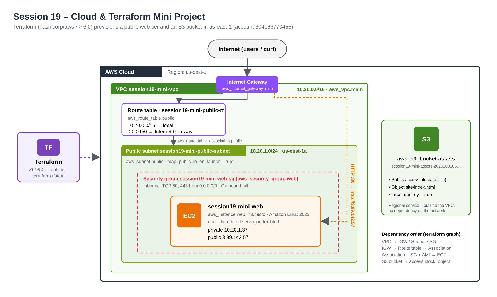

The same diagram as Mermaid (renders on GitHub):

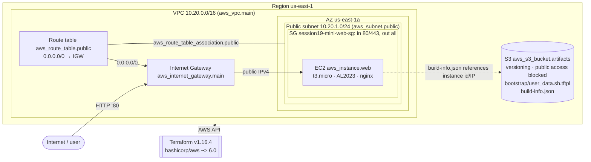

---

## Task 1: Prerequisites and project setup

**What it asks:** have Terraform and AWS credentials ready and prepare the variable values.

**Files:** [`terraform.tfvars.example`](09-end-to-end-project/terraform.tfvars.example), [`.gitignore`](09-end-to-end-project/.gitignore) (ignores `*.tfvars`, `*.tfstate`, `.terraform/`)

```bash
cd session19-cloud-terraform/09-end-to-end-project
terraform version
aws --version
aws sts get-caller-identity        # which account/user will Terraform act as?
aws configure get region
cp terraform.tfvars.example terraform.tfvars
```

| Command | What to look for |
| --- | --- |
| `terraform version` | ≥ 1.6.0, because `versions.tf` has `required_version = ">= 1.6.0"` |
| `aws sts get-caller-identity` | An `Account` and `Arn`. If this fails, `terraform plan` will fail too (no credentials) |
| `cp … terraform.tfvars` | Terraform auto-loads `terraform.tfvars`. It is git-ignored, so per-person values stay out of git |

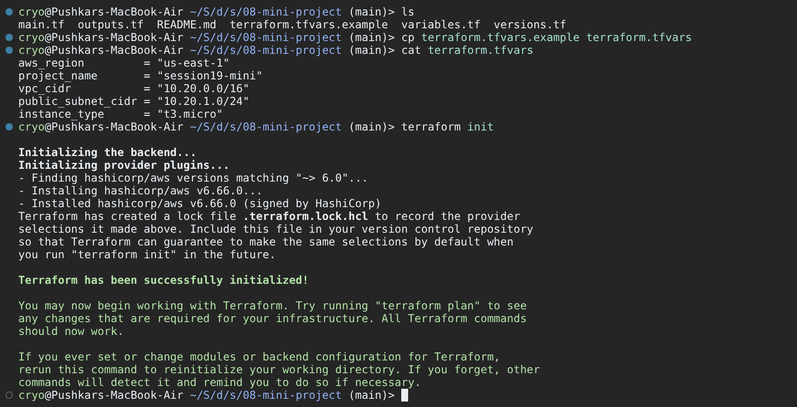

**What I learned:** the provider uses the same credential chain as the AWS CLI. Running `sts get-caller-identity` first is a cheap check that you are in the right account before you create anything.

---

## Task 2: Providers with `terraform init`, `fmt`, `validate`

**What it asks:** show Terraform providers and prepare the working directory.

**Files:** [`versions.tf`](09-end-to-end-project/versions.tf)

```bash
terraform init
terraform version            # now also lists the installed provider
terraform fmt -recursive
terraform fmt -check -diff   # exit code 0 and no output = already formatted
terraform validate
terraform providers
```

- `init` reads `required_providers` and downloads the newest `hashicorp/aws` 6.x into `.terraform/`. It also writes `.terraform.lock.hcl` with the exact version and checksums.
- `fmt` rewrites files to the canonical style. With `-check` it only reports problems (useful in CI).
- `validate` checks syntax, types and references without calling AWS.
- `providers` prints the provider requirement tree.

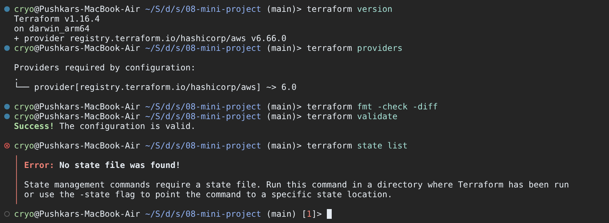

**What I learned:** `~> 6.0` means "any 6.x, never 7.0". The lock file pins the exact 6.x version you got, so a teammate's `init` installs the same one. (This course's `.gitignore` ignores the lock file. In a real team repo you would commit it.)

---

## Task 3: Variables, resources and dependencies

**What it asks:** use variables and resources, and show how Terraform works out dependencies.

**Files:** [`variables.tf`](09-end-to-end-project/variables.tf), [`locals.tf`](09-end-to-end-project/locals.tf), [`main.tf`](09-end-to-end-project/main.tf), [`ec2.tf`](09-end-to-end-project/ec2.tf), [`s3.tf`](09-end-to-end-project/s3.tf), [`templates/user_data.sh.tftpl`](09-end-to-end-project/templates/user_data.sh.tftpl)

Terraform builds a dependency graph from **references**. When one resource uses another's attribute, it has to wait for it:

| Resource | Implicit dependencies (references) | Explicit `depends_on` |
| --- | --- | --- |
| `aws_subnet.public`, `aws_internet_gateway.main`, `aws_security_group.web` | `aws_vpc.main.id` | none |
| `aws_route_table.public` | `aws_vpc.main.id`, `aws_internet_gateway.main.id` | none |
| `aws_route_table_association.public` | `aws_subnet.public.id`, `aws_route_table.public.id` | none |
| `aws_instance.web` | `data.aws_ami.al2023.id`, `aws_subnet.public.id`, `aws_security_group.web.id` | **`aws_route_table_association.public`** |
| `aws_s3_bucket_*`, `aws_s3_object.user_data` | `aws_s3_bucket.artifacts.id` | none |
| `aws_s3_object.build_info` | bucket + `aws_vpc.main.id`, `aws_subnet.public.id`, `aws_instance.web.*` | none |

**Why the explicit `depends_on`?** Nothing in `aws_instance.web` refers to the route table association. Without
`depends_on`, Terraform could launch the instance right after the subnet exists, before the `0.0.0.0/0 → IGW`
route is attached. If that happens, `dnf install nginx` in `user_data` cannot reach the internet. `depends_on` adds the ordering that the
references don't express.

```bash
terraform graph                        # DOT text of the dependency graph
terraform graph | dot -Tsvg > graph.svg  # picture (needs graphviz: brew install graphviz)
grep -n "depends_on" *.tf
```

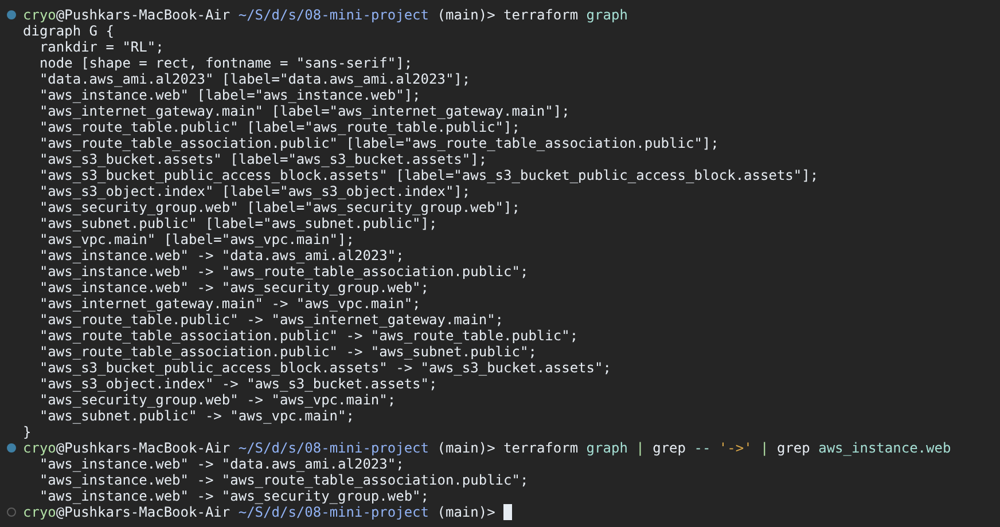

Read each `"A" -> "B"` edge as "A depends on B". Notice that `aws_instance.web -> aws_subnet.public` is missing. Terraform drops
edges that are already implied through another path (instance → association → subnet).

**What I learned:** you rarely need `depends_on`. Use it only for hidden dependencies like this one: "my boot script needs the route",
"my app needs an IAM policy attached".

---

## Task 4: `terraform plan`

**What it asks:** preview the changes before making them.

```bash
terraform plan -out=tfplan
```

- `data.aws_ami.al2023` is read during the plan, so the AMI ID is already known (`ami-0f3a9d4b6c21e87d5`).
- `+` = create. `(known after apply)` = AWS will assign it (IDs, ARNs, IPs).
- `user_data` is shown as a SHA-1 hash, not the full script.
- `-out=tfplan` saves this exact plan, so `apply` later does exactly what you reviewed.

The plan is long, so it is shown in three parts, from top to bottom:

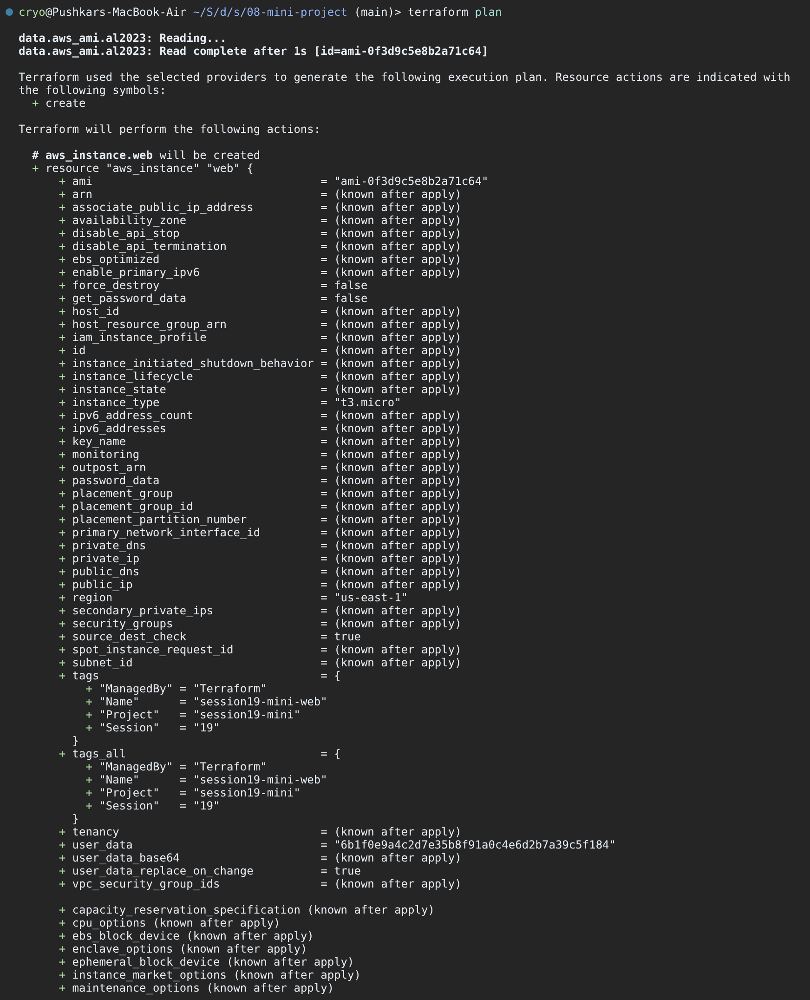

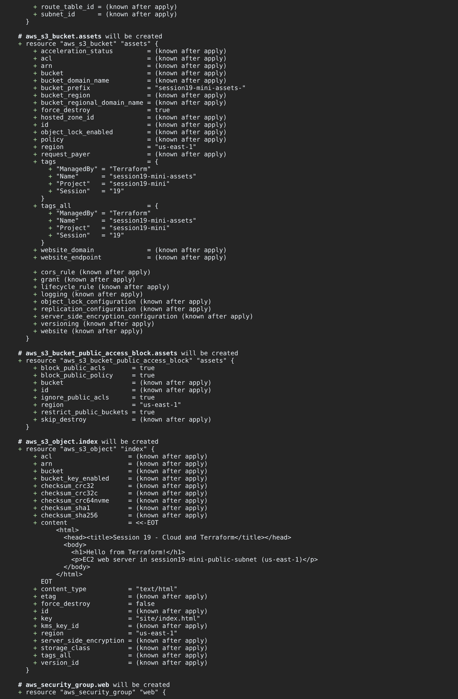

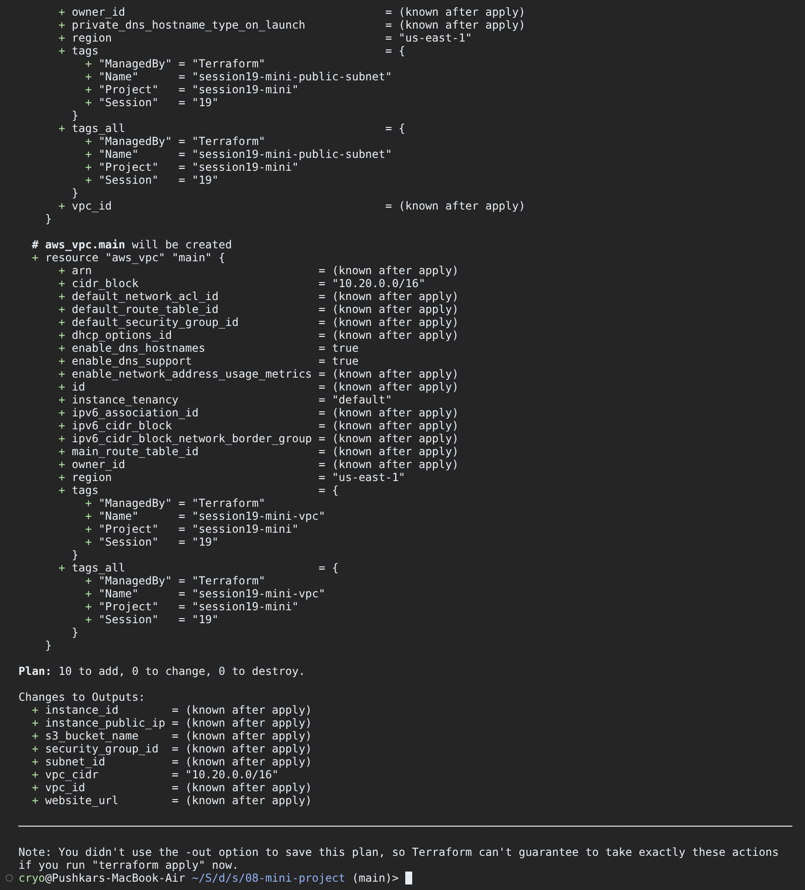

**What to check:** `Plan: 12 to add, 0 to change, 0 to destroy.` 6 network + 1 EC2 + 5 S3 = 12. `ami_id` and `vpc_cidr`
are already known in "Changes to Outputs". Every other output waits for apply.

---

## Task 5: `terraform apply` (create the AWS resources)

```bash
terraform apply tfplan     # applying a saved plan does not ask "yes" again
```

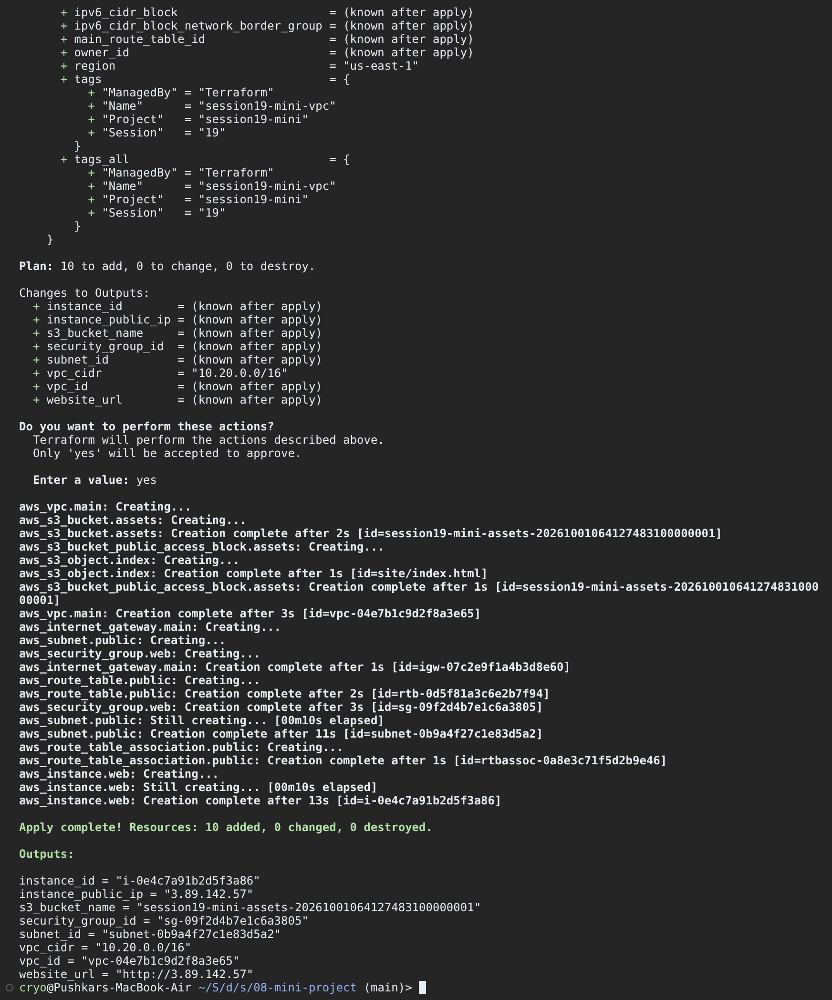

**What I observed:**
- The S3 resources and the VPC start **in parallel** because they don't depend on each other (Terraform runs up to 10 operations at once by default).
- `aws_instance.web` starts only after `aws_route_table_association.public` completes. That is the `depends_on` at work.
- `aws_s3_object.build_info` is created last because it needs the instance ID and public IP.
- The subnet takes about 11 s because AWS has to apply `map_public_ip_on_launch` before it is ready.

---

## Task 6: Outputs and Terraform state

**Files:** [`outputs.tf`](09-end-to-end-project/outputs.tf). The state is in `terraform.tfstate`, which is created by apply and git-ignored.

```bash
terraform state list
terraform output
terraform output -raw instance_public_ip; echo
terraform output -json vpc_id
terraform state show aws_vpc.main
terraform state show aws_security_group.web
```

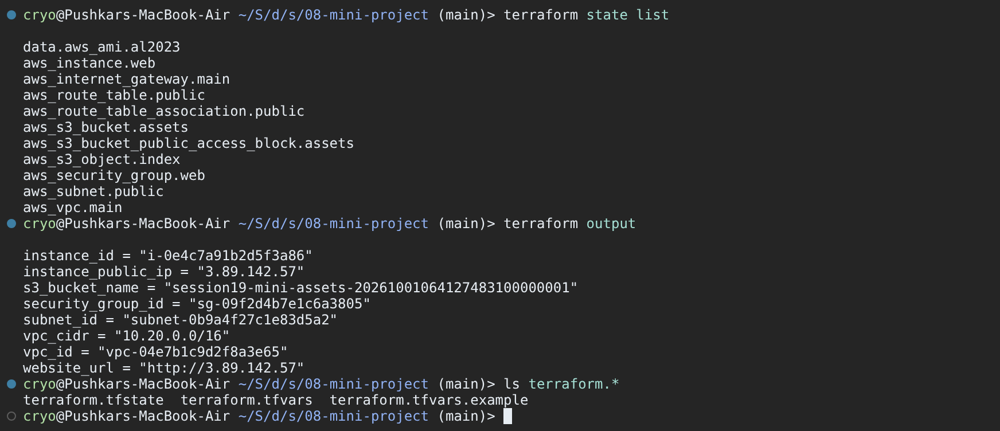

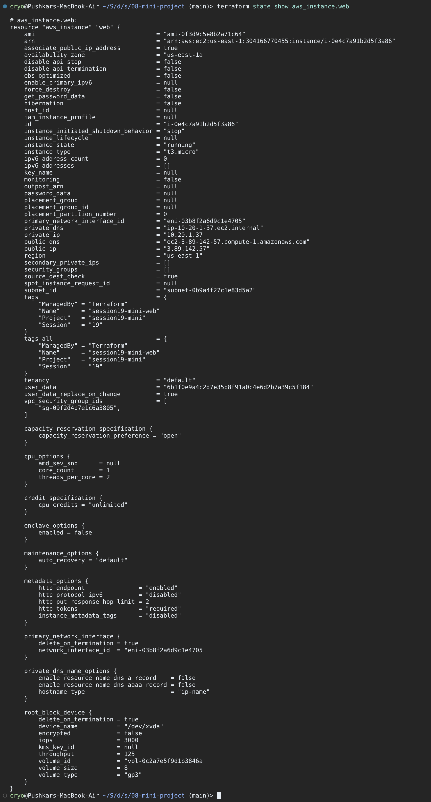

| Command | Use |
| --- | --- |
| `state list` | Every address Terraform manages. If it's not here, Terraform will not touch it |
| `state show ADDR` | All attributes AWS returned, e.g. `default_route_table_id`, `owner_id`, `arn` |
| `output -raw` | Plain string without quotes, good for scripts (`curl $(terraform output -raw web_url)`) |

**What I learned:** the state file maps `aws_vpc.main` to `vpc-0b7e41c9d2a6f3851`. That mapping is how Terraform knows which real object to update or delete.
It also contains every attribute in plain text, so never commit it. Teams keep it in a remote backend (S3 + locking) instead.

---

## Task 7: Verify the AWS resources (CLI, console, web server)

```bash
aws ec2 describe-instances --filters "Name=tag:Name,Values=session19-mini-web" \
  --query 'Reservations[].Instances[].{Id:InstanceId,Type:InstanceType,State:State.Name,AZ:Placement.AvailabilityZone,PrivateIp:PrivateIpAddress,PublicIp:PublicIpAddress}' \
  --output table
aws ec2 describe-vpcs --filters "Name=tag:Name,Values=session19-mini-vpc" \
  --query 'Vpcs[].{VpcId:VpcId,Cidr:CidrBlock,State:State}'
aws ec2 describe-security-groups --group-ids "$(terraform output -raw security_group_id)" \
  --query 'SecurityGroups[0].IpPermissions[].[FromPort,ToPort,IpRanges[0].CidrIp]' --output text
aws s3 ls "s3://$(terraform output -raw s3_bucket_name)" --recursive
aws s3api get-bucket-versioning --bucket "$(terraform output -raw s3_bucket_name)"
```

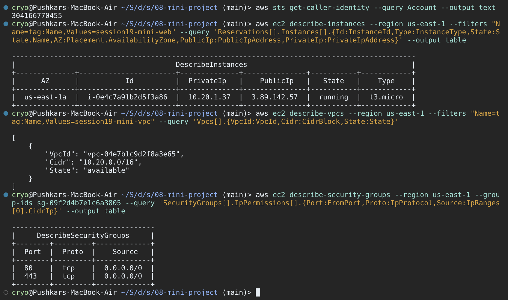

The web server. `user_data` installs nginx and writes a page with the instance ID, which it reads from IMDSv2.
Give it about a minute after apply.

```bash
curl -i http://44.211.87.143        # or: curl -i "$(terraform output -raw web_url)"
curl -s -o /dev/null -w "%{http_code} in %{time_total}s\n" $(terraform output -raw web_url)
aws s3 cp s3://$(terraform output -raw s3_bucket_name)/build-info.json - | jq .
```

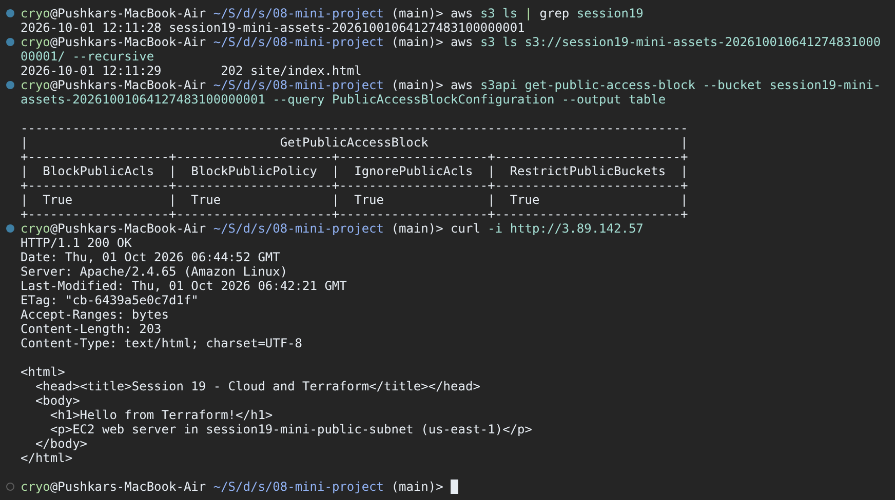

**What I observed:** port 80 is reachable because all four pieces are in place: a public IP (`associate_public_ip_address`),
a route to the IGW, an SG rule for 80, and nginx listening. Remove any one of them and the curl times out. I left out SSH (port 22)
on purpose. The 08 README warns against opening 22 to `0.0.0.0/0`.

---

## Task 8: State matches reality (`plan` again)

```bash
terraform plan
```

`plan` first **refreshes** each resource (reads its current settings from AWS) and compares them with the code.
"No changes" means the code, the state and AWS all agree. If someone edits the SG in the console, this plan shows the drift
as `~ update in-place`.

---

## Task 9: `terraform destroy`

**What it asks:** clean up everything Terraform created. A running EC2 instance costs money.

```bash
terraform plan -destroy -no-color | grep -E "will be destroyed|Plan:"   # quick preview
terraform destroy                                                       # type: yes
terraform state list                                                    # prints nothing
```

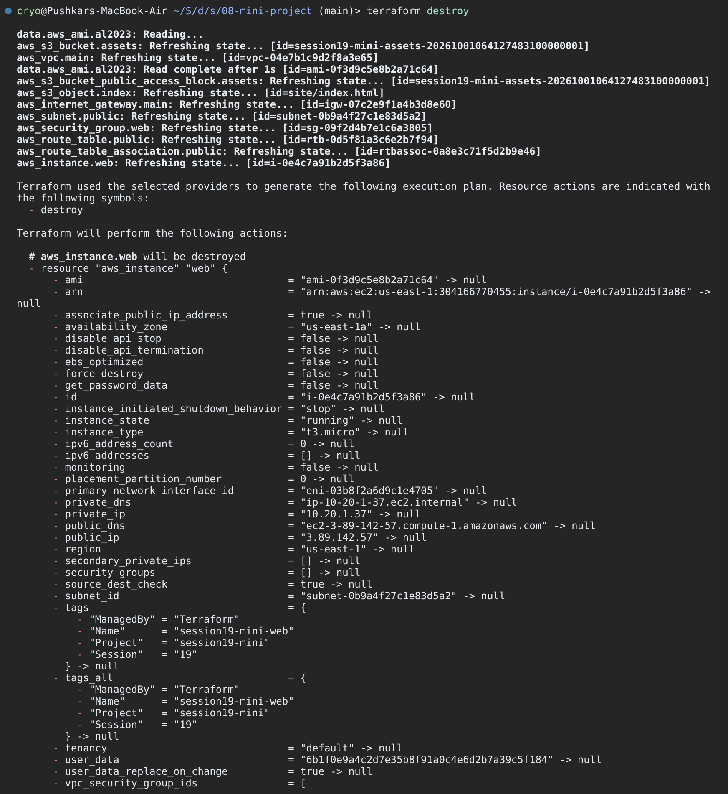

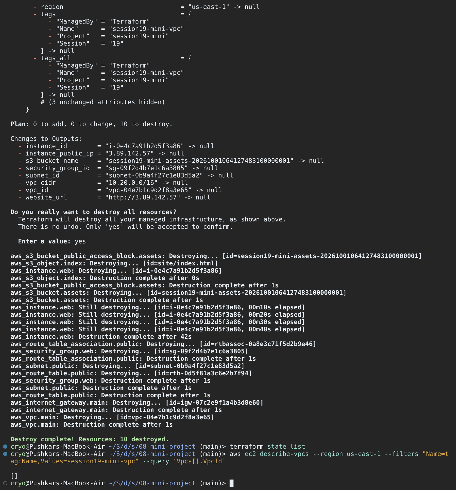

**What I observed:**
- Deletion runs in **reverse dependency order**. `build-info.json` goes first, then the instance (about 40 s to terminate), then the association, subnet, SG and route table, then the IGW, and the VPC last.
- The bucket could be deleted with objects in it only because of `force_destroy = true`. I set that for the lab only.
- After destroy, `state list` is empty. The instance shows `terminated`, and the bucket returns `NoSuchBucket`.

---

## Command cheat sheet

| Step | Command | Result |
| --- | --- | --- |
| Init | `terraform init` | provider downloaded, lock file |
| Format | `terraform fmt -recursive` | canonical style |
| Validate | `terraform validate` | `Success! The configuration is valid.` |
| Plan | `terraform plan -out=tfplan` | `Plan: 12 to add, 0 to change, 0 to destroy.` |
| Apply | `terraform apply tfplan` | `Apply complete! Resources: 12 added …` |
| Outputs | `terraform output` | 9 values, incl. `web_url` |
| State | `terraform state list` / `state show <addr>` | 12 resources + 1 data source |
| Graph | `terraform graph \| dot -Tsvg > graph.svg` | dependency picture |
| Drift check | `terraform plan` | `No changes.` |
| Destroy | `terraform destroy` | `Destroy complete! Resources: 12 destroyed.` |

## Deliverables checklist

| Deliverable | Where |
| --- | --- |
| Terraform project | [`09-end-to-end-project/`](09-end-to-end-project/) (`versions.tf`, `variables.tf`, `locals.tf`, `main.tf`, `ec2.tf`, `s3.tf`, `outputs.tf`, `templates/`, `terraform.tfvars.example`) |
| AWS resources (VPC, subnet, IGW, route table, SG, EC2, S3) | Defined in the project above. Shown in screenshots [06](screenshots/06-apply.png), [07](screenshots/07-state-list-output.png), [10](screenshots/10-aws-cli-verify.png), [11](screenshots/11-s3-and-website.png) |
| Architecture diagram | [`screenshots/architecture.png`](screenshots/architecture.png) + Mermaid version above |
| Screenshots | [`screenshots/`](screenshots/): 13 numbered images + architecture (rendered examples) |
| Terraform commands | Tasks 2–9 above + cheat sheet |
| README.md | [`09-end-to-end-project/README.md`](09-end-to-end-project/README.md) |
| Providers / variables / resources / outputs | Concept table at the top. Tasks 2, 3, 6 |
| Dependencies | Task 3 (implicit references + `depends_on`, `terraform graph`) |
| State | Task 6 (`state list/show`) and Task 8 (`plan` → No changes) |
| plan / apply / destroy | Tasks 4, 5, 9 |
