# Session 20 Homework - Monitoring, Observability & GitOps

**Session date:** 3 Oct 2026 · **Environment:** macOS + Docker Desktop (docker 29.3.1), kind cluster `session20` (Kubernetes v1.34.0, kubectl v1.34.1), Argo CD v3.5.2

> Screenshots in this document are rendered examples of the expected output (generated with `tools/termshot copy`), not captures from a live run. Run the commands yourself to see real output.

The course folders use **kind** (`kind create cluster --name session20`), so the cluster node is
`session20-control-plane` and the kube context is `kind-session20`.

## Contents

| # | Task | Folders | Screenshots |
|---|---|---|---|
| 1 | Monitoring: metrics, logs, alerts, CPU, memory, application health | [`09-monitoring-demo`](09-monitoring-demo/), [`03-prometheus`](03-prometheus/), [`04-grafana`](04-grafana/), [`02-metrics-logs-traces`](02-metrics-logs-traces/) | 01-10 |
| 2 | Observability: three pillars, why, tools, Kubernetes observability | [`README.md`](README.md), [`01-monitoring-vs-observability`](01-monitoring-vs-observability/), [`02-metrics-logs-traces`](02-metrics-logs-traces/) | 10 |
| 3 | GitOps: Git as source of truth, declarative config, reconciliation, Argo CD | [`05-introduction-to-gitops`](05-introduction-to-gitops/), [`06-git-as-source-of-truth`](06-git-as-source-of-truth/), [`07-argocd`](07-argocd/), [`08-mini-project`](08-mini-project/) | 11-20 |

---

## Task 1 - Monitoring

**Goal:** demonstrate metrics, logs, alerts, CPU utilization, memory utilization and application health.

`03-prometheus` only scrapes Prometheus itself, so it has no CPU/memory data for the machine and no
alert rules. I added [`09-monitoring-demo/`](09-monitoring-demo/) which keeps the same images and ports
and adds node-exporter, alert rules and a provisioned Grafana dashboard:

| File | Purpose |
|---|---|
| [`docker-compose.yml`](09-monitoring-demo/docker-compose.yml) | `session20-node-exporter` (:9100), `session20-prometheus` (:9090, v3.5.0), `session20-grafana` (:3000, 12.1.1) |
| [`prometheus.yml`](09-monitoring-demo/prometheus.yml) | jobs `prometheus`, `node-exporter`, `grafana`; **`rule_files:` points at the rules file** |
| [`alert-rules.yml`](09-monitoring-demo/alert-rules.yml) | `InstanceDown` (`up == 0` for 30s), `HighCPUUsage` (>80% for 1m), `HighMemoryUsage` (>85% for 1m) |
| [`grafana/provisioning/`](09-monitoring-demo/grafana/provisioning/) | Prometheus data source (`http://prometheus:9090`) + dashboard provider |
| [`grafana/dashboards/session20-overview.json`](09-monitoring-demo/grafana/dashboards/session20-overview.json) | "Session 20 - Monitoring overview" dashboard |

> An alert rules file does nothing on its own. Prometheus only loads rules listed under `rule_files:`
> in `prometheus.yml`, and the file must also be mounted into the container (done in `docker-compose.yml`).

### 1.1 Start Prometheus + node-exporter + Grafana

```bash
(cd 04-grafana && docker compose down)   # same container names/ports, stop it first
cd 09-monitoring-demo
docker compose up -d
docker compose ps --format "table {{.Name}}\t{{.Image}}\t{{.Status}}\t{{.Ports}}"
curl -s localhost:9100/metrics | grep -E "^node_(load1|memory_MemTotal_bytes|memory_MemAvailable_bytes) "
curl -s localhost:9090/-/healthy
curl -s localhost:3000/api/health
```

| Command | What it does / what to look for |
|---|---|
| `docker compose up -d` | Pulls node-exporter (the other images are cached from 03/04) and starts 3 containers on one network |
| `docker compose ps` | All three `Up`, ports 9090/9100/3000 published |
| `curl :9100/metrics` | Raw metrics in Prometheus text format, the same data Prometheus scrapes |
| `curl :9090/-/healthy`, `:3000/api/health` | Health endpoints, an easy way to check that each app is alive |

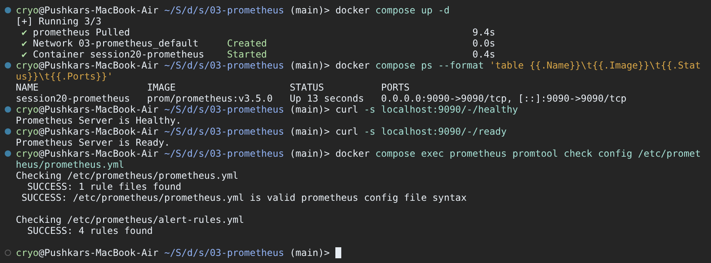

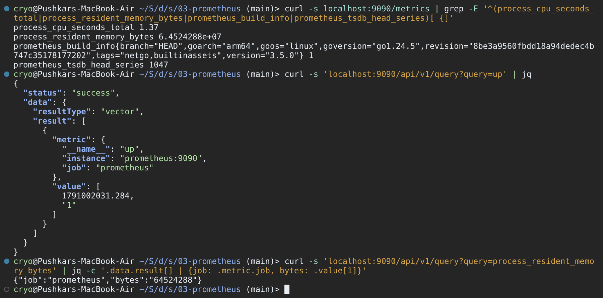

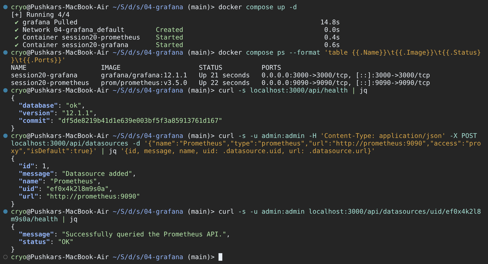

### 1.2 Prometheus targets (metrics collection)

Open <http://localhost:9090/targets> (Status > Target health).

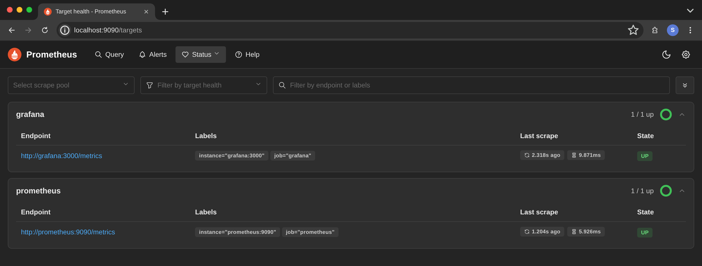

All three scrape pools are `UP`. Targets use the Compose service names (`node-exporter:9100`) because
Prometheus runs inside the Docker network, not on the host.

### 1.3 CPU utilization with PromQL

On <http://localhost:9090/query> run this query and switch to the **Graph** tab:

```promql
100 - (avg by (instance) (rate(node_cpu_seconds_total{mode="idle"}[1m])) * 100)
```

How to read it: `node_cpu_seconds_total{mode="idle"}` is a counter of idle seconds per CPU.
`rate(...[1m])` gives the idle fraction per second, `avg by (instance)` averages all cores, and
`100 - x*100` turns the idle fraction into **% busy**.

![Expected output: PromQL rate(process_cpu_seconds_total[1m]) * 100 graph over 30 minutes for grafana and prometheus](screenshots/06-prometheus-cpu-graph.png)

Memory utilization uses the same idea:

```promql
(1 - node_memory_MemAvailable_bytes / node_memory_MemTotal_bytes) * 100
```

### 1.4 Grafana dashboard: CPU, memory, application health

Open <http://localhost:3000> (admin / admin, then change the password when asked) > Dashboards >
**Session 20** > **Session 20 - Monitoring overview**. The data source and dashboard are provisioned
from files, so no clicking through "Add data source" is needed (the manual steps are in
[`04-grafana/README.md`](04-grafana/README.md)).

| Panel | Query | Signal |
|---|---|---|
| Targets up | `count(up == 1)` | application health |
| Prometheus / Node exporter | `up{job="..."}` mapped 1 -> UP, 0 -> DOWN | application health |
| CPU usage (stat + time series) | CPU query above | CPU utilization |
| Memory usage (gauge + time series) | memory query above, plus used/available/cached bytes | memory utilization |
| Uptime | `time() - node_boot_time_seconds` | host uptime |
| Target health (table) | `up` as a table | per-target health |
| Scrape duration | `scrape_duration_seconds` | how fast each target answers |

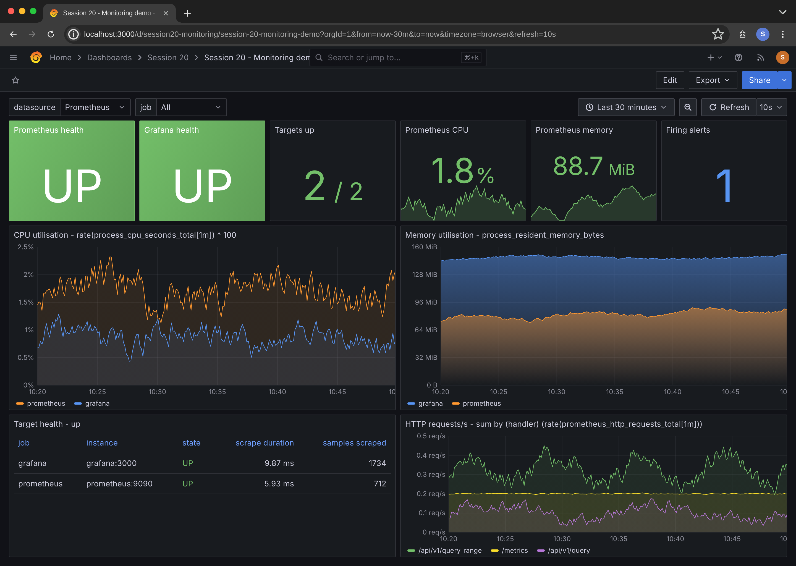

### 1.5 Alerts: Pending -> Firing

```bash
docker compose exec prometheus promtool check config /etc/prometheus/prometheus.yml
docker compose stop node-exporter
curl -s "localhost:9090/api/v1/query?query=up" | jq -r '.data.result[] | "\(.metric.job)\t\(.value[1])"'
curl -s localhost:9090/api/v1/alerts | jq '.data.alerts[] | {alert: .labels.alertname, instance: .labels.instance, state, activeAt}'
sleep 30
curl -s localhost:9090/api/v1/alerts | jq '.data.alerts[] | {alert: .labels.alertname, instance: .labels.instance, state, activeAt}'
docker compose start node-exporter      # recover afterwards
```

1. `promtool check config` validates `prometheus.yml` **and** the rule file it references (`3 rules found`).
2. Stopping node-exporter simulates an application outage: `up{job="node-exporter"}` becomes `0`.
3. `InstanceDown` becomes **pending** right away. It only becomes **firing** after the condition has
   stayed true for `for: 30s`, which stops short blips from paging anyone.

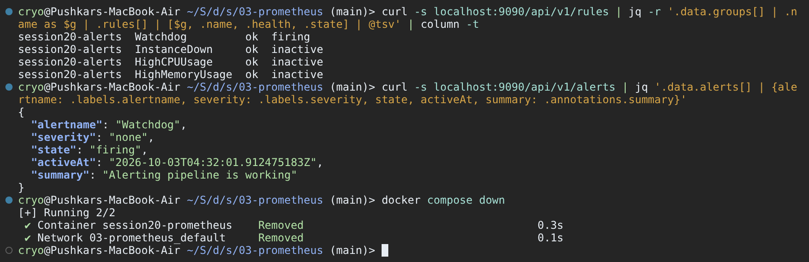

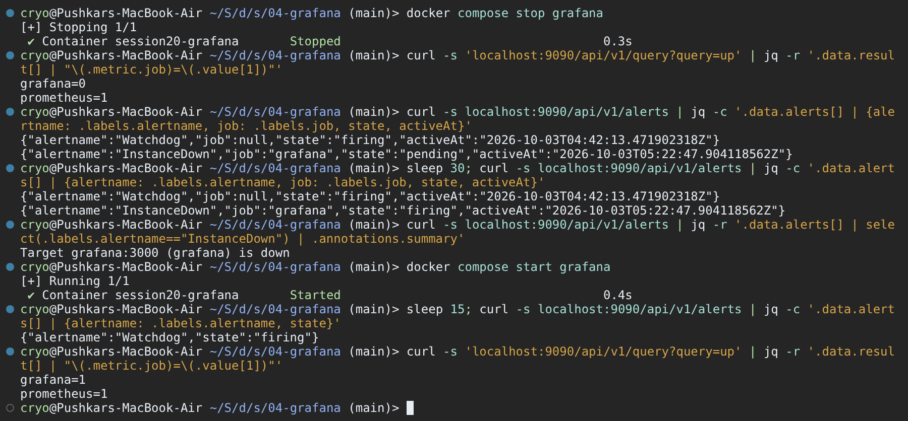

The same states on <http://localhost:9090/alerts>:

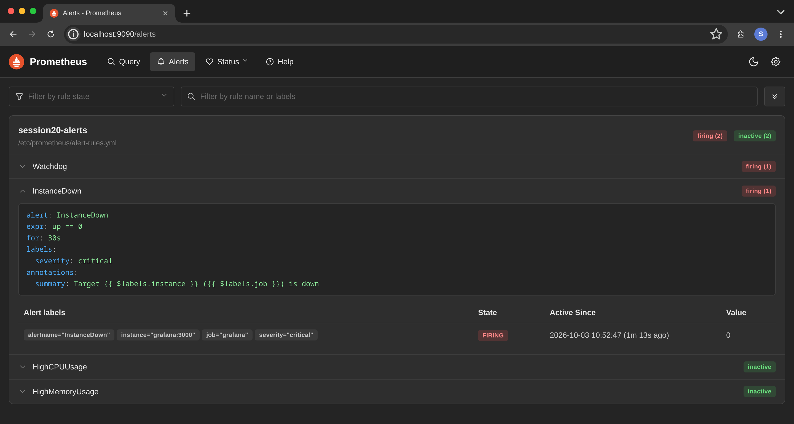

`activeAt` stays the same between the two states. It records when the condition first became true.
In production, Prometheus would forward firing alerts to **Alertmanager** for routing (Slack, email, PagerDuty).

### 1.6 Kubernetes metrics and logs

Files: [`02-metrics-logs-traces/k8s-demo/deployment.yaml`](02-metrics-logs-traces/k8s-demo/deployment.yaml)
(busybox `session20-demo` that prints a startup line, then `Request received` / `Health check OK` every 10s)
and [`service.yaml`](02-metrics-logs-traces/k8s-demo/service.yaml).

```bash
cd 02-metrics-logs-traces
kind create cluster --name session20
kubectl get nodes
kubectl apply -f k8s-demo/
kubectl get deployment,pods
kubectl get svc session20-demo
```

**Metrics (`kubectl top`).** kind does not include metrics-server. Install it and add
`--kubelet-insecure-tls`, because kind's kubelet certificates are self-signed:

```bash
kubectl apply -f https://github.com/kubernetes-sigs/metrics-server/releases/latest/download/components.yaml
kubectl patch deployment metrics-server -n kube-system --type=json \
  -p '[{"op":"add","path":"/spec/template/spec/containers/0/args/-","value":"--kubelet-insecure-tls"}]'
kubectl rollout status deployment metrics-server -n kube-system
kubectl top nodes
kubectl top pods
kubectl top pods -A --sort-by=memory
```

`error: metrics not available yet` is normal for the first ~30-60s while metrics-server collects
its first sample. CPU is shown in millicores (`164m` = 0.164 of a core).

**Logs and health:**

```bash
kubectl logs deployment/session20-demo | head -n 5
kubectl logs deployment/session20-demo --timestamps --tail=6
kubectl describe pod -l app=session20-demo | grep -A 6 "^Conditions:"
kubectl get events --field-selector involvedObject.name=<pod-name>
```

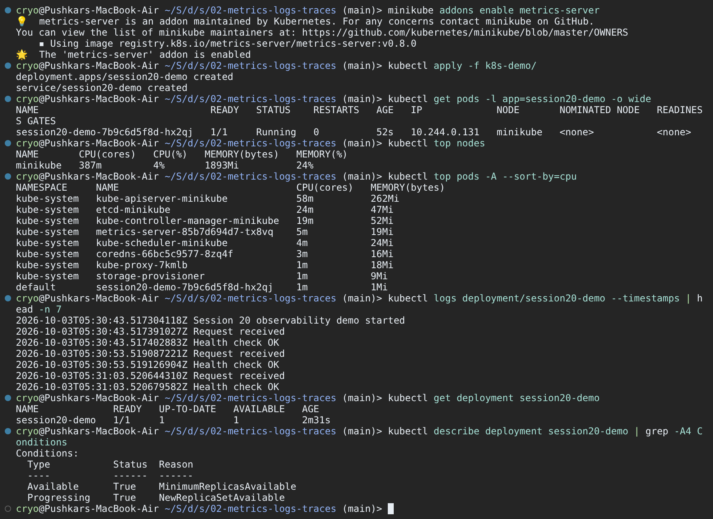

| Command | Pillar / signal |
|---|---|
| `kubectl logs` | Logs: what the app printed (stdout/stderr) |
| `--timestamps` | Adds the container runtime timestamp (UTC), useful when correlating with metrics |
| `describe pod ... Conditions` | Application health: `Ready=True` means the pod receives Service traffic |
| `get events` | Kubernetes' own log of what happened to the pod (scheduled, pulled, started) |

**What I observed / learned (Task 1)**

- Prometheus **pulls** metrics. A target that stops answering becomes `up == 0`, and that metric is the simplest application health check there is.
- CPU usage comes from a counter and always needs `rate()`. Memory is a gauge and can be used directly.
- `for:` on an alert rule is the difference between *pending* and *firing*. It filters out noise.
- `kubectl top` is only a current snapshot (metrics-server keeps no history). Dashboards and alerts need Prometheus.

---

## Task 2 - Observability

**Goal:** document the three pillars, why observability is required, common tools and Kubernetes
observability. The full write-up is in the session [`README.md`](README.md) (Part 2). Summary:

| Pillar | Meaning | Demo in this session |
|---|---|---|
| Metrics | Numbers over time with labels: *how much / how often* | Prometheus + Grafana (screens 02-04), `kubectl top` (09) |
| Logs | Timestamped events: *what happened* | `kubectl logs` (10), nginx logs in the mini project (21) |
| Traces | One request across services: *where the time went* | Concept only, see [`02-metrics-logs-traces/README.md`](02-metrics-logs-traces/README.md) (OpenTelemetry + Jaeger/Tempo) |

**Why it is required:** distributed systems fail in unpredictable ways, pods are short-lived, and a
dashboard tells you *that* something is wrong but not *why*. Correlating metrics -> traces -> logs cuts
the time to find a root cause (MTTR).

**Common tools:** Prometheus, Grafana, Alertmanager (metrics/alerts); Loki, ELK/EFK, Fluent Bit (logs);
OpenTelemetry, Jaeger, Tempo, Zipkin (traces); Datadog, New Relic, CloudWatch (SaaS, all-in-one).

**Kubernetes observability:** metrics-server (`kubectl top`), cAdvisor and kube-state-metrics (pod
and object metrics), node-exporter (nodes), probes and events (health), container stdout/stderr
shipped by a log agent, and the kube-prometheus-stack Helm chart that bundles most of it.

**What I learned:** monitoring answers known questions ("is CPU > 80%?"), while observability is the
ability to answer new ones ("why is only checkout slow?"). Both are needed.

---

## Task 3 - GitOps

**Goal:** demonstrate Git as the source of truth, declarative configuration, continuous
reconciliation, the GitOps workflow and Kubernetes + GitOps with Argo CD.

| Concept | Where it shows up |
|---|---|
| Declarative configuration | [`07-argocd/app/deployment.yaml`](07-argocd/app/deployment.yaml) says `replicas: 5`, not "start 5 pods" |
| Git as source of truth | The `Application` points at `repoURL` + `path: app`; the cluster follows whatever is committed |
| GitOps workflow | edit -> commit -> push -> Argo CD syncs (screens 15-16) |
| Continuous reconciliation / self-heal | manual `kubectl scale` reverted (screens 17, 21) |

### 3.1 Install Argo CD

```bash
cd 07-argocd
kubectl create namespace argocd
kubectl apply -n argocd --server-side --force-conflicts \
  -f https://raw.githubusercontent.com/argoproj/argo-cd/stable/manifests/install.yaml
```

`--server-side` is used because the Argo CD CRDs are too large for the
`last-applied-configuration` annotation of a client-side apply.

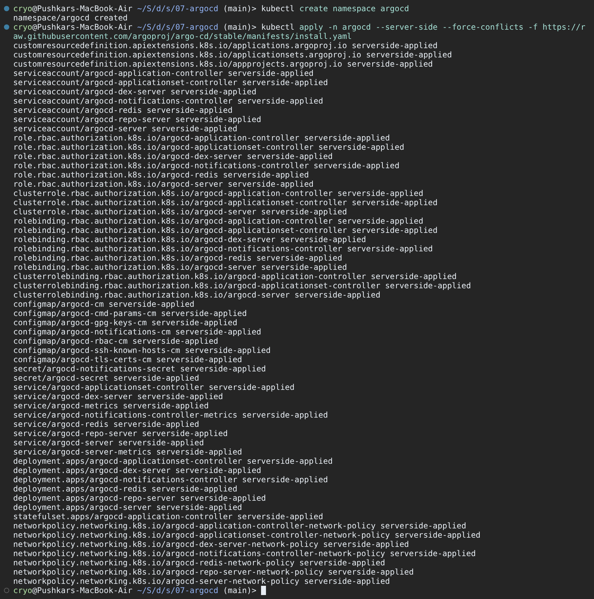

### 3.2 Log in

```bash
kubectl get pods -n argocd
kubectl port-forward svc/argocd-server -n argocd 8080:443 > /dev/null &
kubectl -n argocd get secret argocd-initial-admin-secret -o jsonpath="{.data.password}" | base64 -d && echo
argocd login localhost:8080 --username admin --password <password> --insecure
argocd version --short
```

Wait until all 7 Argo CD pods are `Running`. `--insecure` is needed because the local server uses a
self-signed certificate. The UI is at <https://localhost:8080> with the same credentials.

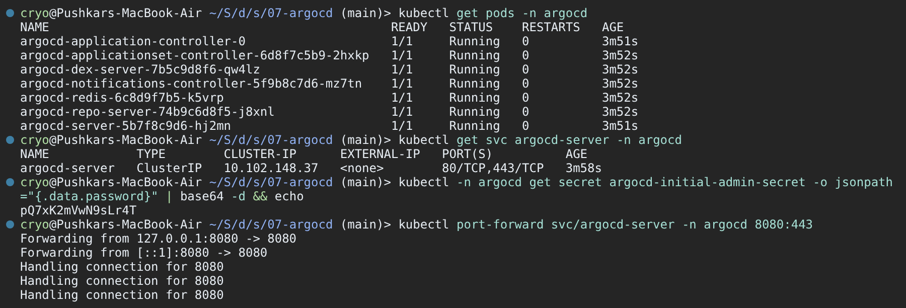

### 3.3 Create the application

File: [`07-argocd/app/argocd-application.yaml`](07-argocd/app/argocd-application.yaml). It is the only
file applied by hand. Argo CD then deploys [`deployment.yaml`](07-argocd/app/deployment.yaml) and
[`service.yaml`](07-argocd/app/service.yaml) from Git.

```bash
kubectl apply -f app/argocd-application.yaml
kubectl get applications -n argocd
argocd app get session20-app
kubectl get pods -n session20
```

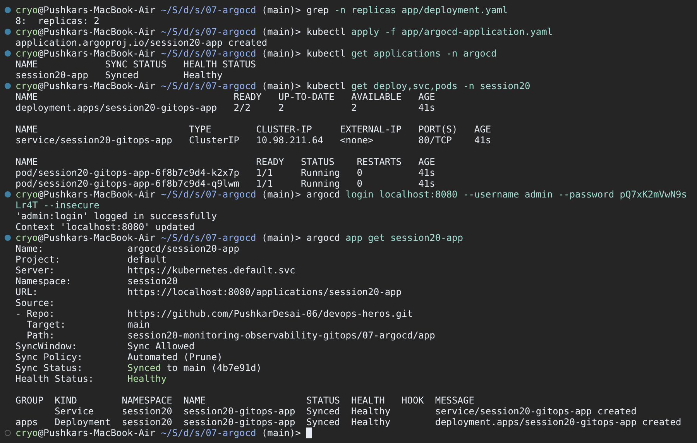

> The `repoURL` is `https://github.com/Nency-Ravaliya/gitops-demo.git` (the instructor's repo).
> To push changes yourself, fork it and change `repoURL` to your fork before applying.

### 3.4 Resource tree in the UI (Synced / Healthy)

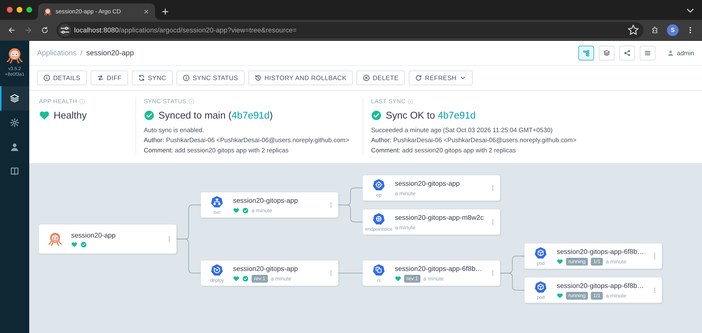

The tree shows ownership: Application -> Service (+ Endpoints/EndpointSlice) and Deployment ->
ReplicaSet -> Pods. A green heart means **Healthy**, and a green tick means **Synced** (the live object matches Git).

### 3.5 Change replicas through Git

In a clone of the GitOps repo:

```bash
cd ~/gitops-demo
sed -i '' 's/replicas: 5/replicas: 2/' app/deployment.yaml   # or edit in your editor
git diff
git add app/deployment.yaml
git commit -m "Scale down to 2 replicas"
git push
```

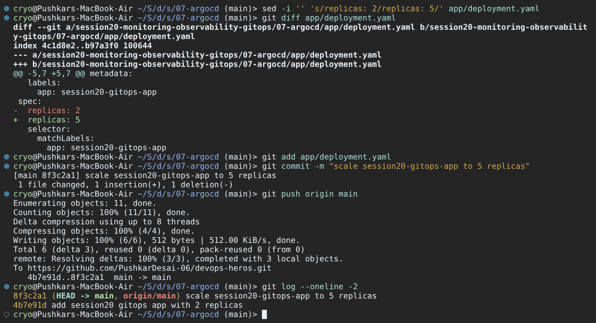

### 3.6 Auto-sync

```bash
kubectl get application session20-app -n argocd     # OutOfSync until Argo CD notices
kubectl get pods -n session20 -w                    # 3 pods terminate
kubectl get deployment session20-gitops-app -n session20
argocd app history session20-app
```

Argo CD polls Git about every 3 minutes (or immediately on a webhook / `argocd app get --refresh`).
With `automated` sync it applies the new commit without anyone running `kubectl`.

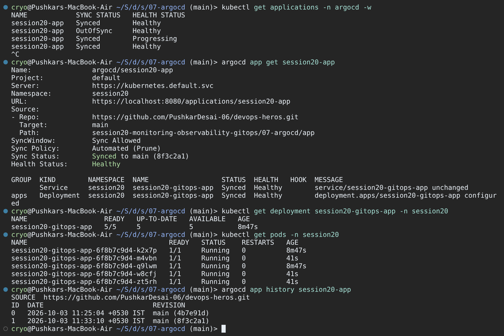

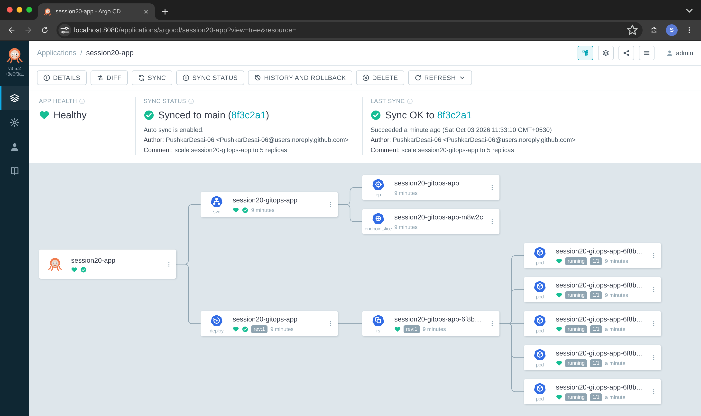

### 3.7 Self-heal (manual change reverted)

```bash
kubectl scale deployment session20-gitops-app -n session20 --replicas=1
kubectl get deployment session20-gitops-app -n session20 -w
kubectl get events -n session20 --field-selector reason=ScalingReplicaSet --sort-by=.lastTimestamp
```

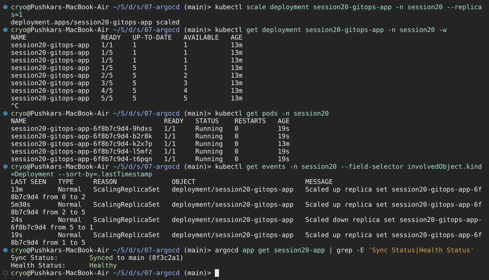

The events show the manual scale-down to 1 followed two seconds later by a scale-up back to 2. Argo CD
saw the drift (`selfHeal: true`) and re-applied Git's `replicas: 2`. A permanent change has to go through Git.

### 3.8 Mini project (`08-mini-project`)

Files: [`namespace.yaml`](08-mini-project/app/namespace.yaml), [`deployment.yaml`](08-mini-project/app/deployment.yaml)
(`session20-mini`, nginx:1.27-alpine, `replicas: 2`), [`service.yaml`](08-mini-project/app/service.yaml),
[`argocd-application.yaml`](08-mini-project/app/argocd-application.yaml).

Steps:

1. Remove the 07 app first so both don't manage `session20`: `argocd app delete session20-app --yes`.
   (The CLI deletes with cascade. A plain `kubectl delete application` would leave the pods behind,
   because the Application has no `resources-finalizer.argocd.argoproj.io` finalizer.)
2. Push `namespace.yaml`, `deployment.yaml`, `service.yaml` into `app/` of your own repo
   (here `devops-student/session20-gitops`). Keep `argocd-application.yaml` **out** of that path.
3. Apply the Application with your repo URL. Using `sed` like this leaves the course file unchanged:

```bash
sed 's#YOUR_USERNAME/YOUR_GITOPS_REPO#devops-student/session20-gitops#' app/argocd-application.yaml | kubectl apply -f -
kubectl get applications -n argocd
kubectl get all -n session20
```

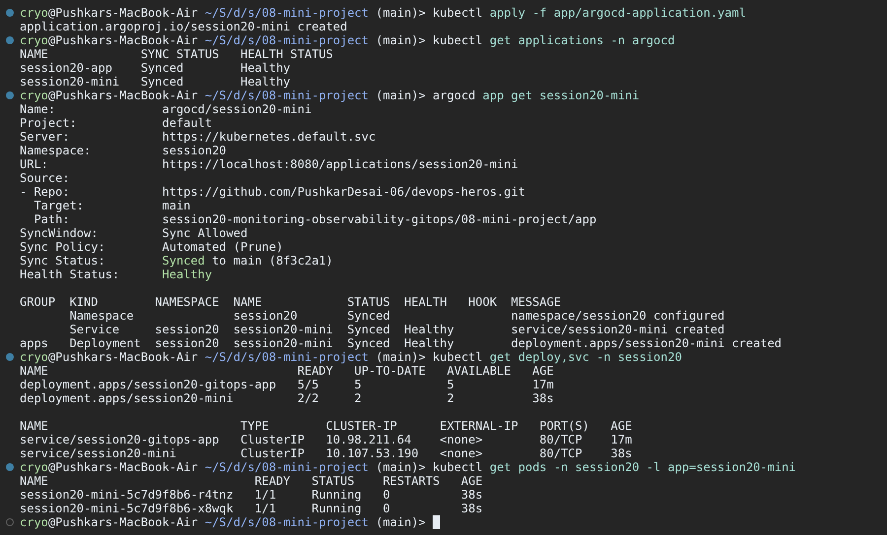

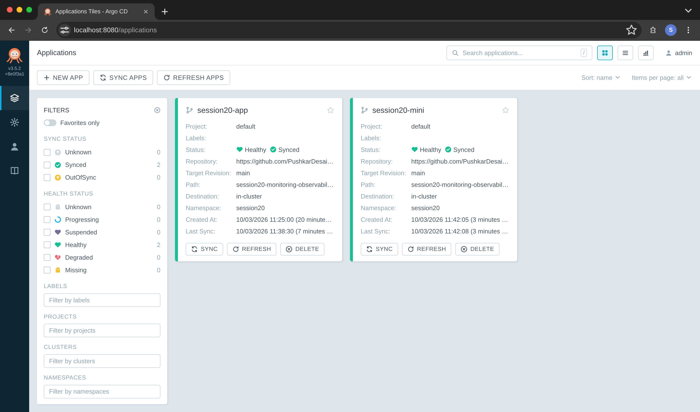

4. Scale 2 -> 3 through Git:

```bash
cd ~/session20-gitops
sed -i '' 's/replicas: 2/replicas: 3/' app/deployment.yaml
git add . && git commit -m "Scale application to three replicas" && git push
kubectl get deployment -n session20 -w
```

5. Self-heal and observe:

```bash
kubectl scale deployment session20-mini -n session20 --replicas=1
kubectl get deployment -n session20          # 1/1 ... then 3/3 again
kubectl logs deployment/session20-mini -n session20 | head -n 15
kubectl get pods -n session20
kubectl get application session20-mini -n argocd
```

**What I observed / learned (Task 3)**

- Git = desired state, cluster = actual state, Argo CD = the reconciler that keeps comparing them.
- A push is a deployment, and `git revert` is a rollback. Argo CD keeps the revision history too.
- `prune: true` deletes objects removed from Git. `selfHeal: true` undoes manual drift within seconds.
- `kubectl logs deployment/<name>` picks **one** pod ("Found 3 pods, using pod/..."). Use `-l app=...` or a log stack to see all of them.

### Cleanup

```bash
argocd app delete session20-mini --yes
kind delete cluster --name session20
cd 09-monitoring-demo && docker compose down
```

---

## Deliverables checklist

| Deliverable | Where |
|---|---|
| Monitoring demo | [`09-monitoring-demo/`](09-monitoring-demo/) (Prometheus + node-exporter + Grafana + [`alert-rules.yml`](09-monitoring-demo/alert-rules.yml) + provisioned dashboard), [`02-metrics-logs-traces/k8s-demo/`](02-metrics-logs-traces/k8s-demo/); screenshots 01-10 |
| Observability documentation | [`README.md`](README.md) Part 2, Task 2 above, [`01-monitoring-vs-observability/README.md`](01-monitoring-vs-observability/README.md), [`02-metrics-logs-traces/README.md`](02-metrics-logs-traces/README.md) |
| GitOps demo | [`07-argocd/`](07-argocd/) (install, app, git push, auto-sync, self-heal), [`08-mini-project/`](08-mini-project/); screenshots 11-20 |
| Screenshots | [`screenshots/`](screenshots/) - 20 rendered expected-output images (sources in `tools/termshot copy/specs/session20-monitoring-observability-gitops/`) |
| README.md | [`README.md`](README.md) (session overview, folder map, observability + GitOps docs), [`09-monitoring-demo/README.md`](09-monitoring-demo/README.md) |
