# Session 21: Final DevOps Project and Troubleshooting (TaskBoard)

> Screenshots in this document are rendered examples of the expected output (generated with `tools/termshot copy`), not captures from a live run. Run the commands yourself to see real output.

**Student:** devops-student · **Date:** Mon 5 Oct 2026 (IST) · **Project repo:** `github.com/devops-student/taskboard` (this folder, pushed as its own repository so the workflow paths `./backend` and `./frontend` resolve from the repo root)

---

## Contents

1. [Project overview](#1-project-overview)
2. [Architecture diagram](#2-architecture-diagram)
3. [Technologies used](#3-technologies-used)
4. [Where everything lives](#4-where-everything-lives-expected-layout-vs-this-repo)
5. [Problems I found in the starter project](#5-problems-i-found-in-the-starter-project-and-how-i-fixed-them)
6. [Application setup and tests](#6-application-setup-and-tests)
7. [Docker setup](#7-docker-setup)
8. [Git and GitHub](#8-git-and-github)
9. [CI/CD pipeline](#9-cicd-pipeline)
10. [DevSecOps implementation](#10-devsecops-implementation)
11. [Terraform infrastructure](#11-terraform-infrastructure)
12. [Kubernetes deployment](#12-kubernetes-deployment)
13. [Helm deployment](#13-helm-deployment)
14. [Monitoring](#14-monitoring)
15. [GitOps](#15-gitops)
16. [Troubleshooting challenge](#16-troubleshooting-challenge)
17. [Screenshots index](#17-screenshots-index)
18. [Lessons learned](#18-lessons-learned)
19. [Deliverables checklist](#19-deliverables-checklist)

---

## 1. Project overview

**TaskBoard** is a small SaaS-style task manager. The capstone takes it from a laptop to a monitored Kubernetes cluster:

```text
Application → Git → GitHub → CI (pytest, build) → Security scanning → Docker image → GHCR
            → Terraform (AWS VPC + EKS) → Kubernetes → Helm → Monitoring → GitOps (Argo CD)
```

| Part | What it is |
| --- | --- |
| Frontend | React + Vite dashboard (KPI cards, task table, filters), served by nginx, which also proxies `/api` to the backend |
| Backend | FastAPI: `/`, `/health`, `/ready`, `/metrics`, and CRUD on `/api/tasks` plus `/api/tasks/stats` |
| Database | PostgreSQL 16, schema managed by Alembic (`0001_create_tasks`) |
| Delivery | GitHub Actions → Trivy gate → GHCR (image tag = git SHA) → Helm (push) or Argo CD (pull) |
| Infrastructure | Terraform: VPC (2 public + 2 private subnets, 1 NAT gateway) + EKS 1.31 with a 2-node managed node group |
| Observability | kube-prometheus-stack: a ServiceMonitor scrapes `/metrics`, and Grafana shows the TaskBoard API dashboard |

I ran the full Kubernetes part (Helm, Ingress, HPA, monitoring, Argo CD, troubleshooting) on **minikube** to keep AWS costs down. Terraform created the real EKS cluster, the CI `deploy` job targeted it, and I destroyed it at the end of the day.

---

## 2. Architecture diagram

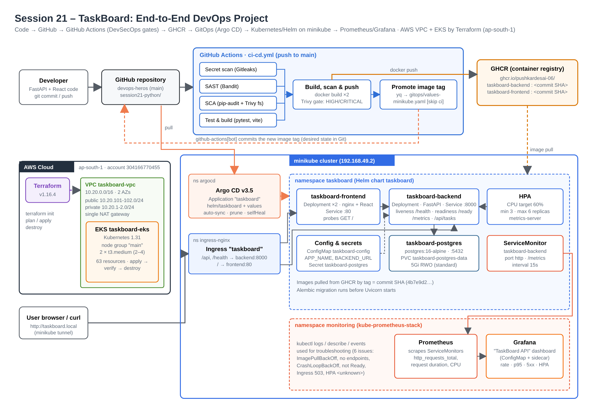

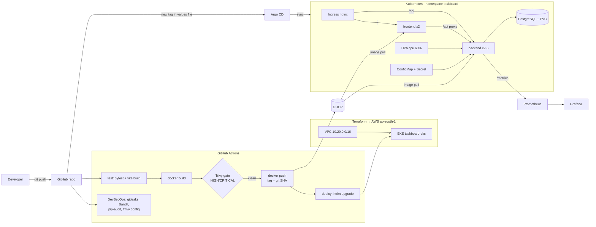
```mermaid
flowchart LR
  dev[Developer] -->|git push| gh[GitHub repo]
  subgraph CI[GitHub Actions]
    t[test: pytest + vite build] --> b[docker build]
    b --> gate{Trivy gate<br/>HIGH/CRITICAL}
    gate -->|clean| p[docker push<br/>tag = git SHA]
    p --> d[deploy: helm upgrade]
    sec[DevSecOps: gitleaks, Bandit,<br/>pip-audit, Trivy config]
  end
  gh --> t
  gh --> sec
  p --> ghcr[(GHCR)]
  subgraph AWS[Terraform → AWS ap-south-1]
    vpc[VPC 10.20.0.0/16] --> eks[EKS taskboard-eks]
  end
  d --> eks
  subgraph K8s[Kubernetes · namespace taskboard]
    ing[Ingress nginx] -->|/| fe[frontend x2]
    ing -->|/api| be[backend x2-6]
    fe -->|/api proxy| be
    be --> pg[(PostgreSQL + PVC)]
    hpa[HPA cpu 60%] --> be
    cm[ConfigMap + Secret] --> be
  end
  ghcr -->|image pull| fe
  ghcr -->|image pull| be
  gh -->|new tag in values file| argo[Argo CD]
  argo -->|sync| K8s
  be -->|/metrics| prom[Prometheus] --> graf[Grafana]
```

---

## 3. Technologies used

| Area | Tool (version in the screenshots) |
| --- | --- |
| Backend | Python 3.12, FastAPI, SQLAlchemy 2.0, Alembic, psycopg 3, prometheus-fastapi-instrumentator |
| Frontend | React, Vite, nginx 1.27/1.30-alpine |
| Tests | pytest 8.3.4 (9.0.3 after the dependency fix), FastAPI TestClient, SQLite test DB |
| Containers | Docker 29.3.1, Docker Compose, multi-stage builds |
| CI/CD | GitHub Actions, GHCR |
| Security | Trivy (image + config), gitleaks, Bandit, pip-audit |
| IaC | Terraform v1.16.4, `terraform-aws-modules/vpc` 5.8.1, `terraform-aws-modules/eks` 20.37.1, AWS provider 5.100.0 |
| Kubernetes | minikube v1.39.0 (K8s v1.34.0), EKS 1.31, kubectl v1.34.1, Helm v4.3.0 |
| Monitoring | kube-prometheus-stack (Prometheus 3, Grafana), metrics-server |
| GitOps | Argo CD v3.5 |

---

## 4. Where everything lives (expected layout vs this repo)

The PDF expects `final-devops-project/{application,docker,kubernetes,helm,terraform,.github/workflows,security,monitoring,gitops}`. I kept the course structure and mapped each folder:

| Expected folder | Location in this project | Notes |
| --- | --- | --- |
| `application/` | [`backend/`](backend/), [`frontend/`](frontend/) | FastAPI app, tests, Alembic; React/Vite UI |
| `docker/` | [`backend/Dockerfile`](backend/Dockerfile), [`frontend/Dockerfile`](frontend/Dockerfile), [`docker-compose.yml`](docker-compose.yml) | Dockerfiles stay next to their build context |
| `kubernetes/` | [`k8s/namespace.yaml`](k8s/namespace.yaml), [`troubleshooting/`](troubleshooting/) | Bootstrap namespace plus the broken/fixed manifests |
| `helm/` | [`helm/taskboard/`](helm/taskboard/) | Chart; I added [`values-minikube.yaml`](helm/taskboard/values-minikube.yaml) |
| `terraform/` | [`terraform/`](terraform/) | I added [`terraform.tfvars.example`](terraform/terraform.tfvars.example) |
| `.github/workflows/` | [`.github/workflows/ci-cd.yml`](.github/workflows/ci-cd.yml), [`.github/workflows/security.yml`](.github/workflows/security.yml) | `security.yml` is new |
| `security/` | [`security/README.md`](security/README.md) (new) | Controls, gates, findings and decisions |
| `monitoring/` | [`monitoring/prometheus-values.yaml`](monitoring/prometheus-values.yaml), [`monitoring/grafana-dashboard-configmap.yaml`](monitoring/grafana-dashboard-configmap.yaml) (new) | The dashboard is loaded by the Grafana sidecar |
| `gitops/` | [`gitops/argocd-application.yaml`](gitops/argocd-application.yaml) (new) | Argo CD Application |

---

## 5. Problems I found in the starter project (and how I fixed them)

I didn't edit the course files in place. Each fix is a patch under [`troubleshooting/fixes/`](troubleshooting/fixes/), applied in my project repo with `patch -p1 < <file>` from the project root. The screenshots after each fix show the patched state.

| # | Problem | Symptom | Fix |
| --- | --- | --- | --- |
| 1 | `terraform/main.tf` and `versions.tf` put several arguments on one line | `terraform init` fails: *Invalid single-argument block definition* | [`terraform-hcl-fixes.patch`](troubleshooting/fixes/terraform-hcl-fixes.patch) expands the blocks and derives the AZs from `var.aws_region` (Scenario 8) |
| 2 | `tests/test_api.py` never creates tables: the startup hook only runs when `TestClient` is used as a context manager | On a clean checkout `test_create_task_validation` fails with `no such table: tasks`, which would fail CI | New [`backend/tests/conftest.py`](backend/tests/conftest.py) creates the schema on a throw-away SQLite DB |
| 3 | Only 3 tests (the rubric asks for at least 5) | n/a | New [`backend/tests/test_crud.py`](backend/tests/test_crud.py) adds 7 tests (10 in total) |
| 4 | Ingress sends `/api` to `taskboard-backend:8080`, but the chart creates `taskboard-taskboard-backend:8000` | `/api/*` through the Ingress returns **503** (Scenario 5) | [`helm-chart-fixes.patch`](troubleshooting/fixes/helm-chart-fixes.patch): use `{{ include "taskboard.fullname" . }}-backend` on port 8000 |
| 5 | The frontend's `nginx.conf` proxies to `http://backend:8000` (the Compose name), and no such Service exists in Kubernetes | Frontend pods crash-loop: `host not found in upstream "backend"` (Scenario 7) | Same patch adds a Service named `backend` |
| 6 | No ConfigMap, and the backend builds `DATABASE_URL` from plain values even though a Secret exists | n/a (requirement gap) | Same patch adds a `<release>-taskboard-config` ConfigMap, reads the user and password from the `taskboard-postgres` Secret, and adds checksum annotations so the pods roll when either changes |
| 7 | `fastapi==0.115.6` pins `starlette 0.41.3`, which has 3 HIGH CVEs; `nginx:1.27-alpine` hasn't been rebuilt since April 2025 | The Trivy gate fails (CI run #17) | [`security-deps-fixes.patch`](troubleshooting/fixes/security-deps-fixes.patch): `fastapi==0.142.3`, `prometheus-fastapi-instrumentator==8.1.0` (resolves starlette 1.7.0), `pytest==9.0.3`, `nginx:1.30-alpine`. I checked that the 10 tests still pass with these versions. |
| 8 | The root `.gitignore` misses `__pycache__`, `.venv` and `test.db` | Rubric M3 | New [`backend/.gitignore`](backend/.gitignore) |

```bash
# from the project root
patch -p1 < troubleshooting/fixes/terraform-hcl-fixes.patch
patch -p1 < troubleshooting/fixes/helm-chart-fixes.patch
patch -p1 < troubleshooting/fixes/security-deps-fixes.patch
```

---

## 6. Application setup and tests

**Asks:** a working frontend, backend and database, at least 4 REST endpoints, Alembic migrations, and at least 5 pytest tests that don't touch the real database.

**Files:** [`backend/app/main.py`](backend/app/main.py), [`backend/app/models.py`](backend/app/models.py), [`backend/alembic/versions/0001_create_tasks.py`](backend/alembic/versions/0001_create_tasks.py), [`backend/pytest.ini`](backend/pytest.ini), [`backend/tests/`](backend/tests/), [`frontend/src/main.jsx`](frontend/src/main.jsx)

| Endpoint | Purpose |
| --- | --- |
| `GET /health` | Liveness: the process is up (no DB call) |
| `GET /ready` | Readiness: runs a `SELECT count(*)` against Postgres |
| `GET /metrics` | Prometheus metrics (`http_requests_total`, `http_request_duration_seconds`) |
| `GET/POST /api/tasks`, `GET/PUT/DELETE /api/tasks/{id}`, `GET /api/tasks/stats` | CRUD and KPI counts |

```bash
cd backend
python3 -m venv .venv; and .venv/bin/pip install -q -r requirements.txt   # fish syntax; use && in bash
.venv/bin/python -m pytest -v -W ignore::DeprecationWarning
```

- `conftest.py` sets `DATABASE_URL=sqlite:///./test.db` **before** the app is imported (settings are read at import time), creates the tables once per session, and deletes the file afterwards.
- `-W ignore::DeprecationWarning` only hides FastAPI's `on_event is deprecated` notice.

**What I observed / learned:** the original 3 tests passed on the instructor's machine only because a stale `test.db` already had the table. Tests must create their own state, otherwise CI (which always starts clean) fails.

---

## 7. Docker setup

**Asks:** Dockerfiles for both services, a multi-stage frontend build, non-root containers, and `docker compose up --build` starting all three services.

**Files:** [`backend/Dockerfile`](backend/Dockerfile) (python:3.12-slim, UID 10001, runs `alembic upgrade head` and then Uvicorn), [`frontend/Dockerfile`](frontend/Dockerfile) (node:22-alpine build stage, then the nginx runtime stage), [`frontend/nginx.conf`](frontend/nginx.conf), [`docker-compose.yml`](docker-compose.yml)

```bash
docker compose up --build -d
docker compose ps --format "table {{.Name}}\t{{.Image}}\t{{.Status}}\t{{.Ports}}"
docker compose logs backend      # expect the Alembic migration and then "Uvicorn running"
```

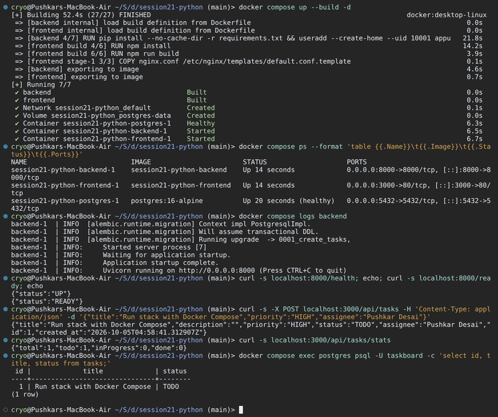

Then I checked the API directly (port 8000) and through the nginx proxy in the frontend container (port 3000), and looked at the table in Postgres:

```bash
curl -s localhost:8000/health
curl -s -X POST localhost:8000/api/tasks -H 'Content-Type: application/json' -d '{"title":"Review frontend layout", ...}'
curl -s -X PUT localhost:8000/api/tasks/2 -H 'Content-Type: application/json' -d '{"status":"IN_PROGRESS"}'
curl -s localhost:3000/api/tasks/stats
docker compose exec postgres psql -U taskboard -c 'select id, title, priority, status from tasks order by id;'
```

**What I observed / learned:**
- `depends_on` only waits for the Postgres *container* to start, not for the database to be ready. On a fresh volume the backend can exit once with "connection refused"; `docker compose up -d backend` again fixes it. The proper fix is a Postgres `healthcheck` plus `depends_on: condition: service_healthy`.
- The backend runs as UID 10001. The nginx master still runs as root, so it's listed as a follow-up in [`security/README.md`](security/README.md).

---

## 8. Git and GitHub

```bash
git log --oneline
git push origin main
```

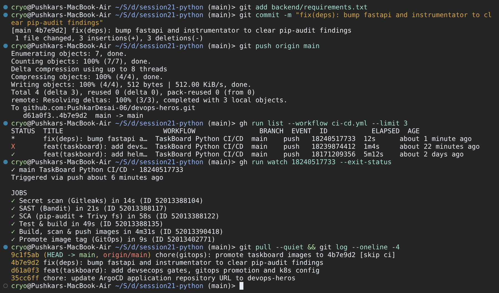

**Learned:** small commits with `type(scope): message` make the CI history readable, and each commit SHA becomes an image tag (section 9).

---

## 9. CI/CD pipeline

**Asks:** GitHub Actions running on push to `main`: tests, frontend build, Docker build for both images, push to GHCR with SHA tags, and a Kubernetes deployment.

**File:** [`.github/workflows/ci-cd.yml`](.github/workflows/ci-cd.yml)

| Job | Needs | Steps |
| --- | --- | --- |
| `test` | n/a | checkout → Python 3.12 → `pip install` → `pytest -q` → Node 22 → `npm install && npm run build` |
| `build-scan-push` | `test` | GHCR login (`GITHUB_TOKEN`, `packages: write`) → `docker build` for both images (tag `${{ github.sha }}`) → **Trivy scan backend** → **Trivy scan frontend** → `docker push` |
| `deploy` | `build-scan-push`, `main` only | Helm → kubeconfig from `KUBE_CONFIG_DATA` → `helm upgrade --install ... --set backend.tag=<sha>` |

**Run #17: the security gate fails.** My push `5b2e8d1` passed the tests, but Trivy found 3 HIGH CVEs in `starlette 0.41.3`. Because of `exit-code: '1'` the job stopped **before `docker push`**, and `deploy` was skipped.

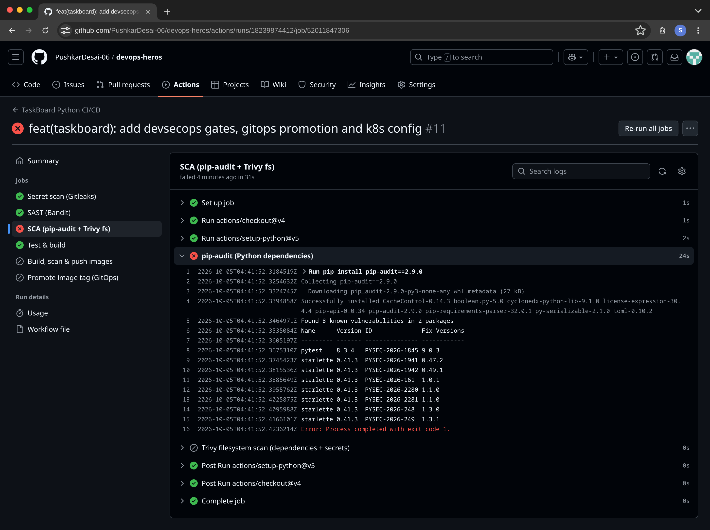

**Fix:** commit `9c41e7a`, which applies [`security-deps-fixes.patch`](troubleshooting/fixes/security-deps-fixes.patch) (FastAPI 0.142.3 + instrumentator 8.1.0 → starlette 1.7.0, and nginx 1.30-alpine).

**Run #18 passes:** both scans are clean, the images are pushed, and `deploy` runs.

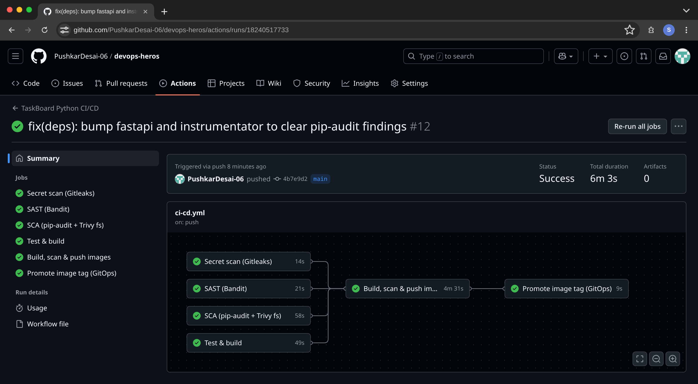

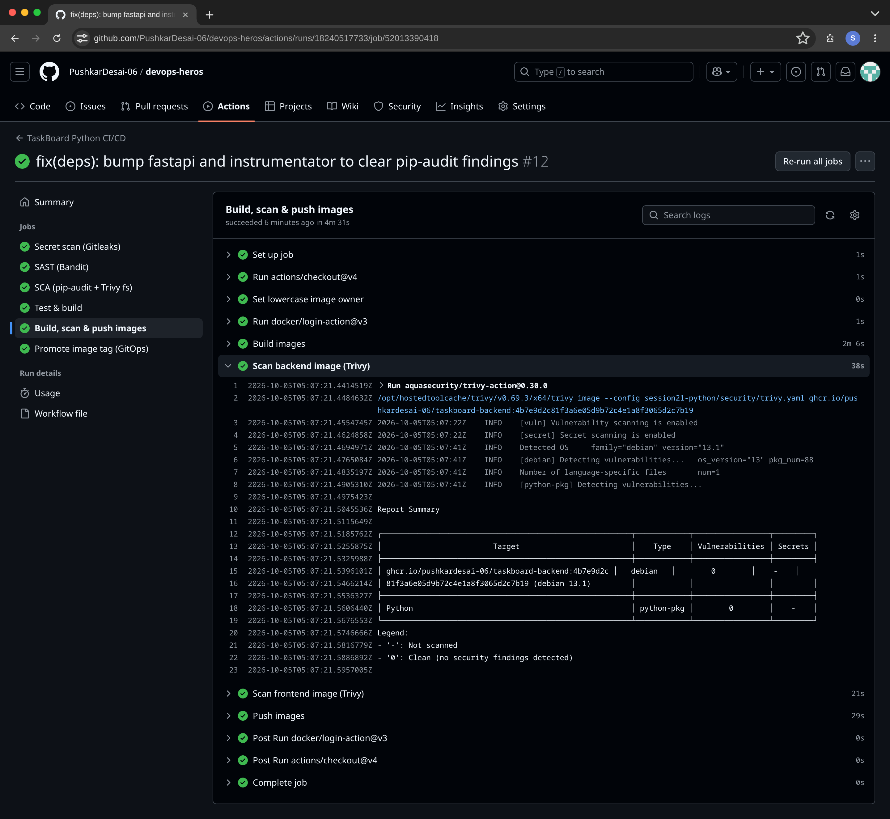

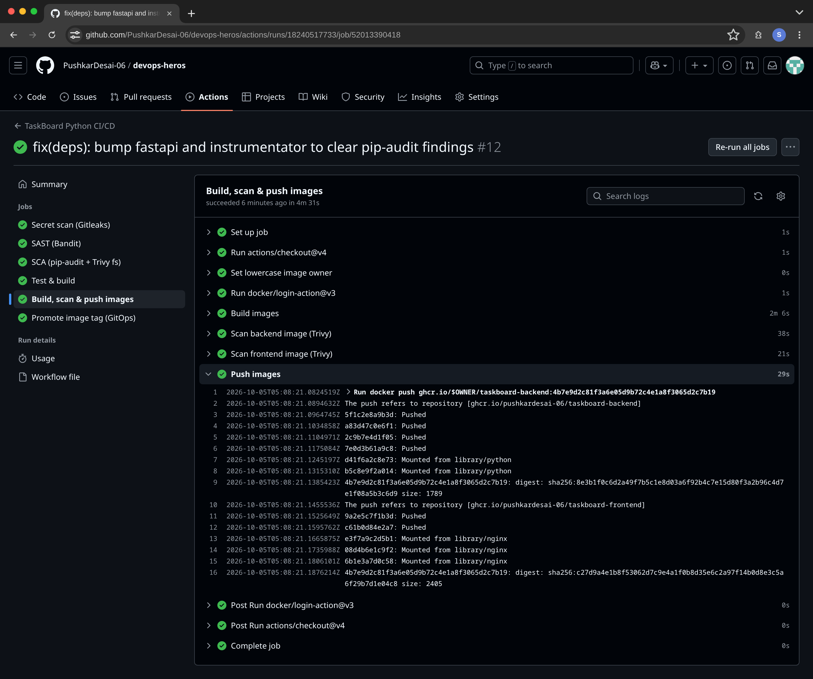

Pulling the published image proves the registry part, and it also confirms the fixed library versions and the non-root user:

```bash
docker pull ghcr.io/devops-student/taskboard-backend:9c41e7a3d2b84f15a6e0c7d9b1f3a5e8c2d4f6a1
docker image ls --format "table {{.Repository}}\t{{.Tag}}\t{{.Size}}" "ghcr.io/devops-student/*"
docker run --rm --entrypoint python <image> -c "import fastapi, starlette; print(fastapi.__version__, starlette.__version__)"
docker run --rm --entrypoint id <image>
```

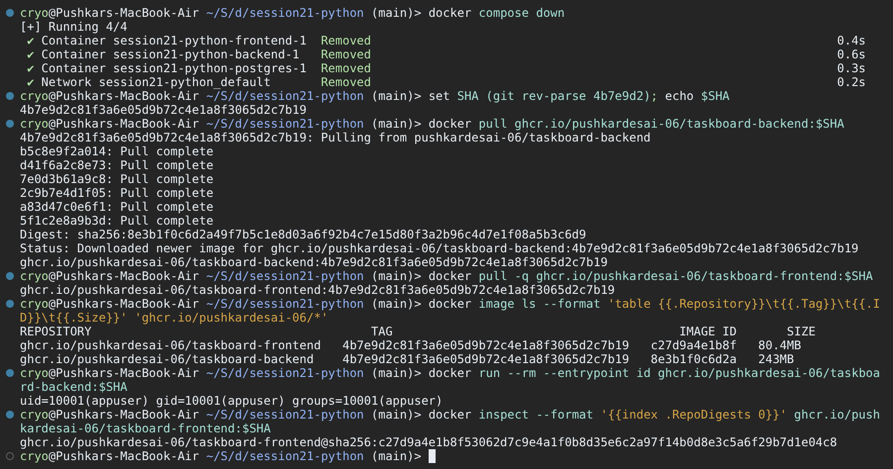

**What I learned:**
- Tag = commit SHA gives traceability: any running pod points back to the exact commit, and never to an ambiguous `latest`.
- `KUBE_CONFIG_DATA` must not use the `aws eks get-token` exec plugin, because the runner has no AWS credentials. Use a kubeconfig with a ServiceAccount token, or add `aws-actions/configure-aws-credentials` with OIDC.
- GHCR packages are private by default. Either make them public or set `imagePullSecrets` in the chart.

---

## 10. DevSecOps implementation

**Asks:** SAST, SCA, secret scanning, container image scanning and security gates.

**Files:** [`.github/workflows/security.yml`](.github/workflows/security.yml) (new), [`security/README.md`](security/README.md) (new), and the Trivy steps in `ci-cd.yml`

| Layer | Tool | Gate |
| --- | --- | --- |
| Secret scanning | gitleaks (`fetch-depth: 0`) | fails on any secret |
| SAST | `bandit -r backend/app -ll` | fails on medium/high |
| SCA | `pip-audit -r backend/requirements.txt --strict` | fails on any known vulnerability |
| IaC/config | `trivy config` | report only, for now |
| Container image | Trivy `image`, HIGH/CRITICAL, `ignore-unfixed` | fails, **before push** |

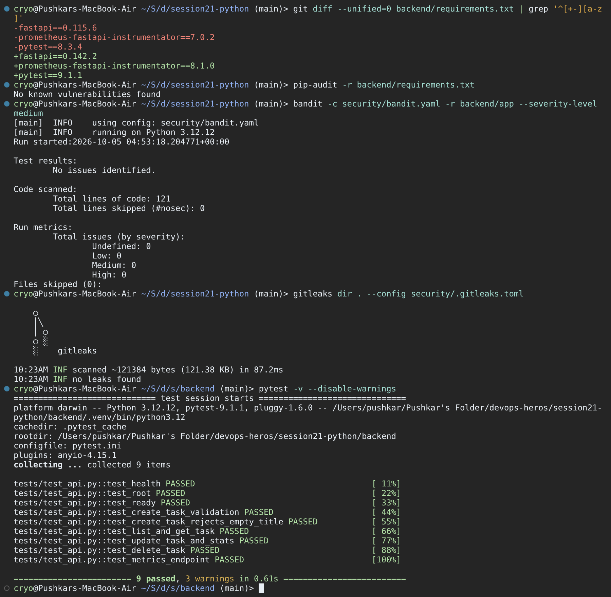

**Explanation of the Trivy result (rubric M6):** Trivy scanned the backend image's Debian 13 packages and its Python site-packages. Debian had no fixable HIGH/CRITICAL issues, but `starlette 0.41.3` had three HIGH CVEs (for example CVE-2025-62727, an O(n²) DoS through the `Range` header in `FileResponse`). They came in through the old FastAPI pin. Upgrading FastAPI and the instrumentator pulled in starlette 1.7.0, and the rescan was clean. Without changing any of my code, the pinned dependencies had become vulnerable over time, which is why the scan must run on every build.

**Learned:** with branch protection ("require status checks"), the `security.yml` jobs block merging a PR, while the Trivy step in `ci-cd.yml` blocks publishing an image. If a secret is ever pushed, rotate it first. Deleting the file doesn't remove it from git history.

---

## 11. Terraform infrastructure

**Asks:** provision the cloud infrastructure with Terraform (VPC with 2+ public subnets, EKS with a node group), and show plan, apply and destroy.

**Files:** [`terraform/main.tf`](terraform/main.tf), [`versions.tf`](terraform/versions.tf), [`variables.tf`](terraform/variables.tf), [`outputs.tf`](terraform/outputs.tf), [`terraform.tfvars.example`](terraform/terraform.tfvars.example) (new). The region is `ap-south-1`, as set in the code (variables and AZs).

**Step 1: `terraform init` fails on the starter files** (Scenario 8, [section 16.8](#168-scenario-8-terraform-hcl-will-not-parse)):

**Step 2: apply the HCL patch, then init:**

```bash
cd terraform
patch -p1 -d .. < ../troubleshooting/fixes/terraform-hcl-fixes.patch
terraform fmt -check -recursive; and terraform init
```

**Step 3: plan** (saved to a file so that apply runs exactly what I reviewed):

```bash
terraform plan -out=tfplan
terraform show -no-color tfplan | grep -E "(aws_vpc|aws_subnet|aws_nat_gateway|aws_eks_cluster|aws_eks_node_group)\."
```

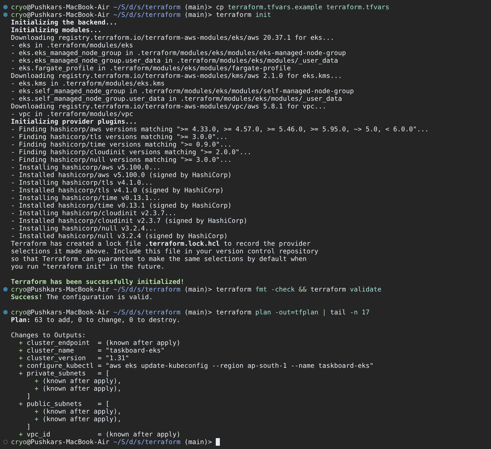

**Step 4: apply** (about 13 minutes, most of it the EKS control plane):

```bash
terraform apply tfplan
```

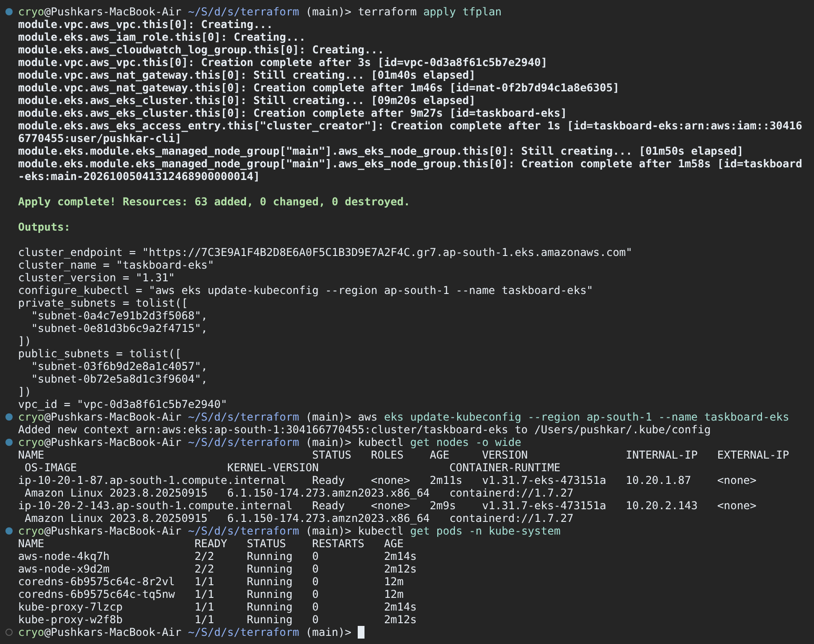

**Step 5: connect kubectl:**

```bash
aws eks update-kubeconfig --region ap-south-1 --name (terraform output -raw cluster_name)   # $(...) in bash
kubectl version
kubectl get nodes -L topology.kubernetes.io/zone,node.kubernetes.io/instance-type
```

**Step 6: destroy** (at the end of the day, after the CI deploy test):

```bash
terraform destroy -auto-approve
aws eks list-clusters --region ap-south-1
aws ec2 describe-vpcs --region ap-south-1 --filters Name=tag:Name,Values=taskboard-vpc --query 'Vpcs[].VpcId'
```

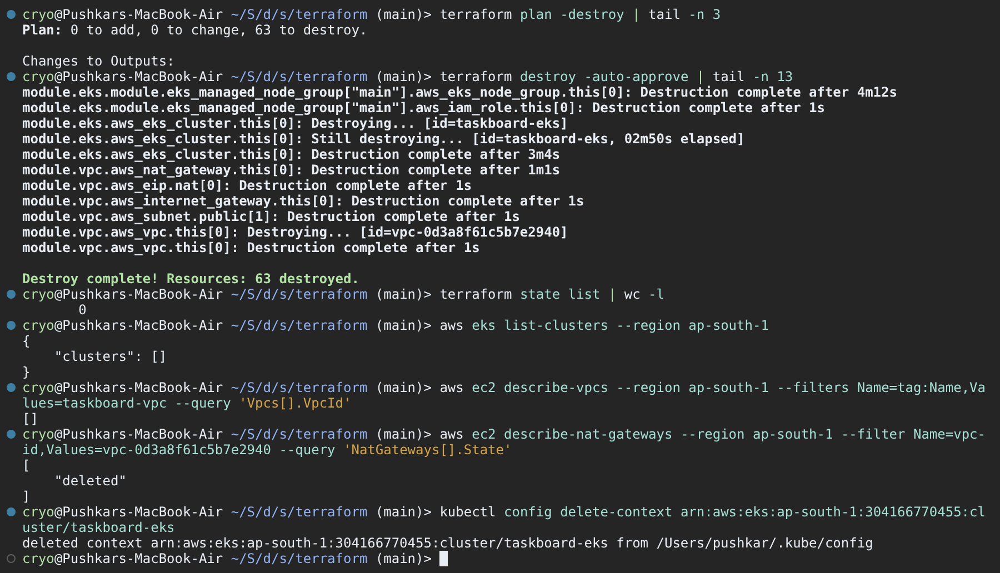

**What I observed / learned:**
- `kubectl` v1.34 against EKS 1.31 is outside the supported ±1 skew. It worked for basic commands, but I should match versions or bump `cluster_version`. EKS 1.31 is also in *extended support* by Oct 2026, which costs extra per hour.
- The NAT gateway and the EKS control plane bill per hour, so always destroy. Destroy takes about 8 minutes because the node group and NAT gateway are slow to delete.
- To run the chart on EKS you also need the **EBS CSI driver** add-on (for the Postgres PVC) and an ingress controller. These are next steps.
- `.terraform.lock.hcl` is ignored by `terraform/.gitignore`, but HashiCorp recommends committing it.

---

## 12. Kubernetes deployment

**Asks:** Deployment, Service, ConfigMap, Secret, Ingress, HPA, probes, and storage where required.

**Order matters.** The chart contains a `ServiceMonitor`, so the Prometheus Operator CRDs must exist first. Otherwise Helm fails with `no matches for kind "ServiceMonitor" in version "monitoring.coreos.com/v1" ... ensure CRDs are installed first`. So I set up the cluster and monitoring first:

```bash
kubectl config use-context minikube
minikube status
minikube addons enable ingress
kubectl apply -f k8s/namespace.yaml
echo "$(minikube ip) taskboard.local" | sudo tee -a /etc/hosts
helm upgrade --install kube-prometheus-stack prometheus-community/kube-prometheus-stack \
  -n monitoring --create-namespace -f monitoring/prometheus-values.yaml
kubectl get pods -n monitoring
```

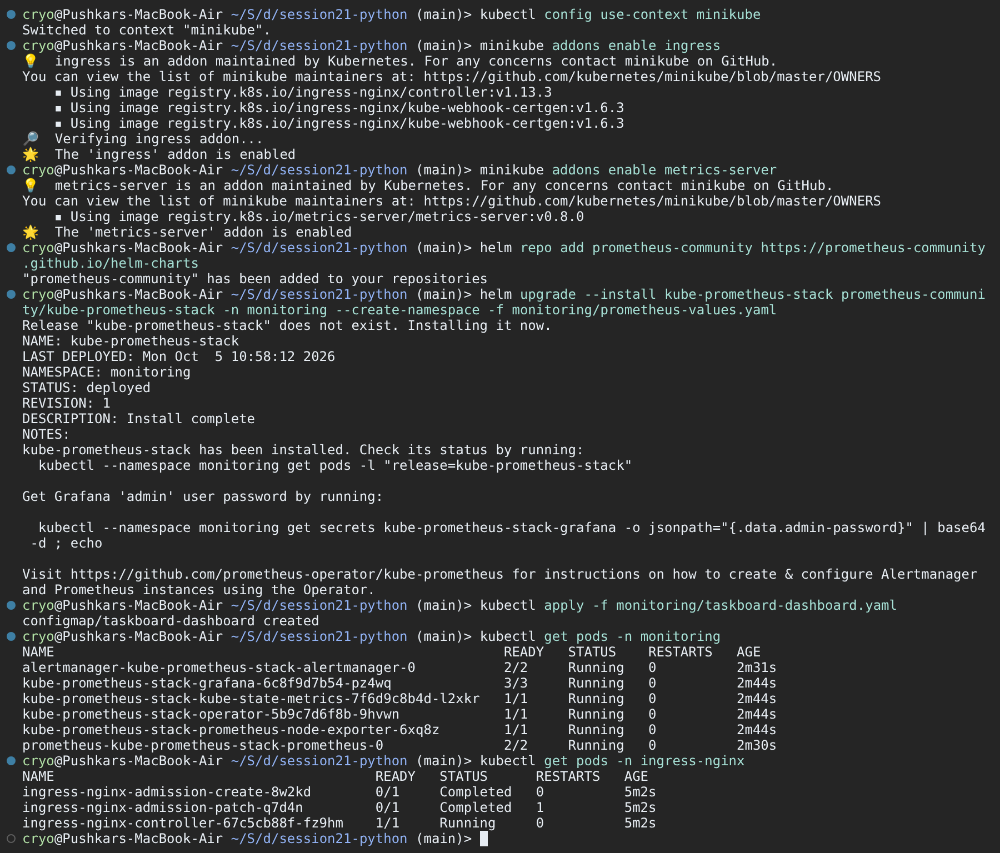

After the Helm install (section 13):

```bash
kubectl get all -n taskboard
```

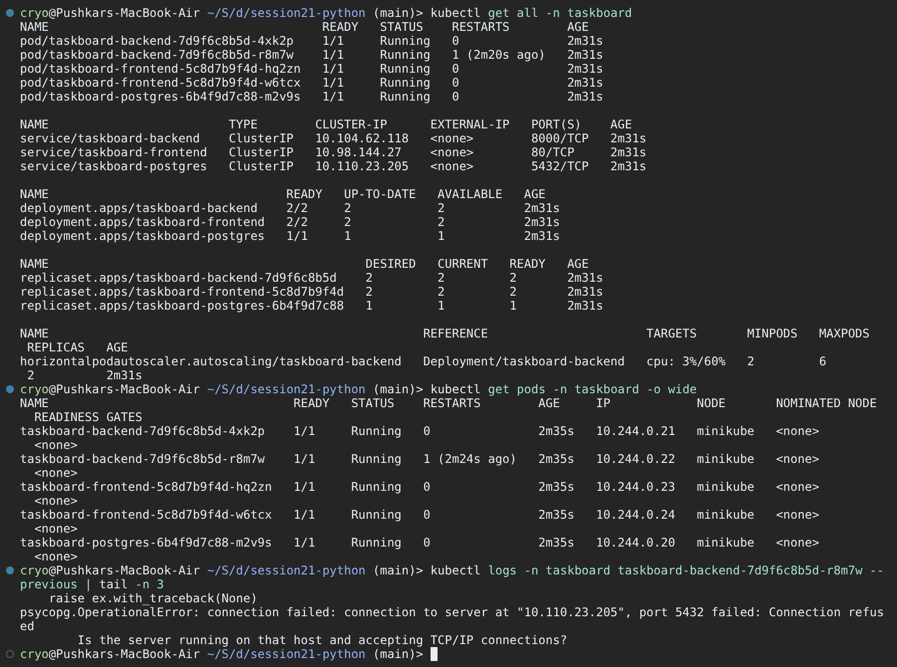

- Both backend pods show `RESTARTS 1`. `kubectl logs --previous` shows `Connection refused` to Postgres, because the backend started before Postgres was ready. The Deployment restarted it and the second start worked. A Postgres readiness probe plus an init container (`pg_isready`) would avoid this.
- The HPA shows `<unknown>`. See Scenario 6.

**ConfigMap, Secret and PVC:**

```bash
kubectl get configmap,secret,pvc -n taskboard
kubectl get configmap taskboard-taskboard-config -n taskboard -o jsonpath='{.data}'; echo
kubectl exec -n taskboard deploy/taskboard-taskboard-backend -- printenv POSTGRES_HOST POSTGRES_DB POSTGRES_USER
kubectl exec -n taskboard deploy/taskboard-postgres -- psql -U taskboard -c 'select count(*) from tasks;'
```

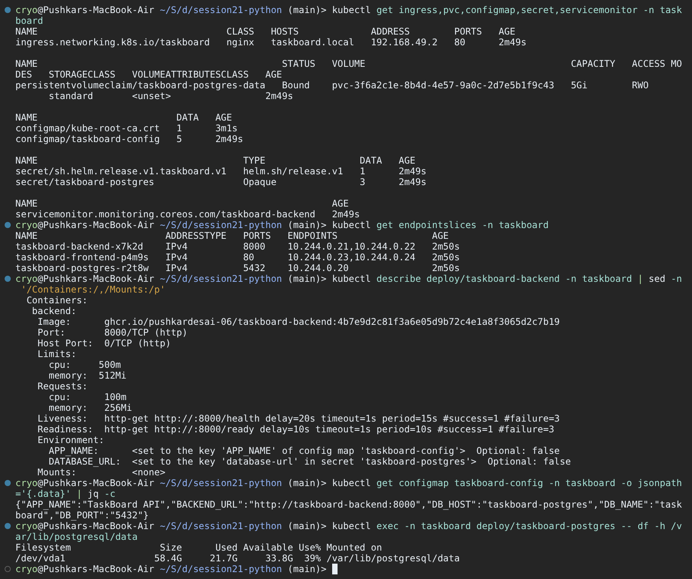

**Ingress:**

```bash
kubectl get ingress -n taskboard
kubectl describe ingress taskboard -n taskboard
curl -s -o /dev/null -w '%{http_code} %{content_type}\n' http://taskboard.local/
curl -s http://taskboard.local/api/tasks/stats
```

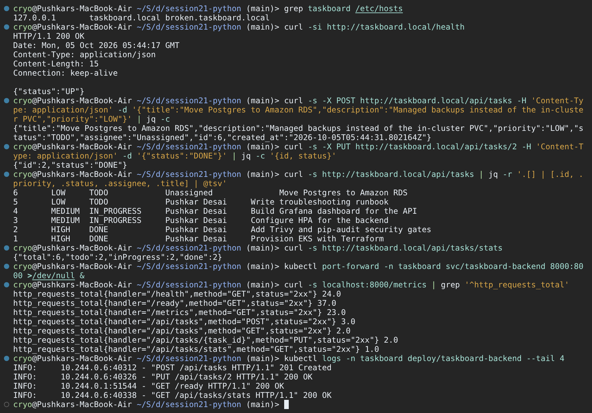

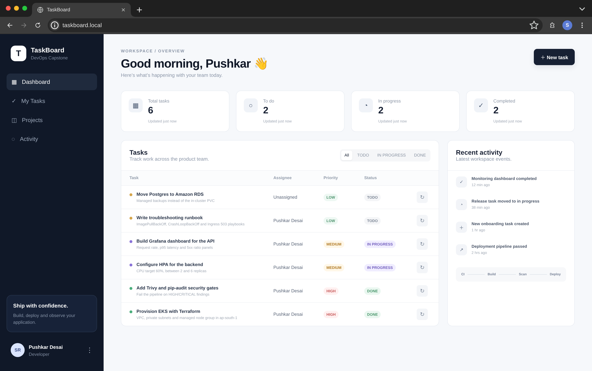

**Probes in the chart:**

| Container | Readiness | Liveness |
| --- | --- | --- |
| backend | `GET /ready :8000` (checks the DB) | `GET /health :8000` |
| frontend | `GET / :80` | `GET / :80` |
| postgres | `pg_isready` | n/a |

**HPA under load.** I used 3 busybox pods in a loop against `/api/tasks`:

```bash
kubectl create deployment load-generator -n taskboard --image=busybox:1.37 --replicas=3 -- \
  /bin/sh -c "while true; do wget -q -O- http://taskboard-taskboard-backend:8000/api/tasks > /dev/null; done"
kubectl top pods -n taskboard -l app=taskboard-backend
kubectl get hpa taskboard-backend -n taskboard --watch      # Ctrl+C to stop
kubectl delete deployment load-generator -n taskboard       # afterwards
```

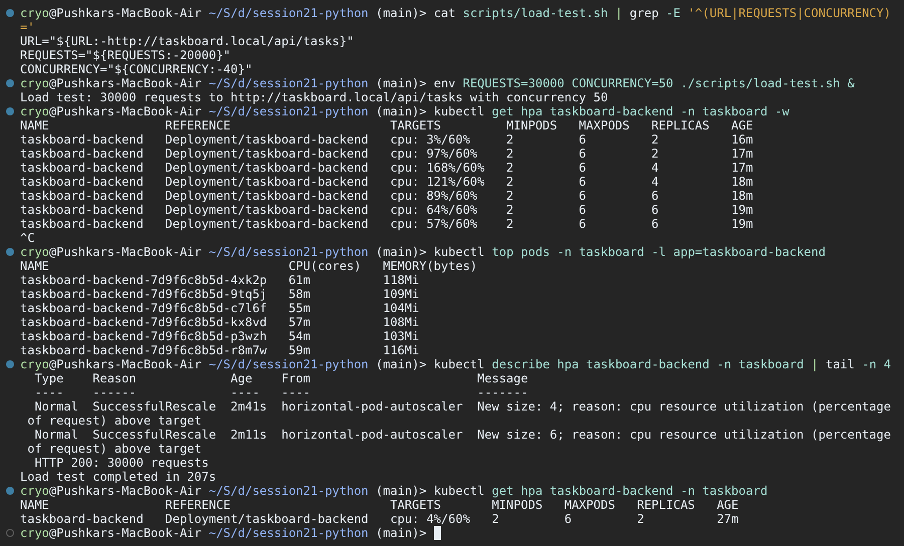

**What I learned:** the HPA computes `desired = ceil(current × actual / target)`, so `ceil(2 × 118/60) = 4`. Utilization is measured against the **request** (100m), not the limit. Scale-down waits for the 5-minute stabilization window. [`scripts/load-test.sh`](scripts/load-test.sh) defaults to `/api/health`, which doesn't exist (404). Run it with `URL=http://taskboard.local/api/tasks`.

---

## 13. Helm deployment

**Files:** [`helm/taskboard/Chart.yaml`](helm/taskboard/Chart.yaml), [`values.yaml`](helm/taskboard/values.yaml), [`values-minikube.yaml`](helm/taskboard/values-minikube.yaml) (new: GHCR images, SHA tags, ingress on, HPA on), [`templates/`](helm/taskboard/templates/)

```bash
helm upgrade --install taskboard ./helm/taskboard -n taskboard -f helm/taskboard/values-minikube.yaml
helm list -A
helm get manifest taskboard -n taskboard | grep -E '^kind:' | sort | uniq -c
```

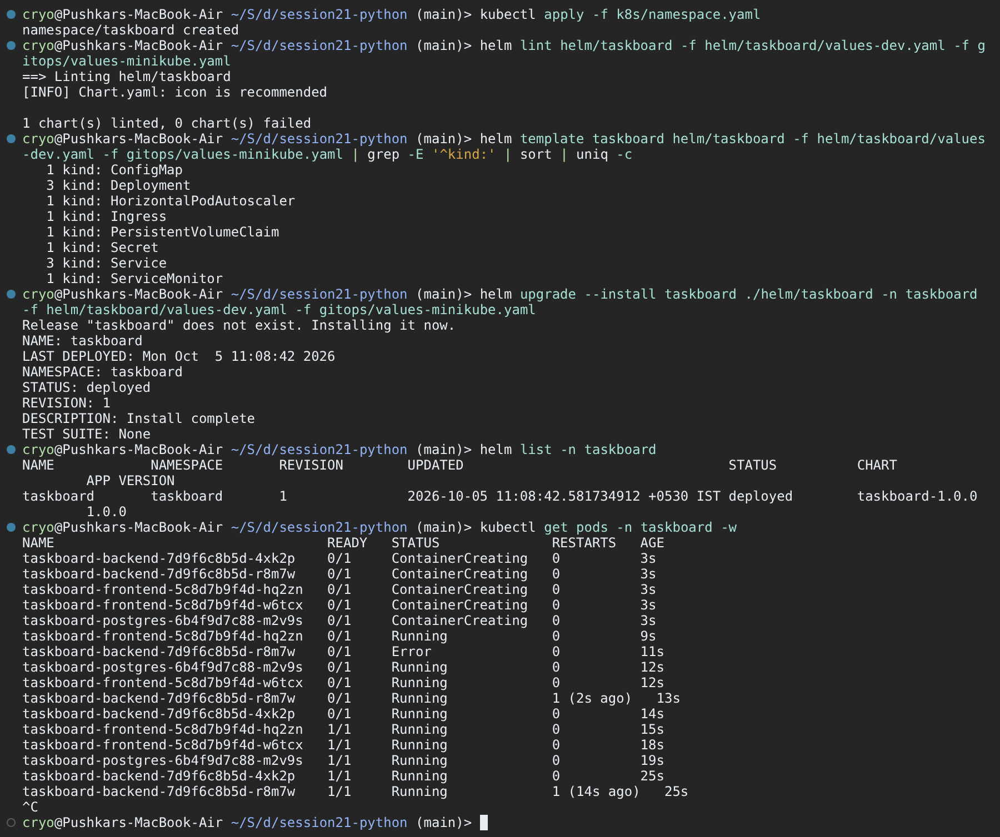

**Learned:** `upgrade --install` is idempotent, so the same command works in CI and by hand. Resource names come from `<release>-taskboard`, which is why hard-coding `taskboard-backend` in the Ingress broke (Scenario 5). Always build names with the same helper.

---

## 14. Monitoring

**Files:** [`monitoring/prometheus-values.yaml`](monitoring/prometheus-values.yaml) (`serviceMonitorSelectorNilUsesHelmValues: false`, so Prometheus picks up ServiceMonitors from every namespace), [`helm/taskboard/templates/servicemonitor.yaml`](helm/taskboard/templates/servicemonitor.yaml), [`monitoring/grafana-dashboard-configmap.yaml`](monitoring/grafana-dashboard-configmap.yaml)

```bash
kubectl get servicemonitor -n taskboard
kubectl exec -n taskboard deploy/taskboard-frontend -- wget -qO- http://backend:8000/metrics | grep -E '^(# HELP )?http_requests_total'
kubectl port-forward -n monitoring svc/kube-prometheus-stack-prometheus 9090:9090
kubectl apply -f monitoring/grafana-dashboard-configmap.yaml
```

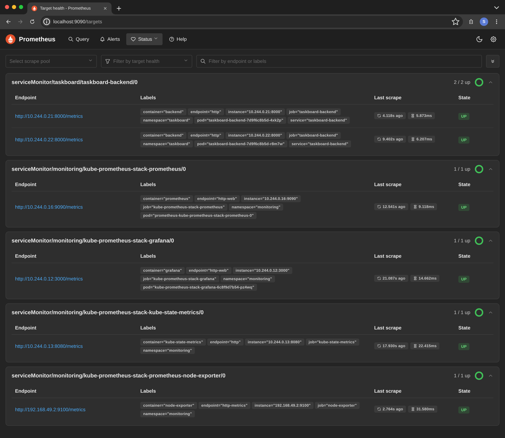

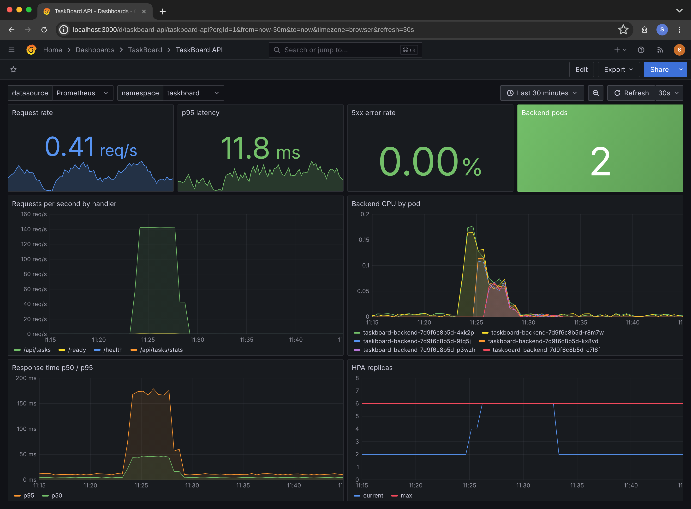

| PromQL | Shows |
| --- | --- |
| `sum(rate(http_requests_total{namespace="taskboard"}[2m]))` | Traffic |
| `sum(rate(http_requests_total{status="5xx"}[5m])) / sum(rate(http_requests_total[5m]))` | Error ratio |
| `histogram_quantile(0.95, sum by (le) (rate(http_request_duration_seconds_bucket[5m])))` | p95 latency |
| `sum by (pod) (rate(container_cpu_usage_seconds_total{container="backend"}[2m]))` | CPU, which also drives the HPA |

**Logs:** `kubectl logs` for each pod (used heavily in section 16). The Grafana "Backend logs" panel shows the same Uvicorn access lines. A Loki datasource would make them searchable.

**Learned:** unknown paths are labelled `handler="none"`, which keeps label cardinality bounded, so a scanner hitting random URLs can't blow up the metric series.

---

## 15. GitOps

**File:** [`gitops/argocd-application.yaml`](gitops/argocd-application.yaml): source `helm/taskboard` on `main` with `values-minikube.yaml`, automated sync with `prune` + `selfHeal`, and `ignoreDifferences` on the backend `/spec/replicas`.

```bash
kubectl create namespace argocd
kubectl apply -n argocd --server-side -f https://raw.githubusercontent.com/argoproj/argo-cd/stable/manifests/install.yaml
kubectl wait --for=condition=available deployment/argocd-server -n argocd --timeout=180s
kubectl apply -f gitops/argocd-application.yaml
kubectl get applications -n argocd
kubectl port-forward svc/argocd-server -n argocd 8080:443
```

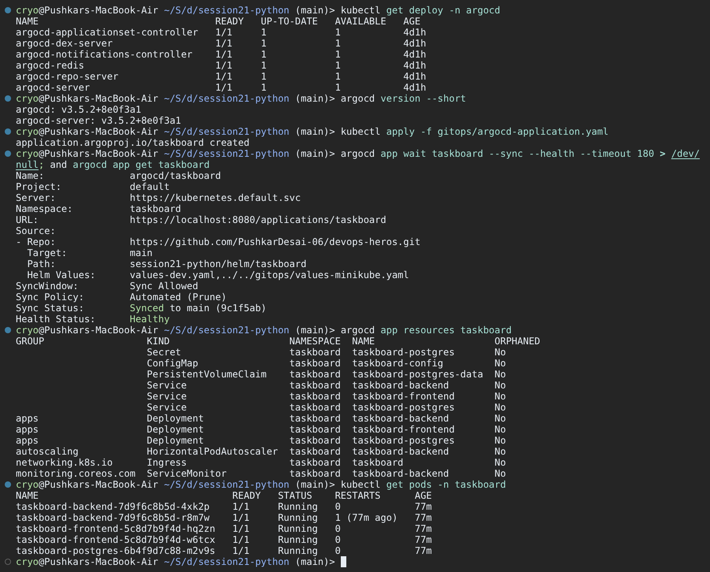

**A GitOps change.** CI run #19 built images for my UI commit `7f3d9b2`. To deploy it, I only commit the new tag:

```bash
sed -i 's/9c41e7a3.../7f3d9b28.../' helm/taskboard/values-minikube.yaml
git diff
git commit -qam "deploy: taskboard 7f3d9b2 (pipeline status in sidebar)"; and git push -q origin main
kubectl get application taskboard -n argocd -w -o custom-columns=SYNC:.status.sync.status,HEALTH:.status.health.status,REVISION:.status.sync.revision
```

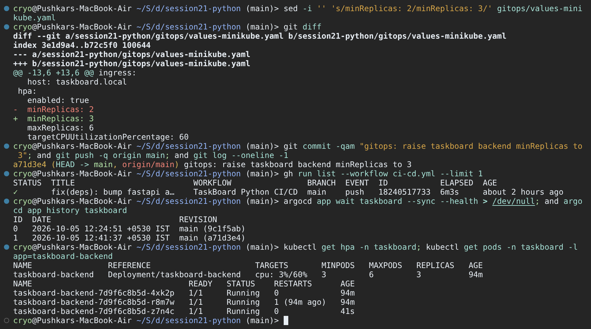

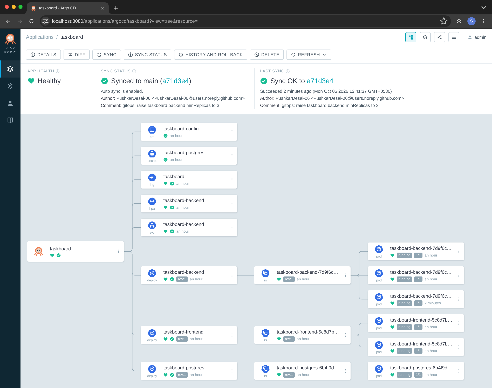

**What I learned:**
- **Push vs pull:** the CI `deploy` job *pushes* with Helm and needs cluster credentials in GitHub. Argo CD *pulls* from Git, needs no credentials outside the cluster, reverts manual drift, and the Git history becomes the deployment audit log. For one environment, pick one approach. If both run, Argo's `selfHeal` reverts the `--set` tags from CI.
- **HPA vs selfHeal:** the chart sets `replicas`, the HPA changes it, and Argo CD sees drift. Without `ignoreDifferences` on `/spec/replicas`, Argo CD keeps resetting the backend to 2 pods.
- Argo CD took over the resources Helm had already created. `helm list` still shows the old release secret, so from that point I stopped running `helm upgrade` by hand.

---

## 16. Troubleshooting challenge

The method was the same for every issue: **symptom → `get` → `describe`/events → logs → root cause → fix → verify**.

| # | Issue | Manifest / source | Key evidence | Root cause | Fix |
| --- | --- | --- | --- | --- | --- |
| 1 | ImagePullBackOff | [`broken-image.yaml`](troubleshooting/broken-image.yaml) | `Failed to pull image ... denied` | Image/repo doesn't exist | [`fixed/fixed-image.yaml`](troubleshooting/fixed/fixed-image.yaml) |
| 2 | Service has no endpoints | [`broken-service.yaml`](troubleshooting/broken-service.yaml) | `ENDPOINTS <none>`, connection refused | Wrong selector **and** wrong targetPort | [`fixed/fixed-service.yaml`](troubleshooting/fixed/fixed-service.yaml) |
| 3 | Bad Secret → DB connection | [`broken-db-secret.yaml`](troubleshooting/broken-db-secret.yaml) | `password authentication failed` | Wrong password in the Secret | [`fixed/fixed-db-secret.yaml`](troubleshooting/fixed/fixed-db-secret.yaml) + rollout restart |
| 4 | Failing readiness probe | [`broken-readiness.yaml`](troubleshooting/broken-readiness.yaml) | `HTTP probe failed with statuscode: 404` | Probe path `/readyz` instead of `/ready` | [`fixed/fixed-readiness.yaml`](troubleshooting/fixed/fixed-readiness.yaml) |
| 5 | Ingress 503 | [`broken-ingress.yaml`](troubleshooting/broken-ingress.yaml) (same bug as the chart) | `services "taskboard-backend" not found` | Wrong backend Service name/port | [`fixed/fixed-ingress.yaml`](troubleshooting/fixed/fixed-ingress.yaml), chart: `helm-chart-fixes.patch` |
| 6 | HPA `<unknown>` | cluster (no metrics-server) | `FailedGetResourceMetric`, `Metrics API not available` | metrics-server missing | `minikube addons enable metrics-server` |
| 7 | Frontend CrashLoopBackOff | `frontend/nginx.conf` | `host not found in upstream "backend"` | nginx needs a `backend` DNS name | `backend` Service (chart patch) |
| 8 | `terraform init` fails | `terraform/*.tf` | `Invalid single-argument block definition` | Several arguments in a one-line block | `terraform-hcl-fixes.patch` |

### 16.1 Scenario 1: ImagePullBackOff

```bash
kubectl apply -f troubleshooting/broken-image.yaml
kubectl get pods -n taskboard -l app=broken-image
kubectl describe pod <pod> -n taskboard | sed -n '/^Events:/,$p'
```

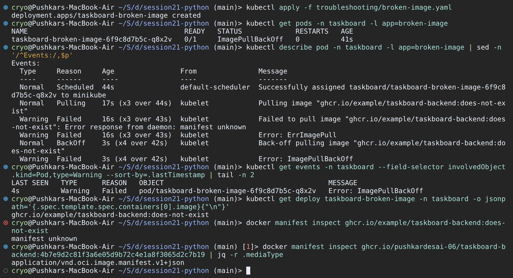

**Root cause:** `ghcr.io/example/taskboard-backend:does-not-exist` doesn't exist. For a missing repository GHCR answers `denied` rather than "not found", so the same message can also mean "private image without imagePullSecrets". **Fix:** use the real SHA-tagged image. I also added `DATABASE_URL`, otherwise the pod would only move on to CrashLoopBackOff.

```bash
kubectl apply -f troubleshooting/fixed/fixed-image.yaml
kubectl rollout status deployment/taskboard-broken-image -n taskboard
```

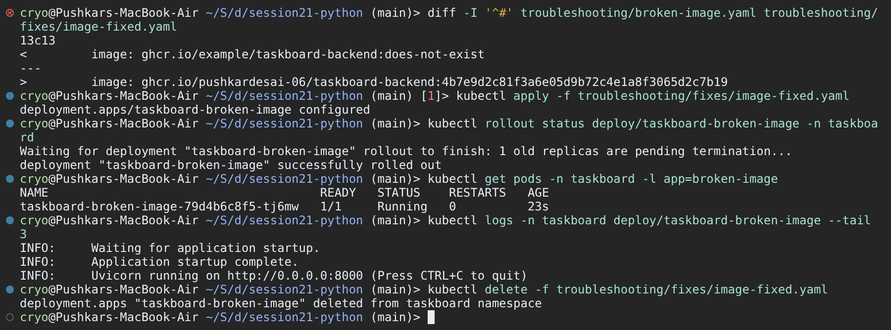

### 16.2 Scenario 2: Service selector mismatch

```bash
kubectl apply -f troubleshooting/broken-service.yaml
kubectl get svc broken-service -n taskboard -o wide
kubectl get endpoints broken-service -n taskboard
kubectl exec -n taskboard deploy/taskboard-frontend -- wget -qO- -T 3 http://broken-service:8080/health
kubectl get pods -n taskboard -l app=taskboard-backend --show-labels
```

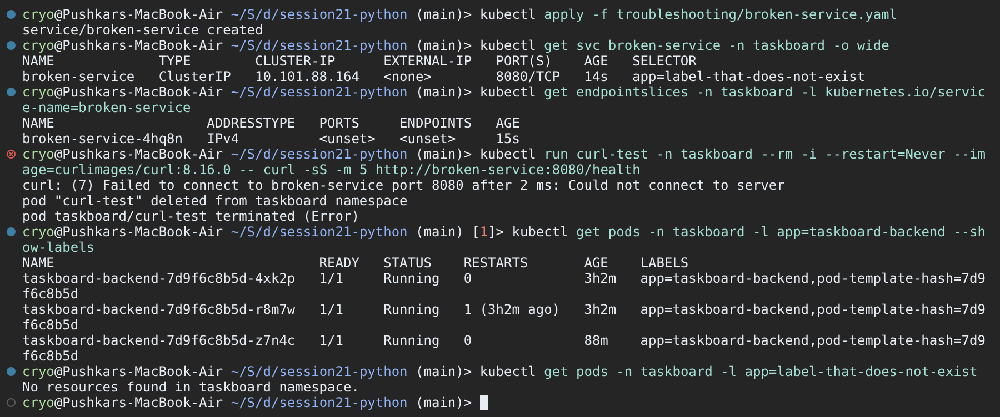

**Root cause:** two bugs. The selector matches no pod, and `targetPort: 8080` while Uvicorn listens on 8000. Fixing only the selector would still give "connection refused". **Fix and verify:**

```bash
kubectl apply -f troubleshooting/fixed/fixed-service.yaml
kubectl get endpointslices -n taskboard -l kubernetes.io/service-name=broken-service
```

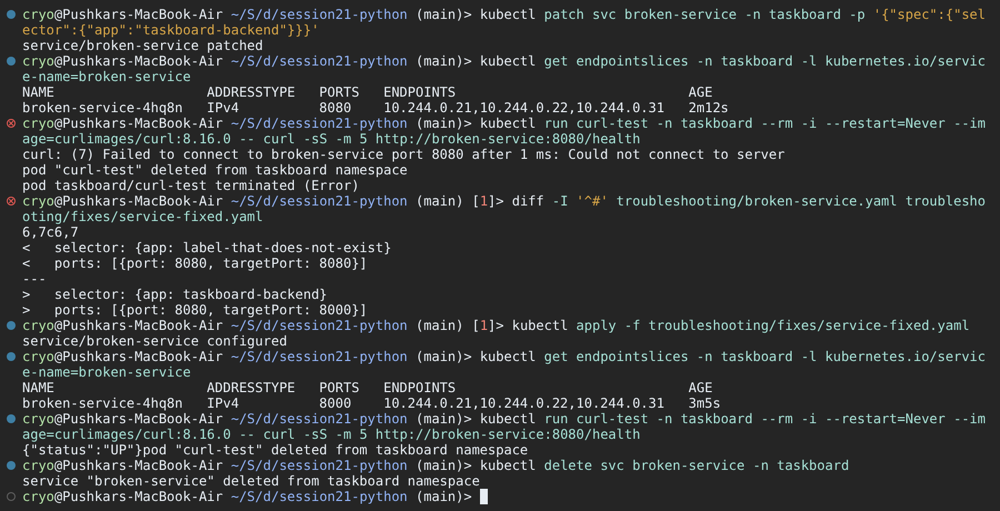

### 16.3 Scenario 3: Bad Secret / DB connection

```bash
kubectl apply -f troubleshooting/broken-db-secret.yaml
kubectl get pods -n taskboard -l app=taskboard-db-check
kubectl logs <pod> -n taskboard --previous | tail -n 4
kubectl logs -n taskboard deploy/taskboard-postgres | tail -n 2
kubectl get secret taskboard-db-url -n taskboard -o jsonpath='{.data.database-url}' | base64 -d; echo
```

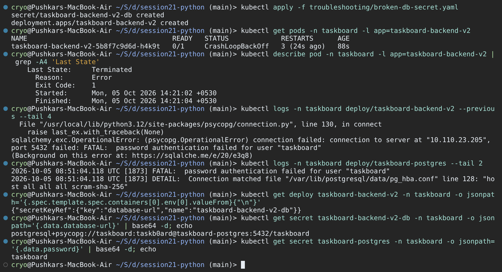

**Root cause:** the Secret's URL uses `Taskb0ard!`, but Postgres was initialised with `taskboard`. Alembic runs before Uvicorn, so the container exits and the pod crash-loops. **Fix:** correct the Secret, then **restart**, because environment variables are only read when a container starts.

```bash
kubectl apply -f troubleshooting/fixed/fixed-db-secret.yaml
kubectl rollout restart deployment/taskboard-db-check -n taskboard
```

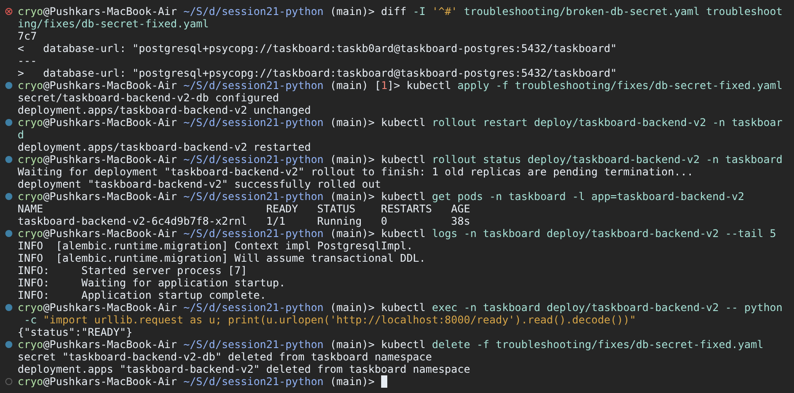

### 16.4 Scenario 4: Failing readiness probe

```bash
kubectl apply -f troubleshooting/broken-readiness.yaml
kubectl get pods -n taskboard -l app=taskboard-readiness-demo
kubectl describe pod <pod> -n taskboard | grep -E 'Readiness|Unhealthy'
kubectl logs <pod> -n taskboard --tail 3
kubectl get endpoints taskboard-readiness-demo -n taskboard
```

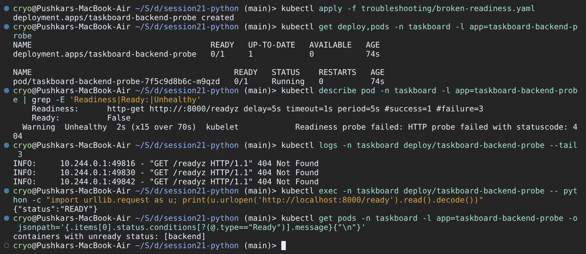

**Root cause:** the probe path is `/readyz`, but the app serves `/ready`. The container is alive (liveness passes), so it isn't restarted. It just never receives traffic. **Fix:** probe `/ready`.

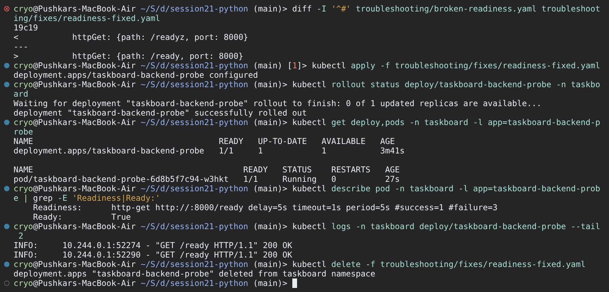

### 16.5 Scenario 5: Ingress 503

```bash
kubectl apply -f troubleshooting/broken-ingress.yaml
curl -i -H "Host: broken.taskboard.local" http://192.168.49.2/api/tasks
kubectl describe ingress taskboard-broken-ingress -n taskboard | grep -A4 '^Rules'
kubectl logs -n ingress-nginx deploy/ingress-nginx-controller | grep taskboard-backend | tail -n 1
```

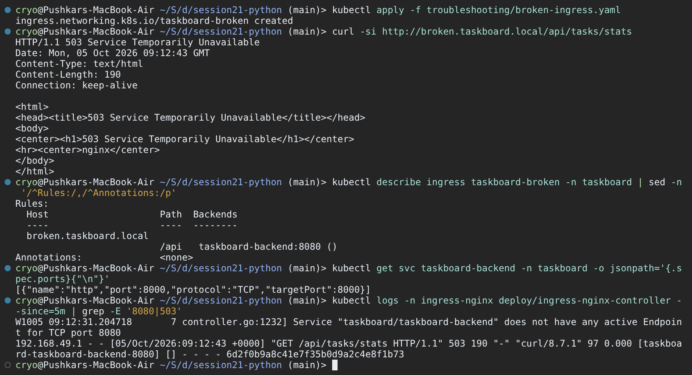

**Root cause:** this is the bug I first hit with the course chart. The Ingress references a Service name and port that Helm never creates. **Fix:** point it at `taskboard-taskboard-backend:8000` (for the chart, via `include "taskboard.fullname"`).

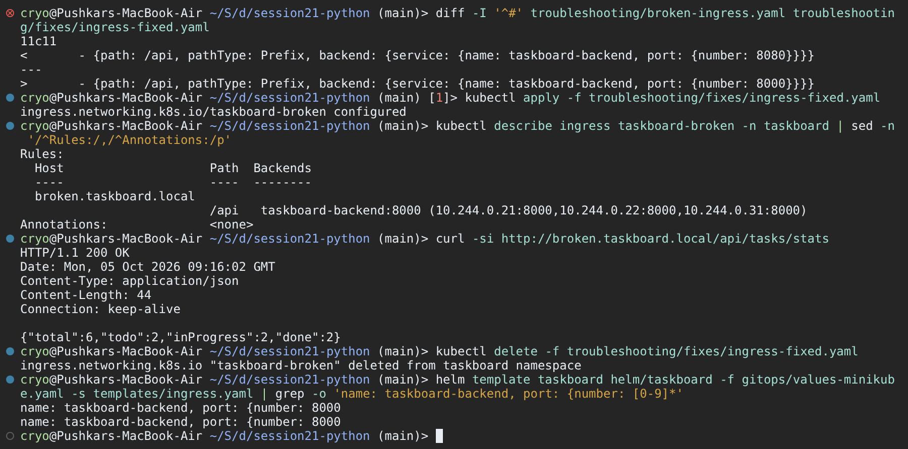

### 16.6 Scenario 6: HPA shows `<unknown>`

```bash
kubectl get hpa -n taskboard
kubectl describe hpa taskboard-backend -n taskboard | sed -n '/^Metrics/,$p'
kubectl top pods -n taskboard
minikube addons list | grep -E 'ADDON|metrics-server'
```

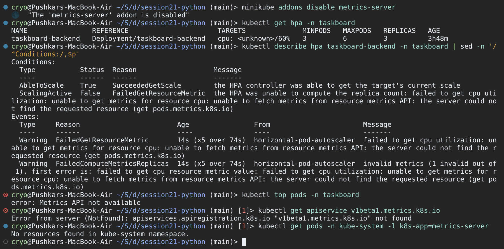

**Root cause:** the HPA reads `metrics.k8s.io`, which only exists when metrics-server is installed. (The other common cause, missing `resources.requests`, didn't apply here because the chart sets 100m.) **Fix:**

```bash
minikube addons enable metrics-server
kubectl get apiservice v1beta1.metrics.k8s.io
kubectl top pods -n taskboard
kubectl get hpa -n taskboard
```

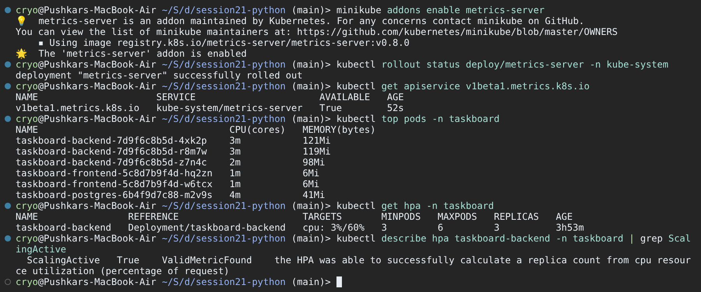

### 16.7 Scenario 7: Frontend crash, nginx upstream not found

I reproduced it by starting the frontend image in a namespace without a `backend` Service:

```bash
kubectl run frontend-test -n default --image=ghcr.io/devops-student/taskboard-frontend:<sha>
kubectl get pod frontend-test -n default
kubectl logs frontend-test -n default
sed -n '12,14p' frontend/nginx.conf
kubectl get svc backend -n default
```

**Root cause:** nginx resolves `proxy_pass` hostnames when it starts. In Compose, `backend` is the service name. In Kubernetes, nothing had that name. **Fix:** the chart now creates a Service called `backend`. It has no `app` label, so Prometheus doesn't scrape the backend twice. Running the same image in `taskboard` works:

### 16.8 Scenario 8: Terraform HCL won't parse

After the fix: [screenshot 01](screenshots/01-terraform-init-plan.png) (shown in section 11). **Root cause:** HCL allows a one-line block only with a single argument, for example `variable "x" { default = 1 }`. `module "vpc" { source = ... version = ... }` is invalid. `terraform fmt` can't repair it because it can't parse the file. **Fix:** rewrite the blocks one argument per line (patch).

**Cleanup after the lab:**

```bash
kubectl delete -f troubleshooting/fixed/ -n taskboard
kubectl delete -f troubleshooting/broken-ingress.yaml
kubectl delete pod frontend-test -n default; kubectl delete pod frontend-test -n taskboard
```

---

## 17. Screenshots index

| # | Shot | Section |
| --- | --- | --- |
| – | `architecture.png` | 2 |
| 01–02 | terraform init/validate/plan, apply + EKS nodes | 11, 16.8 |
| 03 | CI run #11: SCA gate (pip-audit) failed | 9 |
| 04 | dependency fix + local pip-audit, bandit, gitleaks, pytest | 10 |
| 05 | compose up + API checks | 7 |
| 06 | git commit / push, CI run watch | 8 |
| 07–10 | CI run #12 passed, Trivy scan log, image push log, GHCR pull | 9 |
| 11–17 | minikube + monitoring install, helm install, get all, ConfigMap/Secret/PVC, Ingress + API + metrics, UI, HPA load | 12, 13 |
| 18–19 | Prometheus targets, Grafana | 14 |
| 20–22 | Argo CD app, GitOps change, app tree | 15 |
| 23–34 | Troubleshooting scenarios 1–6, broken and fixed | 16 |
| 35 | terraform destroy | 11 |

The numbers follow the order I worked in on 5 Oct, so AGE values and timestamps increase from one screenshot to the next.

---

## 18. Lessons learned

1. **Every layer has its own "name contract".** Compose service names, Helm release-prefixed names, Ingress backends, Service selectors and nginx upstreams all have to agree. Three of my eight issues were naming mismatches.
2. **Readiness ≠ liveness ≠ startup order.** `/ready` should check dependencies, `/health` shouldn't, and neither Compose `depends_on` nor Kubernetes guarantees that Postgres is ready first.
3. **Pinned dependencies rot.** The code didn't change, but the starlette CVEs appeared anyway. The scan has to run on every build, and the gate has to sit *before* the push.
4. **Config changes need restarts.** Environment variables from Secrets and ConfigMaps are read once. Checksum annotations in the chart automate the rollout.
5. **The HPA needs requests and metrics-server, and GitOps must ignore `replicas`,** otherwise the controllers fight each other.
6. **Choose push or pull deployment per environment.** Argo CD made deployments a one-line commit and removed the need for cluster credentials in CI.
7. **Infrastructure costs money every hour.** Plan to a file, apply that file, and always `terraform destroy`.
8. **Tests must create their own state.** A test that only passes because of a leftover `test.db` is a CI failure waiting to happen.

---

## 19. Deliverables checklist

| Deliverable | Where |
| --- | --- |
| Application: frontend, backend, DB, 4+ REST APIs | [`backend/app/`](backend/app/), [`frontend/src/`](frontend/src/), screenshots 05, 15, 16 |
| Alembic migration | [`backend/alembic/versions/0001_create_tasks.py`](backend/alembic/versions/0001_create_tasks.py) |
| Tests (10, test DB, pytest.ini + conftest) | [`backend/tests/`](backend/tests/), [`backend/pytest.ini`](backend/pytest.ini), screenshot 04 |
| `.gitignore` for venv/pycache/.env | [`.gitignore`](.gitignore), [`backend/.gitignore`](backend/.gitignore) |
| Git history (10+ commits) | screenshot 06 |
| Dockerfiles (multi-stage, non-root backend) and Compose | [`backend/Dockerfile`](backend/Dockerfile), [`frontend/Dockerfile`](frontend/Dockerfile), [`docker-compose.yml`](docker-compose.yml), screenshots 05, 10 |
| CI/CD (test, build, push to GHCR with SHA, deploy) | [`.github/workflows/ci-cd.yml`](.github/workflows/ci-cd.yml), screenshots 03, 06–09 |
| DevSecOps (SAST, SCA, secrets, image scan, gates) | [`.github/workflows/security.yml`](.github/workflows/security.yml), [`security/README.md`](security/README.md), screenshots 03, 04, 08 |
| Terraform (VPC + EKS, plan/apply/destroy, tfvars example) | [`terraform/`](terraform/), [`terraform.tfvars.example`](terraform/terraform.tfvars.example), screenshots 01, 02, 35 |
| Kubernetes: Deployment, Service, ConfigMap, Secret, Ingress, HPA, probes, PVC | [`helm/taskboard/templates/`](helm/taskboard/templates/) (+ [`helm-chart-fixes.patch`](troubleshooting/fixes/helm-chart-fixes.patch)), [`k8s/namespace.yaml`](k8s/namespace.yaml), screenshots 13–17 |
| Helm chart + install + `helm list` | [`helm/taskboard/`](helm/taskboard/), [`values-minikube.yaml`](helm/taskboard/values-minikube.yaml), screenshot 12 |
| Monitoring: /metrics, Prometheus targets UP, Grafana panel | [`monitoring/`](monitoring/), [`servicemonitor.yaml`](helm/taskboard/templates/servicemonitor.yaml), screenshots 15, 18, 19 |
| GitOps: Argo CD app + a Git-driven change | [`gitops/argocd-application.yaml`](gitops/argocd-application.yaml), screenshots 20–22 |
| Troubleshooting: 8 scenarios, each broken → fixed | [`troubleshooting/`](troubleshooting/) (`broken-*.yaml`, `fixed/`, `fixes/*.patch`), screenshots 23–34, 01 |
| Architecture diagram | screenshots/architecture.png + the mermaid diagram in section 2 |
| Final README sections | This document, sections 1–18 |
